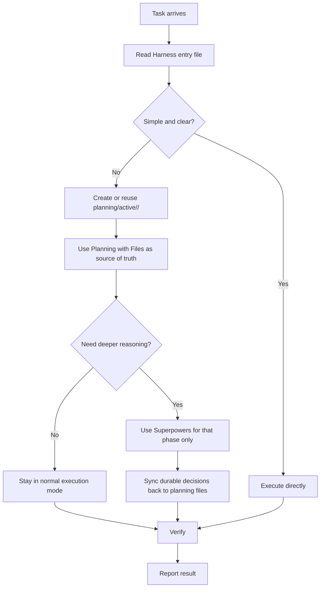
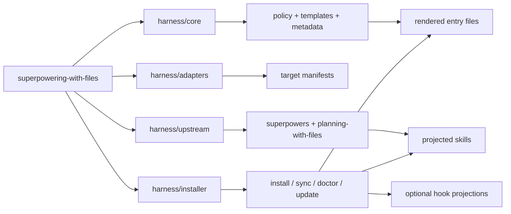

# superpowering-with-files

superpowering-with-files is a governance harness for local coding-agent workflows. It turns one shared policy into native instruction files, projected skills, and optional hooks for Codex, GitHub Copilot, Cursor, and Claude Code.

Gemini CLI is not currently a supported installer target.

## Core Model

- `planning-with-files` owns durable task state
- `superpowers` is optional and temporary
- Harness projects both into each supported IDE's native shape



### Task State

| Path | Role |
| --- | --- |
| `planning/active/<task-id>/task_plan.md` | active plan, phases, lifecycle |
| `planning/active/<task-id>/findings.md` | durable findings and constraints |
| `planning/active/<task-id>/progress.md` | session log, checks, changed files |
| `planning/archive/<timestamp>-<task-id>/` | closed tasks after lifecycle guard passes |

Rules:

1. `planning-with-files` is the only durable task-memory system.
2. `docs/**`, `docs/superpowers/plans/**`, and `docs/plans/**` are documentation, not active task memory.
3. **Default mode stays lightweight**
   - Do direct execution only for quick tasks.
   - Once work becomes a tracked task, create or reuse `planning/active/<task-id>/` and keep its three planning files updated.
   - Use `superpowers` only when architecture is unclear, requirements are ambiguous, debugging is complex, root cause is not obvious, or deep structured reasoning is explicitly needed.

4. **Task classification comes before workflow choice**
   - `Quick task`: single-stage work with a clear path and no durable planning needs.
   - `Tracked task`: multi-phase, research-heavy, isolated, parallel, or cross-session work that needs durable state.
   - `Deep-reasoning task`: a tracked task that also justifies `superpowers`.
   - Tool-call count is only a hint; it does not override the classification above by itself.

5. **Complex-mode order is fixed**
   - create or reuse one task under `planning/active/<task-id>/`
   - group work into phases with finishing criteria
   - run worktree preflight before isolation when needed
   - use `superpowers` only for the phase that justifies it
   - sync durable decisions back into Planning with Files
   - let the main agent review, verify, and integrate

6. **Worktree base must be explicit**

```bash
./scripts/harness worktree-preflight
git worktree add <path> -b <new-branch> <base-ref>
```

## Upstream, License, Credit

Harness vendors two upstream systems and applies stricter local governance on top.

| Upstream | Original role | Upstream license | Harness usage |
| --- | --- | --- | --- |
| [`superpowers`](https://github.com/obra/superpowers) | agentic skills framework and software-development workflow | MIT | optional reasoning layer for complex planning, debugging, execution, and review phases |
| [`planning-with-files`](https://github.com/OthmanAdi/planning-with-files) | persistent markdown planning and session-recovery skill | MIT | the only durable task-memory system, rooted in `planning/active/<task-id>/` |

Harness keeps vendored sources under `harness/upstream/**` and patches only projected copies when local governance requires different output paths, such as redirecting `writing-plans` from `docs/superpowers/plans/**` to `planning/active/<task-id>/`.

Thanks to the upstream authors and communities whose work this repository builds on:

- [`obra/superpowers`](https://github.com/obra/superpowers) by Jesse Vincent and contributors
- [`OthmanAdi/planning-with-files`](https://github.com/OthmanAdi/planning-with-files) by Othman Adi and contributors

## Quick Start

```bash
# workspace
./scripts/harness install --scope=workspace --targets=all --projection=link
./scripts/harness sync
./scripts/harness doctor

# user-global
./scripts/harness install --scope=user-global --targets=all --projection=link
./scripts/harness sync
./scripts/harness doctor
```

Use `--scope=both` when you want a shared user-global baseline plus repository-local entry files.

### Integration Modes

| Mode | Use when | Result |
| --- | --- | --- |
| Replace | existing rules should be retired | Harness-rendered files become the rule source |
| Update | Harness already owns the scope | `sync` refreshes the rendered files |
| Enhance | lower-level rules still matter | Harness stays above them as governance |
| Wrap | another local router already coordinates behavior | Harness sets policy and delegates selectively |

## Repository Structure

- `harness/core`: policy, templates, schemas, projection metadata
- `harness/adapters`: target-specific manifests
- `harness/installer`: CLI commands, state, projection logic, health checks
- `harness/upstream`: vendored `superpowers` and `planning-with-files` baselines



## Projection Map

### Sources

| Source in repo | Role | `sync` output |
| --- | --- | --- |
| `harness/core/policy/**` + `harness/core/templates/**` | shared governance policy | rendered instruction / rules entry files |
| `harness/upstream/superpowers/skills/**` | optional reasoning skills baseline | projected IDE skill copies |
| `harness/upstream/planning-with-files/**` | durable planning baseline | projected IDE skill copies |
| `harness/core/hooks/**` | optional hook configs and helper scripts | target hook configs and scripts when hook mode is on |

### Entry Files

| Target | Workspace entry | User-global entry | Notes |
| --- | --- | --- | --- |
| Codex | `AGENTS.md` | `~/.codex/AGENTS.md` | rendered file |
| GitHub Copilot | `.github/copilot-instructions.md` | `~/.copilot/instructions/harness.instructions.md` | rendered file |
| Cursor | `.cursor/rules/harness.mdc` | user rules in Cursor settings | workspace rendered file only |
| Claude Code | `CLAUDE.md` | `~/.claude/CLAUDE.md` | rendered file |

### Skill Roots

| Target | Workspace skill root | User-global skill root | Strategy |
| --- | --- | --- | --- |
| Codex | `.agents/skills` | `~/.agents/skills` | materialized |
| GitHub Copilot | `.github/skills` | `~/.copilot/skills` | materialized |
| Cursor | `.cursor/skills` | `~/.cursor/skills` | materialized |
| Claude Code | `.claude/skills` | `~/.claude/skills` | materialized |

Projected skills are materialized by default. Claude Code shared skill-root symlinks are intentionally unsupported.

### Hooks

Hooks are opt-in:

```bash
./scripts/harness install --scope=workspace --targets=all --projection=link --hooks=on
./scripts/harness sync
./scripts/harness doctor --check-only
```

Support matrix:

| Hook source | Codex | GitHub Copilot | Cursor | Claude Code |
| --- | --- | --- | --- | --- |
| `planning-with-files` task-scoped hook | supported with Codex event limits | supported | provisional | supported |
| `superpowers` session-start hook | supported via Harness wrapper | unsupported | provisional | supported |

Hook roots:

| Target | Workspace hook files | User-global hook files |
| --- | --- | --- |
| Codex | `.codex/hooks.json`, `.codex/hooks/*` | `~/.codex/hooks.json`, `~/.codex/hooks/*` |
| GitHub Copilot | `.github/hooks/planning-with-files.json`, `.github/hooks/task-scoped-hook.sh` | `~/.copilot/hooks/planning-with-files.json`, `~/.copilot/hooks/task-scoped-hook.sh` |
| Cursor | `.cursor/hooks.json`, `.cursor/hooks/*` | `~/.cursor/hooks.json`, `~/.cursor/hooks/*` |
| Claude Code | `.claude/settings.json`, `.claude/hooks/*` | `~/.claude/settings.json`, `~/.claude/hooks/*` |

Harness merges only Harness-managed hook entries and preserves unrelated user entries.

## Upstream Updates

```bash
./scripts/harness fetch
./scripts/harness update
```

Update a single upstream baseline:

```bash
./scripts/harness fetch --source=superpowers
./scripts/harness fetch --source=planning-with-files
./scripts/harness update --source=superpowers
./scripts/harness update --source=planning-with-files
```

Then verify and sync:

```bash
npm run verify
./scripts/harness sync --dry-run
./scripts/harness sync
./scripts/harness doctor
```

## Commands

```bash
./scripts/harness install
./scripts/harness sync
./scripts/harness doctor
./scripts/harness status
./scripts/harness fetch
./scripts/harness update
./scripts/harness verify --output=.harness/verification
./scripts/harness worktree-preflight
```

## Docs

- [Architecture](docs/architecture.md)
- [Maintenance](docs/maintenance.md)
- [Release](docs/release.md)
- [Platform support](docs/install/platform-support.md)
- [Codex installation](docs/install/codex.md)
- [GitHub Copilot installation](docs/install/copilot.md)
- [Cursor installation](docs/install/cursor.md)
- [Claude Code installation](docs/install/claude-code.md)
