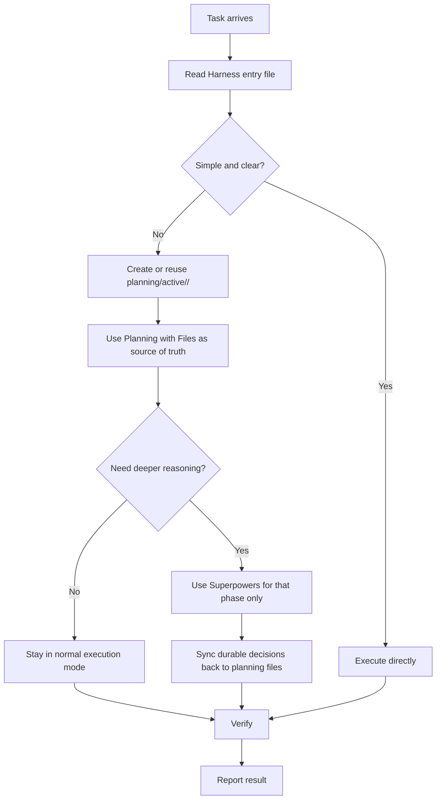
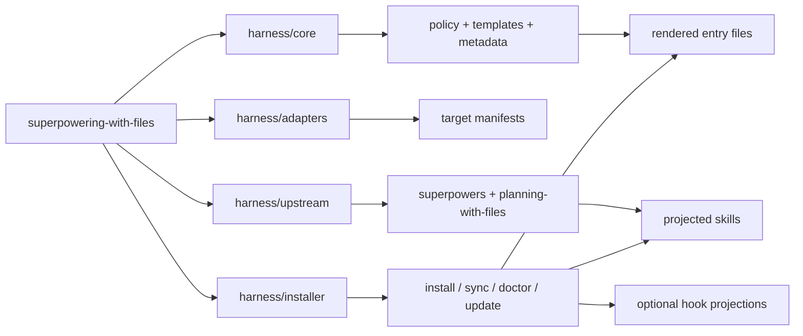

# superpowering-with-files

superpowering-with-files is a governance harness for local coding-agent workflows. It turns one shared policy into native instruction files, projected skills, and optional hooks for Codex, GitHub Copilot, Cursor, and Claude Code.

An opt-in safety profile adds path-boundary hooks, automatic checkpoints, and a worktree-first flow for bypass / autopilot work. See [Safety](#safety).

Gemini CLI is not currently a supported installer target.

## Core Model

- `planning-with-files` owns durable task state
- `superpowers` is optional and temporary
- Harness projects both into each supported IDE's native shape
- Rendered entry files are intentionally thinner than the canonical policy source.



### Task State

| Path | Role |
| --- | --- |
| `planning/active/<task-id>/task_plan.md` | active plan, phases, lifecycle |
| `planning/active/<task-id>/findings.md` | durable findings and constraints |
| `planning/active/<task-id>/progress.md` | session log, checks, changed files |
| `planning/archive/<timestamp>-<task-id>/` | closed tasks after lifecycle guard passes |

Rules:

1. `planning-with-files` is the only durable task-memory system.
2. `docs/**` and `docs/plans/**` are documentation, not active task memory.
3. Once a task is classified as tracked, `planning-with-files` is mandatory even if the implementation itself looks straightforward.
4. If a Deep-reasoning task actually uses Superpowers, it must also create a secondary companion plan under `docs/superpowers/plans/<date>-<task-id>.md`.
5. Companion plans are secondary artifacts only; active task memory stays in `planning/active/<task-id>/`.
6. Keep detailed Superpowers implementation plans and execution checklists in the companion artifact; sync only durable summaries, references, and status back into `planning/active/<task-id>/`.
7. The active task files must point to the companion plan, and the companion plan must point back to `planning/active/<task-id>/`.
8. `harness/core/policy/base.md` remains the canonical policy source, while entry files render only the selected always-on profile sections plus the preamble.

Recommended companion-plan name: `docs/superpowers/plans/<date>-<task-id>.md`.

## Upstream, License, Credit

Harness vendors two upstream systems and applies stricter local governance on top.

| Upstream | Original role | Upstream license | Harness usage |
| --- | --- | --- | --- |
| [`superpowers`](https://github.com/obra/superpowers) | agentic skills framework and software-development workflow | MIT | optional reasoning layer for complex planning, debugging, execution, and review phases; when it is used on a deep-reasoning task, the detailed implementation plan must be written to `docs/superpowers/plans/<date>-<task-id>.md` as a secondary companion artifact |
| [`planning-with-files`](https://github.com/OthmanAdi/planning-with-files) | persistent markdown planning and session-recovery skill | MIT | the only durable task-memory system, rooted in `planning/active/<task-id>/` |

Thanks to the upstream authors and communities whose work this repository builds on:

- [`obra/superpowers`](https://github.com/obra/superpowers) by Jesse Vincent and contributors
- [`OthmanAdi/planning-with-files`](https://github.com/OthmanAdi/planning-with-files) by Othman Adi and contributors

## Quick Start

```bash
# workspace
./scripts/harness install --scope=workspace --targets=all --projection=link
./scripts/harness sync
./scripts/harness doctor

# user-global bootstrap / refresh
./scripts/harness adopt-global
./scripts/harness adoption-status
```

Use `--scope=both` when you want a shared user-global baseline plus repository-local entry files.

If you want a non-default user-global profile, install it once and then reuse `adopt-global`:

```bash
./scripts/harness install --scope=user-global --targets=all --projection=link --skills-profile=minimal-global
./scripts/harness adopt-global
```

Rendered entry files use the `always-on-core` profile by default. That keeps session-start payloads small and leaves tracked-task and deep-reasoning detail in the canonical source for profile-based rendering when needed.

### Skill Profiles

Skill projections use the `full` profile by default. If you are adopting Harness into an existing user-global setup, `minimal-global` is the opt-in profile that keeps `planning-with-files` plus the allow-listed `superpowers` children:

```bash
./scripts/harness install --scope=user-global --targets=all --projection=link --skills-profile=minimal-global
```

The default does not flip to `minimal-global`; omit `--skills-profile` to keep `full`.

### Context Governance

Harness treats context size as a product constraint. Verification reports include `health.context` with entry, hook, planning, skill-profile, summary, and warning data. Entry summaries are measured as the worst target session, not as a cross-IDE total. Use this gate before changing policy rendering, skill projection, or hooks:

```bash
npm run verify
./scripts/harness verify --output=.harness/verification
./scripts/harness sync --dry-run
./scripts/harness doctor --check-only
```

The expected default remains thin rendered entry files, `full` skill projection, and hooks off. For user-global adoption trials, use the opt-in `minimal-global` profile in an isolated profile before writing real user-global files.

### Integration Modes

| Mode | Use when | Result |
| --- | --- | --- |
| Replace | existing rules should be retired | Harness-rendered files become the rule source |
| Update | Harness already owns the scope | `sync` refreshes the rendered files |
| Enhance | lower-level rules still matter | Harness stays above them as governance |
| Wrap | another local router already coordinates behavior | Harness sets policy and delegates selectively |

## Repository Structure

- `harness/core`: policy, templates, schemas, projection metadata
- `harness/adapters`: target-specific manifests
- `harness/installer`: CLI commands, state, projection logic, health checks
- `harness/upstream`: vendored `superpowers` and `planning-with-files` baselines



## Projection Map

### Sources

| Source in repo | Role | `sync` output |
| --- | --- | --- |
| `harness/core/policy/**` + `harness/core/templates/**` | shared governance policy | rendered instruction / rules entry files |
| `harness/upstream/superpowers/skills/**` | optional reasoning skills baseline | projected IDE skill copies |
| `harness/upstream/planning-with-files/**` | durable planning baseline | projected IDE skill copies |
| `harness/core/hooks/**` | optional hook configs and helper scripts | target hook configs and scripts when hook mode is on |

### Entry Files

| Target | Workspace entry | User-global entry | Notes |
| --- | --- | --- | --- |
| Codex | `AGENTS.md` | `~/.codex/AGENTS.md` | rendered file |
| GitHub Copilot | `.github/copilot-instructions.md` | `~/.copilot/instructions/harness.instructions.md` | rendered file |
| Cursor | `.cursor/rules/harness.mdc` | user rules in Cursor settings | workspace rendered file only |
| Claude Code | `CLAUDE.md` | `~/.claude/CLAUDE.md` | rendered file |

### Skill Roots

| Target | Workspace skill root | User-global skill root | Strategy |
| --- | --- | --- | --- |
| Codex | `.agents/skills` | `~/.agents/skills` | materialized |
| GitHub Copilot | `.agents/skills` | `~/.agents/skills` | materialized |
| Cursor | `.cursor/skills` | `~/.cursor/skills` | materialized |
| Claude Code | `.claude/skills` | `~/.claude/skills` | materialized |

Shared skill roots are limited to Codex and GitHub Copilot. Claude Code stays on `.claude/skills`, and Cursor stays on `.cursor/skills` until the official skill-directory contract is re-verified. Hooks and entry files remain platform-native.

Projected skills are materialized by default. Claude Code shared skill-root symlinks are intentionally unsupported.

### Hooks

Hooks are opt-in:

```bash
./scripts/harness install --scope=workspace --targets=all --projection=link --hooks=on
./scripts/harness sync
./scripts/harness doctor --check-only
```

Support matrix:

| Hook source | Codex | GitHub Copilot | Cursor | Claude Code |
| --- | --- | --- | --- | --- |
| `planning-with-files` task-scoped hook | supported with Codex event limits | supported | provisional | supported |
| `superpowers` session-start hook | supported via Harness wrapper | unsupported | provisional | supported |

Hook roots:

| Target | Workspace hook files | User-global hook files |
| --- | --- | --- |
| Codex | `.codex/hooks.json`, `.codex/hooks/*` | `~/.codex/hooks.json`, `~/.codex/hooks/*` |
| GitHub Copilot | `.github/hooks/planning-with-files.json`, `.github/hooks/task-scoped-hook.sh` | `~/.copilot/hooks/planning-with-files.json`, `~/.copilot/hooks/task-scoped-hook.sh` |
| Cursor | `.cursor/hooks.json`, `.cursor/hooks/*` | `~/.cursor/hooks.json`, `~/.cursor/hooks/*` |
| Claude Code | `.claude/settings.json`, `.claude/hooks/*` | `~/.claude/settings.json`, `~/.claude/hooks/*` |

Harness merges only Harness-managed hook entries and preserves unrelated user entries.

## Safety

The `safety` profile is an opt-in layer for users who run agents in bypass / autopilot / long-running modes. It is built on existing hook, policy, and skill projection — no parallel runtime.

```bash
./scripts/harness install --scope=workspace --profile=safety --hooks=on
./scripts/harness install --scope=user-global --profile=safety --hooks=on
./scripts/harness sync
./scripts/harness doctor --check-only
```

What the profile adds:

| Component | Purpose |
| --- | --- |
| `harness/core/policy/safety.md` | Boundary, checkpoint, and risk-assessment rules injected into rendered entry files |
| `harness/core/hooks/safety/pretool-guard.sh` | PreToolUse hook with allow / ask / deny decisions on cwd, target paths, and dangerous patterns |
| `harness/core/hooks/safety/session-checkpoint.sh` | SessionStart hook that runs `harness checkpoint` automatically |
| `harness/core/safety/{protected-paths,dangerous-patterns,safe-commands,cloud-protected-paths}.txt` | Configurable rule lists |
| `harness/core/safety/bin/checkpoint` | `git bundle` + diffs + untracked tarball + manifest, or full tarball for non-git workspaces |
| Skills `risk-assessment-before-destructive-changes`, `safe-bypass-flow` | Force a `## Risk Assessment` block in the active task plan and a worktree → push → merge flow before destructive work |
| `cloud-safe` profile | Stacks on `safety` for Codespaces and devcontainers |

Checkpoints land in `~/.agent-config/checkpoints/<workspace>/<timestamp>/`. Logs land in `~/.agent-config/logs/`. Both are gitignored when projected into a repo.

### Worktree safety

```bash
./scripts/harness worktree-preflight --safety
```

Reports remote status, recommended base ref, checkpoint guidance, and whether the active task plan has a non-placeholder `## Risk Assessment` block. Destructive commands without an upstream branch and without a recorded risk assessment are downgraded to `ask` by the hook.

### Recommended recovery-point flow

When you need an off-machine recovery point for risky work, use this order:

1. Run `./scripts/harness worktree-preflight --safety`.
2. Work from a dedicated worktree branch.
3. Run `./scripts/harness checkpoint-push --message="..."`.
4. Review the generated review artifact directory, especially `review.md` and `result.json`.
5. Keep PR creation and merge as separate manual steps.

### Cloud bootstrap

```bash
./scripts/harness cloud-bootstrap --target=codespaces
```

Generates `.devcontainer/devcontainer.json` and `.devcontainer/postCreateCommand.sh` (as `*.harness.suggested` when files already exist) and patches `.gitignore` for safety state. The bootstrap installs the `cloud-safe` profile on container create.

### Personal config sync

```bash
./scripts/harness link-personal --repo=<git-url>
```

Clones a private personal-config repo into `~/.agent-config/personal/` and projects entries declared in its `manifest.json` into `~/.agents/`, `~/.codex/`, `~/.copilot/`, and `~/.claude/` according to a user-managed allow list. `sync` and `adopt-global` honor `~/.agent-config/user-managed.json` and never overwrite linked personal files. Use this to keep your private AGENTS.md additions, prompts, and skills under Git without entangling them with the harness governance repo.

More detail:

- [Safety architecture](docs/safety/architecture.md)
- [Vibe coding safety manual](docs/safety/vibe-coding-safety-manual.md)
- [Recovery playbook](docs/safety/recovery-playbook.md)

## Upstream Updates

```bash
./scripts/harness fetch
./scripts/harness update
```

Update a single upstream baseline:

```bash
./scripts/harness fetch --source=superpowers
./scripts/harness fetch --source=planning-with-files
./scripts/harness update --source=superpowers
./scripts/harness update --source=planning-with-files
```

Then verify and sync:

```bash
npm run verify
./scripts/harness sync --dry-run
./scripts/harness sync
./scripts/harness doctor
./scripts/harness adopt-global
./scripts/harness adoption-status
```

## Commands

```bash
./scripts/harness install
./scripts/harness sync
./scripts/harness doctor
./scripts/harness status
./scripts/harness fetch
./scripts/harness update
./scripts/harness verify --output=.harness/verification
./scripts/harness adopt-global
./scripts/harness adoption-status
./scripts/harness worktree-preflight
./scripts/harness worktree-preflight --safety
./scripts/harness checkpoint <path>
./scripts/harness cloud-bootstrap --target=codespaces
./scripts/harness link-personal --repo=<git-url>
```

## Docs

- [Architecture](docs/architecture.md)
- [Maintenance](docs/maintenance.md)
- [Release](docs/release.md)
- [Platform support](docs/install/platform-support.md)
- [Codex installation](docs/install/codex.md)
- [GitHub Copilot installation](docs/install/copilot.md)
- [Cursor installation](docs/install/cursor.md)
- [Claude Code installation](docs/install/claude-code.md)
- [Safety architecture](docs/safety/architecture.md)
- [Vibe coding safety manual](docs/safety/vibe-coding-safety-manual.md)
- [Recovery playbook](docs/safety/recovery-playbook.md)
