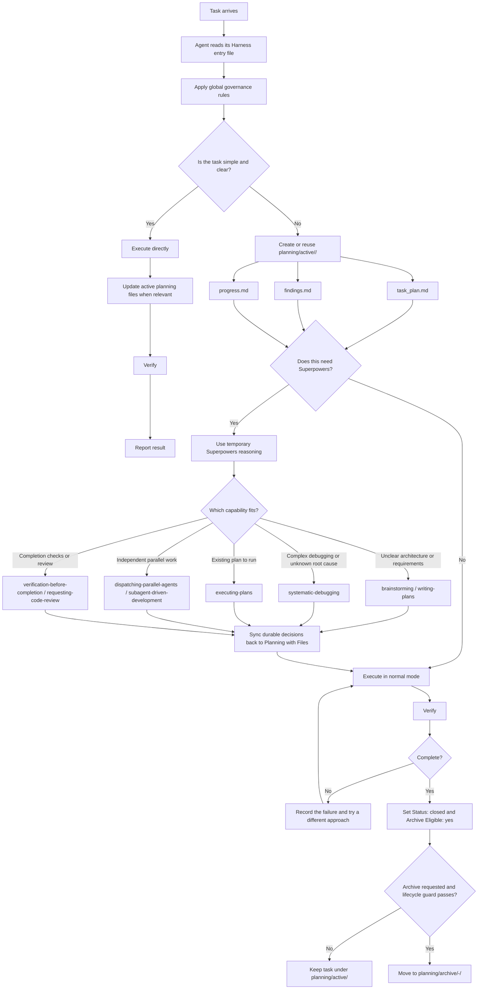
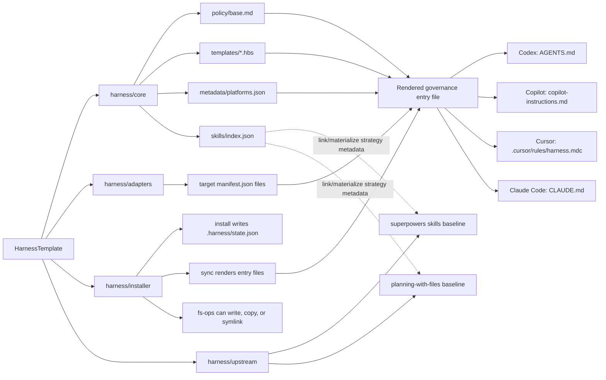

# HarnessTemplate

HarnessTemplate is a reusable workflow template for agents and humans working in the same repository. It gives Codex, GitHub Copilot, Cursor, and Claude Code one shared governance policy while preserving each tool's native instruction entrypoint.

The core model is simple:

- `planning-with-files` is the durable task memory.
- `superpowers` is optional, temporary reasoning support.
- Rendered entry files carry the same Harness policy into each IDE or agent.
- Workspace, user-global, and combined installation scopes are supported.

## Quick Start

```bash
./scripts/harness install --scope=workspace --targets=all --projection=link
./scripts/harness sync
./scripts/harness doctor
```

`workspace` is the default scope. Use `both` when you want a user-level Harness policy plus repository-local entrypoints.

## Workflow

Harness routes work through one global governance policy before any tool-specific behavior matters. The default path is lightweight: do the work directly, keep the active planning files current, and verify before reporting back. Superpowers are reserved for cases where their extra structure is worth the cost.



## Complex Request Mode

For broad requests with mixed bug fixes, UI changes, product strategy, release checks, or App Store preparation, use this order:

```text
Planning with Files master orchestration
-> worktree/branch isolation when risk or parallelism requires it
-> per-phase Superpowers reasoning only when justified
-> scoped subagent execution
-> main-agent review and verification
-> sync back to Planning with Files
```

Rendered entry files carry this mode into Codex, GitHub Copilot, Cursor, and Claude Code. The main agent remains responsible for file ownership boundaries, integration, verification, and syncing durable decisions back to the active Planning with Files task.

Use Superpowers only when the architecture is unclear, requirements are ambiguous, debugging is complex, the root cause is not obvious, or deep structured reasoning is explicitly requested. If Superpowers are used, durable decisions must be copied back into the task's three Planning with Files documents.

## Installation Structure

Harness has four layers:

- `harness/core`: platform-neutral policy, templates, metadata, skill projection metadata, and schemas.
- `harness/adapters`: target-specific manifests for Codex, Copilot, Cursor, and Claude Code.
- `harness/installer`: CLI commands and projection logic.
- `harness/upstream`: vendored baselines for `superpowers` and `planning-with-files`.



Current implementation note: `sync` renders instruction entry files as real files. Skill projection strategies are modeled and tested, but skill filesystem projection is not wired into `sync` yet. There is no hard-link implementation; the filesystem helpers support real files and symlinks.

## Entry Files

| Target | Workspace entry | User-global entry | Current file behavior |
| --- | --- | --- | --- |
| Codex | `AGENTS.md` | `~/.codex/AGENTS.md` | Rendered real file |
| GitHub Copilot | `.copilot/copilot-instructions.md` | `~/.copilot/copilot-instructions.md` | Rendered real file |
| Cursor | `.cursor/rules/harness.mdc` | `~/.cursor/rules/harness.mdc` | Rendered real file |
| Claude Code | `CLAUDE.md` | `~/.claude/CLAUDE.md` | Rendered real file |

## Skill Projection Metadata

| Skill baseline | Codex | GitHub Copilot | Cursor | Claude Code |
| --- | --- | --- | --- | --- |
| `harness/upstream/superpowers/skills` | `link` | `link` | `link` | `link` |
| `harness/upstream/planning-with-files` | `link` | `materialize` | `link` | `link` |

Copilot uses `materialize` for `planning-with-files` because its skill and hook behavior differs from Codex and Claude Code. Other targets prefer symlink-compatible projections when skill projection is implemented.

## Common Commands

```bash
./scripts/harness install
./scripts/harness sync
./scripts/harness doctor
./scripts/harness status
./scripts/harness fetch
./scripts/harness update
```

## Documentation

- [Architecture](docs/architecture.md)
- [Maintenance](docs/maintenance.md)
- [Release](docs/release.md)
- [Codex installation](docs/install/codex.md)
- [GitHub Copilot installation](docs/install/copilot.md)
- [Cursor installation](docs/install/cursor.md)
- [Claude Code installation](docs/install/claude-code.md)
