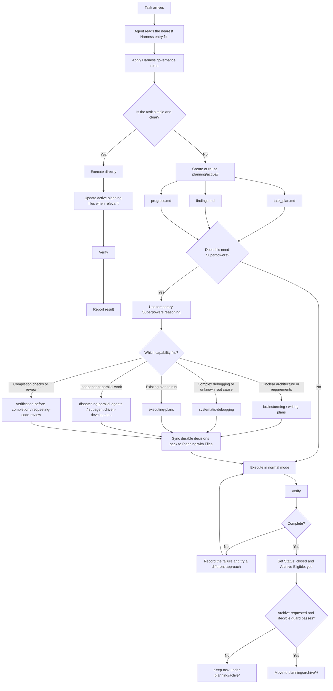
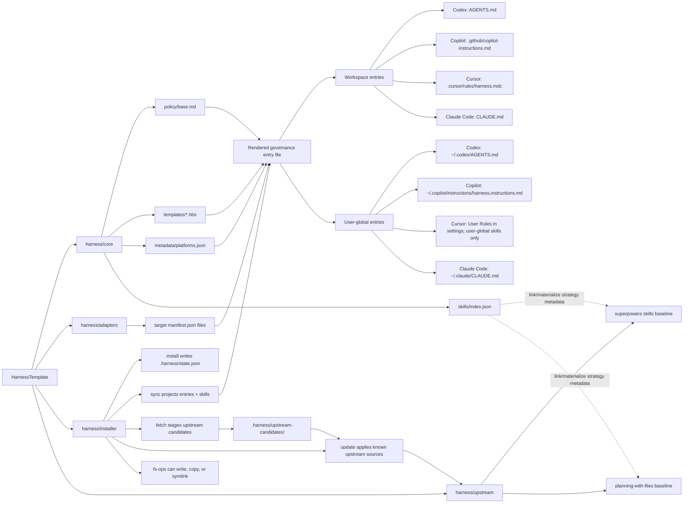

# HarnessTemplate

HarnessTemplate is a higher-level governance harness for humans and agents working in local projects. It turns one shared policy into the native instruction entry files used by Codex, GitHub Copilot, Cursor, and Claude Code.

Use it at workspace scope when a single project should carry its own rules. Use it at user-global scope when you want the same Harness baseline across local projects. Use `both` when a project needs local entry files and a user-level baseline.

## What It Gives You

- `planning-with-files` as durable task memory under `planning/active/<task-id>/`.
- `superpowers` as temporary reasoning support for complex planning, debugging, execution, review, and verification.
- Rendered governance entry files for Codex, GitHub Copilot, Cursor, and Claude Code.
- Workspace, user-global, and combined installation scopes.
- Optional hook projection for verified target adapters.
- Staged upstream updates for vendored `superpowers` and `planning-with-files` baselines.

Harness is the top-level local integration layer. Lower-level skills, project rules, or local routers such as Carnival can stay in place, but Harness should decide when and how those lower-level capabilities are used.

## Quick Start

New workspace:

```bash
./scripts/harness install --scope=workspace --targets=all --projection=link
./scripts/harness sync
./scripts/harness doctor
```

New user-global baseline:

```bash
./scripts/harness install --scope=user-global --targets=all --projection=link
./scripts/harness sync
./scripts/harness doctor
```

Workspace scope is the default and safest starting point because it keeps Harness local to the repository. Use user-global scope when you want new local projects to inherit the same baseline. Use `both` when you want shared user-level rules plus repository-local entry files:

```bash
./scripts/harness install --scope=both --targets=all --projection=link
./scripts/harness sync
./scripts/harness doctor
```

For an existing setup, inspect the current workspace and user-global entry files before syncing. `sync` writes rendered entry files to the configured target paths, so choose whether Harness should replace, update, enhance, or wrap what is already there.

## Integration Modes

| Mode | Use when | Result |
| --- | --- | --- |
| Replace | Existing workspace or user-global rules should be retired. | Harness-rendered entry files become the rule source for the selected scope. |
| Update | A previous Harness install already owns the selected scope. | `sync` refreshes the rendered entry files from the current HarnessTemplate policy. |
| Enhance | Existing lower-level skills or rules are still useful. | Harness becomes the higher-level policy and routes into those capabilities when appropriate. |
| Wrap | A local router or framework already coordinates lower-level behavior. | Harness stays above it, sets governance, and calls into that router only as a scoped capability. |

Recommended path:

1. Start with `workspace` scope for a single project.
2. Move to `user-global` only when the same Harness baseline should apply across projects.
3. Use `both` when the global baseline should exist, but this repository still needs explicit local entry files.
4. Before replacing user-global files, preserve any local rules that should become lower-level capabilities under Harness.

## Workflow

Harness routes work through one governance policy before tool-specific behavior matters. The default path is lightweight: do the work directly, keep the active planning files current, and verify before reporting back. Superpowers are reserved for cases where their extra structure is worth the cost.



## Complex Request Mode

For broad requests with mixed bug fixes, UI changes, product strategy, release checks, or App Store preparation, use this order:

```text
Planning with Files master orchestration
-> worktree base preflight when isolation is needed
-> worktree/branch isolation with an explicit base ref
-> per-phase Superpowers reasoning only when justified
-> scoped subagent execution
-> main-agent review and verification
-> sync back to Planning with Files
```

Rendered entry files carry this mode into Codex, GitHub Copilot, Cursor, and Claude Code. The main agent remains responsible for file ownership boundaries, integration, verification, and syncing durable decisions back to the active Planning with Files task.

Use Superpowers only when the architecture is unclear, requirements are ambiguous, debugging is complex, the root cause is not obvious, or deep structured reasoning is explicitly requested. If Superpowers are used, durable decisions must be copied back into the task's three Planning with Files documents.

Before creating an isolated worktree, run the Harness-owned preflight command and use its explicit start point:

```bash
./scripts/harness worktree-preflight
git worktree add <path> -b <new-branch> <base-ref>
```

Record the reported `Worktree base: <base-ref> @ <base-sha>` in the active task's Planning with Files documents. This keeps simple `dev` or feature-branch sessions from accidentally forking work from `main`, while still allowing clean trunk-based work when the current context is intentionally `main` or `master`.

## Installation Structure

Harness has four layers:

- `harness/core`: shared policy, templates, metadata, skill projection metadata, and schemas.
- `harness/adapters`: target-specific manifests for Codex, Copilot, Cursor, and Claude Code.
- `harness/installer`: CLI commands, projection logic, and health checks.
- `harness/upstream`: vendored baselines for `superpowers` and `planning-with-files`.



`sync` now projects both entry files and skills. Link projections use symlinks; materialized projections copy directories. Existing non-Harness-owned files are not overwritten unless `./scripts/harness sync --conflict=backup` is used.

## Entry Files

| Target | Workspace entry | User-global entry | Behavior |
| --- | --- | --- | --- |
| Codex | `AGENTS.md` | `~/.codex/AGENTS.md` | Rendered file |
| GitHub Copilot | `.github/copilot-instructions.md` | `~/.copilot/instructions/harness.instructions.md` | Rendered file |
| Cursor | `.cursor/rules/harness.mdc` | User Rules in Cursor Settings; no rendered file-system entry | Workspace rendered file; user-global skills only |
| Claude Code | `CLAUDE.md` | `~/.claude/CLAUDE.md` | Rendered file |

GitHub Copilot follows VS Code's default instruction file locations: workspace instructions live under `.github`, while user profile instructions live under `~/.copilot/instructions` as `*.instructions.md` files. Harness renders the Copilot user-global file with `applyTo: "**"` frontmatter so it is applied automatically across workspaces. The legacy `~/.copilot/copilot-instructions.md` path is not used.

## Skills

| Skill baseline | Codex | GitHub Copilot | Cursor | Claude Code |
| --- | --- | --- | --- | --- |
| `harness/upstream/superpowers/skills` | `link` | `link` | `link` | `link` |
| `harness/upstream/planning-with-files` | `link` | `materialize` | `link` | `link` |

GitHub Copilot materializes `planning-with-files` because it is the durable task-state system and must remain visible in environments where symlinked external skill directories may not be indexed reliably. Other skill baselines use links to preserve a single upstream source. `projectionMode: "portable"` materializes link-preferred skills too.

Skill target roots:

| Target | Workspace skill root | User-global skill root |
| --- | --- | --- |
| Codex | `.codex/skills` | `~/.codex/skills` |
| GitHub Copilot | `.github/skills` | `~/.copilot/skills` |
| Cursor | `.cursor/skills` | `~/.cursor/skills` |
| Claude Code | `.claude/skills` | `~/.claude/skills` |

## Hooks

Hooks are opt-in. The default install keeps hook mode off and projects entry files plus skills only:

```bash
./scripts/harness install --scope=workspace --targets=all --projection=link
```

Enable hook projection explicitly:

```bash
./scripts/harness install --scope=workspace --targets=all --projection=link --hooks=on
./scripts/harness sync
./scripts/harness doctor --check-only
```

Harness installs only verified hook adapters. Unsupported adapters appear in `status` and `doctor` output as unsupported, but they do not fail health checks.

| Hook source | Codex | GitHub Copilot | Cursor | Claude Code |
| --- | --- | --- | --- | --- |
| `planning-with-files` task-scoped hook | Unsupported | Supported | Supported | Supported |
| `superpowers` upstream hooks | Unsupported | Unsupported | Supported | Supported |

Hook targets:

| Target | Workspace hook files | User-global hook files |
| --- | --- | --- |
| Codex | Not projected | Not projected |
| GitHub Copilot | `.github/hooks/planning-with-files.json`, `.github/hooks/task-scoped-hook.sh` | `~/.copilot/hooks/planning-with-files.json`, `~/.copilot/hooks/task-scoped-hook.sh` |
| Cursor | `.cursor/hooks.json`, `.cursor/hooks/*` | `~/.cursor/hooks.json`, `~/.cursor/hooks/*` |
| Claude Code | `.claude/settings.json`, `.claude/hooks/*` | `~/.claude/settings.json`, `~/.claude/hooks/*` |

Hook config/settings JSON merge is conservative. Harness-managed hook entries are marked with `Harness-managed ... hook`; `sync` replaces prior Harness-managed entries for the same skill and preserves unrelated user hook entries. Malformed hook config or settings JSON files require `./scripts/harness sync --conflict=backup`.

## Upstream Updates

Harness keeps governance separate from vendored skill baselines. `fetch` stages candidates under `.harness/upstream-candidates/<source>`. `update` applies them only to `harness/upstream/<source>`. The next `sync` projects the refreshed baseline into IDE directories.

```bash
./scripts/harness fetch
./scripts/harness update
```

Both baselines are Git-backed. To update one baseline, pass its source name:

```bash
./scripts/harness fetch --source=superpowers
./scripts/harness fetch --source=planning-with-files
./scripts/harness update --source=superpowers
./scripts/harness update --source=planning-with-files
```

After updating upstream baselines, rerun repository verification before syncing installed projections:

```bash
npm run verify
./scripts/harness sync
./scripts/harness doctor
```

## Commands and Docs

```bash
./scripts/harness install
./scripts/harness sync
./scripts/harness doctor
./scripts/harness status
./scripts/harness fetch
./scripts/harness update
./scripts/harness worktree-preflight
```

- [Architecture](docs/architecture.md)
- [Maintenance](docs/maintenance.md)
- [Release](docs/release.md)
- [Codex installation](docs/install/codex.md)
- [GitHub Copilot installation](docs/install/copilot.md)
- [Cursor installation](docs/install/cursor.md)
- [Claude Code installation](docs/install/claude-code.md)
