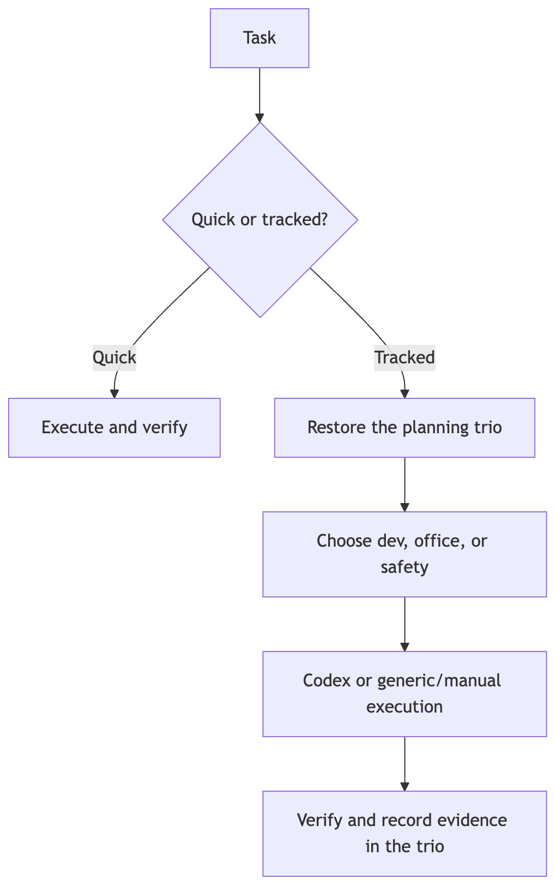
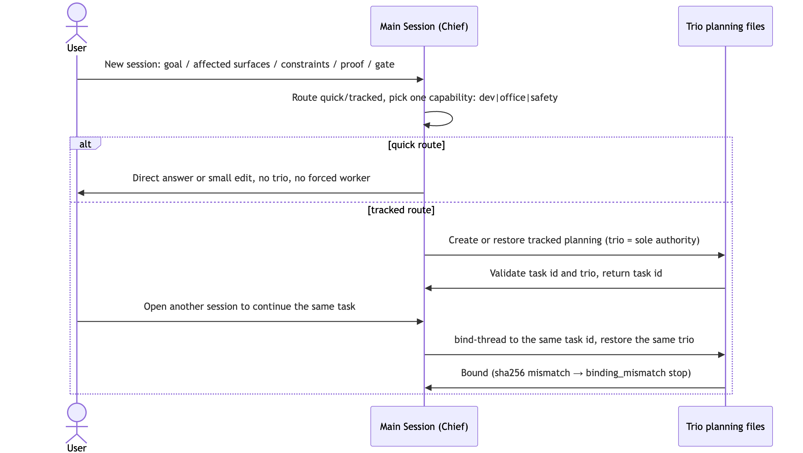
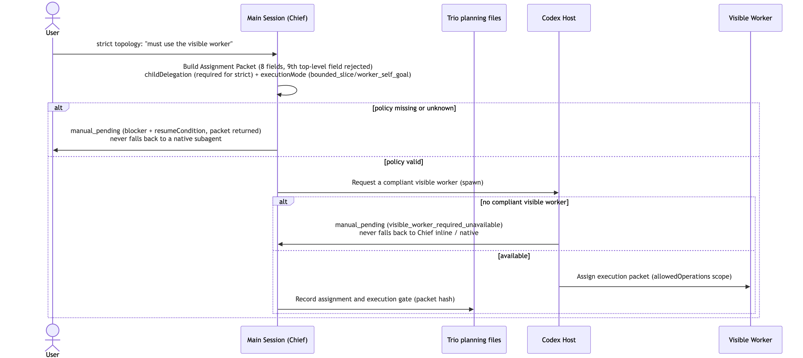
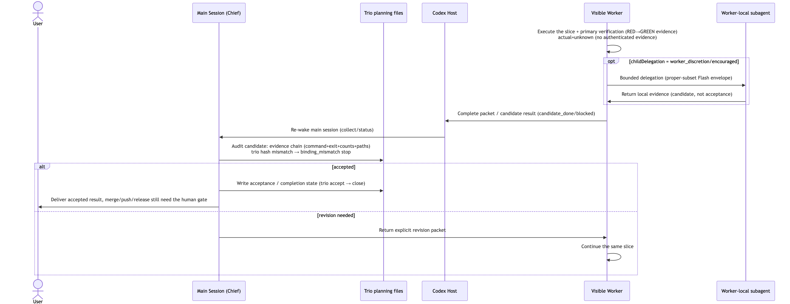

# superpowering-with-files

A lightweight Trio workflow for local coding-agent work: planning-trio task state, one capability pack at a time, tracked execution via a visible `swf_executor` worker, Codex as managed native host (others: generic/manual fallback). It is a harness, not an IDE — it classifies requests, applies rules, picks the executor, decides when a result is done, and keeps human gates. Agents: [AGENTS.md](AGENTS.md) is the binding policy; humans: use the intake table.

## What the harness does

- Routes `quick` / `tracked` / `deep` (deep: per-round reasoning); picks one pack: `dev` / `office` / `safety`.
- Keeps the planning trio as the only durable task authority for tracked work.
- Routes tracked changes to the visible `swf_executor` role with a requested economic profile (Flash, high/xhigh/max); never silent fallback — no compliant worker means `manual_pending` (`blocker` + `resumeCondition`).
- Enforces three-layer permission governance (scope → sandbox → approval); approval never expands allowed paths.
- Retains human gates (merge, push, publish, release, send, credentials, destructive) and a command surface (list below).

## How the harness controls work

| Layer | Where it lives | What it does |
|---|---|---|
| Entry policy | [AGENTS.md](AGENTS.md) | Injected every session: route first, one pack, human gates. |
| Skills | [`.agents/skills/trio/`](.agents/skills/trio/SKILL.md) | Quality contracts: `dev` / `office` / `safety` + `chiefops`. |
| Durable record | `planning/active/<task-id>/` | Only authority for task outcome, scope, evidence. |
| Decision core | [`harness/trio/core/routing.mjs`](harness/trio/core/routing.mjs) | Pure logic: assignment packet, sha256 binding, permission adjudication, `manual_pending`. |
| Host adapters | [`harness/trio/hosts/codex.mjs`](harness/trio/hosts/codex.mjs), `generic.mjs` | Translate the contract into host form (`swf_executor` for Codex); generic fallback. |
| Command surface | [`scripts/harness`](scripts/harness) | Operator CLI (see below). |
| Runtime logs | `.harness/runtime-hooks/*.jsonl` | Per-host session logs; audit evidence, not rules. |
| Human gates | every layer | Merge, push, publish, release, send, credentials, destructive — always require a human. |
| Host plugins | [`plugins/`](plugins/) (e.g. `plugins/dsh/`) | Same governance for other hosts (DeepSeek Harness cordis). |

## Control scope

**Controls:** routing and pack selection; durable task record; visible-worker topology and evidence; permission adjudication; human gates; budgets and approval flows in host plugins.

**Never claims:** scheduler or daemon behavior; authenticated model evidence it lacks (`actual` stays `unknown` until the Host authenticates it); an unimplemented Host lifecycle bridge (honest exit: `manual_pending`); silent fallback.

## Core model



## Durable task authority

For tracked tasks the only durable authority is:

```text
planning/active/<task-id>/task_plan.md   # outcome, scope, completion criteria
planning/active/<task-id>/findings.md    # verified facts and constraints
planning/active/<task-id>/progress.md    # execution and verification evidence
```

Quick tasks need no trio. Tracked work restores the three files before substantive rounds; a worker result is only a candidate until the main session accepts it.

## Capability packs

One pack per task: `dev` — implementation, debugging, tests, review; `office` — documents, spreadsheets, presentations, PDFs; `safety` — destructive, security-sensitive, external-effect decisions. Packs guide quality only; they never own task state, Host lifecycle, permissions, or human gates.

## Human intake: how to ask, what to expect

Plain language, no ceremony; add goal, affected surfaces, constraints, proof, and stopping gate when relevant.

| Scenario | How to ask | What you get |
|---|---|---|
| Quick (Q&A / small edit) | One line | Direct answer or small edit; no trio, no worker |
| Tracked (default) | One paragraph: goal, surfaces, constraints, proof, gate | Trio → slice plan → candidate → your acceptance → you decide merge |
| Strict (visible worker) | Add: "visible swf_executor role, no hidden subagent" | `visible_worker_required` packet; if unavailable → `manual_pending`, never silent fallback |
| Deep (analyze first) | "Analyze first with evidence; I approve before touching code" | Evidence-backed analysis; execution only after your approval |
| Human gate | State the stop: "stop at draft PR" / "no push" / "confirm before release" | Stops at the gate; confirmation always retained |
| After `manual_pending` | Don't repeat the request; pick one of the three resolutions | Continues via `blocker` + `resumeCondition` |

`manual_pending` resolutions: ① provide a compliant visible worker (manual bind with the exact packet) ② release the strict topology (legacy chain) ③ wait, or record the blocker as `blocked`.

## Basic workflow

Three diagrams (mermaid sources: [docs/trio-v2/workflow.md](docs/trio-v2/workflow.md)); operator guide (Chinese): [docs/trio-v2/human-usage.md](docs/trio-v2/human-usage.md).

### 1. Routing and binding



### 2. Strict topology and dispatch gates



### 3. Execution, acceptance, and revision



Guiding notes:

- **Permission gate** — three ordered layers: scope (`allowedOperations.files` is the only authorization source; out-of-scope and materialized outputs like `generated_target` are blocked) → sandbox (authenticated evidence + matching packet digest; writable roots must cover the target) → approval (allow/deny only; never expands allowed paths).
- **Requested vs actual** — requested model/effort are intent; `actual` stays `unknown` until the Host authenticates it; a result is a candidate until Chief acceptance and Trio writeback.
- **Human gates** — merge/push/release/publish/send/credentials/destructive actions are retained at all times.
- **Host bridge** — the local fail-closed routing contract is implemented; the Host lifecycle bridge (authenticated spawn/continue/status/interrupt/collect, dynamic child rejection) is not; until it exists, the honest exit is `manual_pending`, never local simulation or bypass.

Audits: [2026-08-09-plan-execute-deepseek-executor-audit.md](reports/audit/2026-08-09-plan-execute-deepseek-executor-audit.md) and [2026-08-09-economic-execution-routing-20260809-conclusion.md](reports/audit/2026-08-09-economic-execution-routing-20260809-conclusion.md).

## Public commands

`install`, `sync`, `doctor`, `trio`, `verify`, `checkpoint`, `token-audit`. `trio` creates/restores tracked state; `verify` runs supported verification; `checkpoint` precedes recovery-sensitive changes. Commands never bypass Host or human gates.

### Existing user-global governance-surface takeover

`./scripts/harness install --takeover-chiefops` adopts one unowned user-global governance surface (ChiefOps) when the authority root holds an eligible schema-v2 `user-global` state. Eligibility fails closed: exactly one enabled managed Codex placement, exactly the five owned Trio surfaces, exactly one unowned ChiefOps target, no second managed conflict, no unsafe physical paths. Writes are bound to preimage-stable captures with a read-back-verified immutable backup under `<authorityRoot>/.harness-backup/trio-takeover/<id>/`; it never merges, pushes, or publishes automatically. Run only from the authority root with a separate human gate; verify with `sync --check` / `doctor --check-only`. See [docs/install/codex.md](docs/install/codex.md) and [docs/trio-v2/cutover.md](docs/trio-v2/cutover.md).

## Codex plugin

The only packaged artifact is `harness-codex-plugin-<version>.tgz`: `.codex-plugin/plugin.json` + five skill files (the four Trio skills plus ChiefOps). Experimental source plugins live in [`plugins/`](plugins/) — e.g. [`plugins/dsh/`](plugins/dsh/README.md) packages the same governance for DeepSeek Harness (cordis); source-first, not published to npm.

See [Codex installation](docs/install/codex.md), [plugin package installation](docs/install/plugin-packages.md), and [release artifacts](docs/release-plugin-artifacts.md).

## Boundaries

Codex is the only managed native target; its plugin carries the Trio policy and the three packs; generic/manual is guidance for hosts without a managed artifact. The Host owns worker/subtask lifecycle, permissions, continuation, and human gates; the main session plans, integrates, accepts, and writes the trio. This repository documents the current local Trio contract; it does not claim any existing global installation has been migrated. Keep generic/manual hosts on their own documented setup path, with human approval for external or irreversible actions.
