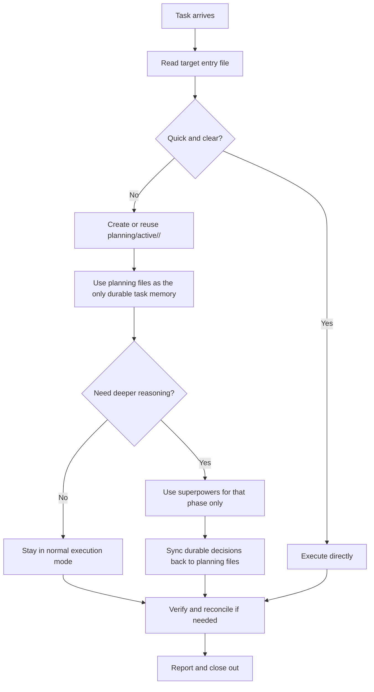

# superpowering-with-files

superpowering-with-files is a governance harness for local coding-agent workflows. It turns one shared policy into native entry files, projected skills, and optional hooks for Codex, GitHub Copilot, Cursor, and Claude Code.

It is built around four rules:

- `planning-with-files` owns durable task state.
- `superpowers` stays optional and temporary.
- Harness projects one policy into each target's native shape.
- `safety` stays opt-in for risky or long-running work.

## Core Model

Harness separates entry guidance, durable task memory, optional reasoning, and platform projection.


```mermaid
flowchart TD
    A["Task arrives"] --> B["Read target entry file"]
    B --> C{"Quick and clear?"}
    C -- "Yes" --> D["Execute directly"]
    C -- "No" --> E["Create or reuse planning/active/<task-id>/"]
    E --> F["Use planning files as the only durable task memory"]
    F --> G{"Need deeper reasoning?"}
    G -- "Yes" --> H["Use superpowers for that phase only"]
    G -- "No" --> I["Stay in normal execution mode"]
    H --> J["Sync durable decisions back to planning files"]
    I --> K["Verify and reconcile if needed"]
    J --> K
    D --> K
    K --> L["Report and close out"]
```

### Durable task state

| Path | Role |
| --- | --- |
| `planning/active/<task-id>/task_plan.md` | phases, lifecycle, decisions |
| `planning/active/<task-id>/findings.md` | durable findings and constraints |
| `planning/active/<task-id>/progress.md` | session log, checks, changed files |
| `planning/archive/<timestamp>-<task-id>/` | closed task history after lifecycle guard passes |

Rules:

1. `planning-with-files` is the only durable task-memory system.
2. Tracked tasks still use `planning/active/<task-id>/` even when implementation is straightforward.
3. Superpowers may assist deep-reasoning phases, but durable state always syncs back to the active task.
4. Reconcile sits between verify and finish/archive when a tracked task changes meaningful behavior, policy, workflow, or support contracts.

### Goal-like continuations

Harness keeps `/goal`, `/plan-goal`, and similar continuations native. It does not add a second runner.

At each substantive round:

1. reopen `task_plan.md`, `progress.md`, and `findings.md`
2. reclassify the round as `quick`, `tracked`, or `deep-reasoning`
3. keep quick rounds light
4. keep `planning/active/<task-id>/` authoritative for tracked rounds
5. use companion-plan + reviewer discipline only for deep-reasoning rounds

## Quick Start

### Workspace install

```bash
./scripts/harness install --scope=workspace --targets=all --projection=link
./scripts/harness sync
./scripts/harness doctor
```

### User-global bootstrap or refresh

```bash
./scripts/harness adopt-global
./scripts/harness adoption-status
```

Notes:

- user-global and `--scope=both` installs default to the lean `minimal-global` skill profile
- use `--skills-profile=full` only when a workspace intentionally needs the complete skill surface
- `sync --dry-run` is the safe preview before any projection change

## Workflow Lanes

Harness exposes a small operator-facing lane map:

- `plan`: create or restore tracked task state and worktree context
- `cloud-dev`: stage remote-only work from `origin/dev` without mutating the local checkout
- `review`: inspect plans, diffs, PRs, and archive decisions
- `verify`: run focused checks, full verification, dry-runs, and doctor
- `reconcile`: align intent, actual changes, evidence, and follow-up before finish/archive
- `finish`: return scoped work to the recorded base and update task state
- `release`: align verified `dev`, release docs, adoption state, and `main`
- `archive`: close and archive only after lifecycle and reconcile gates pass

See [Workflows](docs/workflows.md) for when to use each lane.

## Implementation Shape

Harness has six implementation layers:

- `harness/core`: canonical policy, templates, metadata, schemas
- `harness/adapters`: target-specific projection contracts
- `harness/installer`: install, sync, doctor, status, update, adoption
- `harness/runtime`: shared services used by CLI and MCP
- `harness/mcp`: governed MCP facade over runtime services
- `harness/upstream`: vendored `superpowers` and `planning-with-files` baselines

The key separation is:

- adapters own platform projection
- runtime owns reusable behavior
- MCP exposes runtime as a compatibility/control surface
- upstream baselines stay upstream; local policy lives in Harness-owned layers

### Shared skill roots

| Target | Workspace skill root | User-global skill root | Strategy |
| --- | --- | --- | --- |
| Codex | `.agents/skills` | `~/.agents/skills` | materialized |
| GitHub Copilot | `.agents/skills` | `~/.agents/skills` | materialized |
| Cursor | `.agents/skills` | `~/.agents/skills` | materialized |
| Claude Code | `.claude/skills` | `~/.claude/skills` | materialized |

GitHub Copilot may switch the workspace root to `.github/skills` for the optional `github-cloud` deployment profile. That is a deployment-specific exception, not the shared default.

See [Architecture](docs/architecture.md) for the detailed layer and source-of-truth model.

## Common Commands

```bash
./scripts/harness install
./scripts/harness sync
./scripts/harness sync --dry-run
./scripts/harness doctor --check-only
./scripts/harness status
./scripts/harness verify --output=.harness/verification
./scripts/harness active-summary
./scripts/harness summary --task <task-id>
./scripts/harness worktree-preflight --task <task-id>
./scripts/harness worktree-name --task <task-id> --namespace <prefix>
./scripts/harness adopt-global
./scripts/harness adoption-status
./scripts/harness fetch
./scripts/harness update
```

## Read Next

### Start here

- [Workflows](docs/workflows.md) for the lane map
- [Adoption starter kit](docs/install/adoption-starter-kit.md) for safe rollout choices
- [Platform support](docs/install/platform-support.md) for target coverage and caveats

### Operate and maintain

- [Maintenance](docs/maintenance.md) for lifecycle audit, upkeep, sync/update/archive discipline
- [Reconciliation](docs/reconciliation.md) for source-of-truth conflict handling and archive readiness
- [State convergence](docs/state-convergence.md) for roadmap/backlog/planning alignment

### Understand the implementation

- [Architecture](docs/architecture.md) for implementation layers and boundaries
- [MCP read-only compatibility](docs/mcp-read-only-compatibility.md) for compatibility tiers and write-promotion gates
- [Cloud Dev Harness](docs/cloud-dev-harness.md) and [Cloud Dev parity](docs/cloud-dev-parity.md) for remote staging and evidence-gated cloud work

### Platform installs

- [Codex installation](docs/install/codex.md)
- [GitHub Copilot installation](docs/install/copilot.md)
- [Cursor installation](docs/install/cursor.md)
- [Claude Code installation](docs/install/claude-code.md)
- [Harness packed plugin installation](docs/install/plugin-packages.md)

## Status And Boundaries

- Supported installer-managed targets today: Codex, GitHub Copilot, Cursor, Claude Code
- Gemini CLI is not currently a supported installer target
- `safety` is opt-in, not the default baseline
- `cloud-dev` is a remote staging lane, not a replacement for local verification
- MCP is a compatibility/runtime facade, not a fifth projection adapter

## Upstream, License, Credit

Harness vendors two upstream systems and adds stricter local governance on top.

| Upstream | Original role | License | Harness usage |
| --- | --- | --- | --- |
| [`superpowers`](https://github.com/obra/superpowers) | agentic skills framework and workflow | MIT | optional reasoning layer for deep-reasoning phases |
| [`planning-with-files`](https://github.com/OthmanAdi/planning-with-files) | persistent markdown planning and session recovery | MIT | the only durable task-memory system |

Thanks to the upstream authors and communities whose work this repository builds on.
