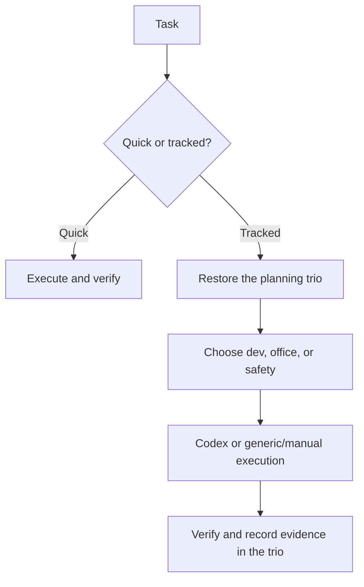

# superpowering-with-files

superpowering-with-files is a lightweight Trio workflow for local coding-agent work. It keeps durable task state in a planning trio, applies one capability pack at a time, and treats Codex as the managed native host. Other hosts use the generic/manual fallback.

## Core model


```mermaid
flowchart TD
    A["Task"] --> B{"Quick or tracked?"}
    B -- "Quick" --> C["Execute and verify"]
    B -- "Tracked" --> D["Restore the planning trio"]
    D --> E["Choose dev, office, or safety"]
    E --> F["Codex or generic/manual execution"]
    F --> G["Verify and record evidence in the trio"]
```

### Durable task authority

For every tracked task, the only durable task authority is:

```text
planning/active/<task-id>/task_plan.md
planning/active/<task-id>/findings.md
planning/active/<task-id>/progress.md
```

`task_plan.md` records the outcome, scope, and completion criteria. `findings.md` records verified facts and constraints. `progress.md` records execution and verification evidence.

Quick tasks do not need a trio. Tracked work restores the three files before a substantive round. A worker result is only a candidate until the main session accepts it and records the outcome in the trio.

### Capability packs

Select exactly one pack for a task:

- `dev` for implementation, debugging, tests, and code review.
- `office` for source-backed documents, spreadsheets, presentations, and PDFs.
- `safety` for destructive, security-sensitive, or external-effect decisions.

The packs guide quality behavior. They do not replace the planning trio or Host-owned worker lifecycle, permissions, and human gates.

### Host boundary

Codex is the only managed native target. Its plugin contains the Trio entry policy and the `dev`, `office`, and `safety` packs. Generic/manual fallback is guidance for hosts without a managed native artifact.

Requested model and reasoning effort are intent. Actual values remain unknown unless the Host authenticates them. The main session plans, integrates, and accepts; bounded workers execute assigned slices and return evidence.

### Plan → Execute usage at a glance

Tracked production changes are routed to the visible `swf_executor` execution role with a requested economic profile (DeepSeek Flash provider, xhigh effort, no fallback). Requested values are routing intent: the actual provider, model, and effort remain `unknown` until the Host authenticates them. When strict routing requires a visible worker and no compliant one is available, the result is `manual_pending`, never a silent native fallback. A worker result is a candidate until the main session accepts it. Say what you need in plain language — no skill invocation or task ceremony is required.

| Route | How you ask | What you get |
|---|---|---|
| quick (Q&A / small edit) | one-line question, zero ceremony | direct answer/edit, no trio |
| tracked / default | one paragraph: goal, affected surfaces, constraints, acceptance proof, gate | trio + slice plan + `swf_executor` candidate → you accept → you decide merge |
| strict (visible worker required) | add: "must be done by the visible swf_executor role, no hidden subagent" | `visible_worker_required` packet; `manual_pending` if unavailable, never a silent native fallback |
| deep (analyze first) | "analyze first with evidence, I approve before you touch code" | evidence-backed analysis report, then execution |
| human gate | state the stopping point ("stop at a draft PR" / "no push" / "confirm before release") | stops at the gate; human confirmation is always retained |
| after `manual_pending` | don't repeat the request; pick one: provide a compliant worker / release strict / confirm blocked | handled via the descriptor's `blocker` and `resumeCondition` |

Full operator guide (Chinese): [docs/trio-v2/human-usage.md](docs/trio-v2/human-usage.md). Audits: [2026-08-09-plan-execute-deepseek-executor-audit.md](reports/audit/2026-08-09-plan-execute-deepseek-executor-audit.md) and [2026-08-09-economic-execution-routing-20260809-conclusion.md](reports/audit/2026-08-09-economic-execution-routing-20260809-conclusion.md).

## Public commands

The public command list is: `install`, `sync`, `doctor`, `trio`, `verify`, `checkpoint`, and `token-audit`.

Use `trio` to create or restore tracked task state. Use `verify` for the repository's supported verification surfaces. Use `checkpoint` before a scoped local recovery-sensitive change. These commands do not bypass Host or human gates for external, destructive, security-sensitive, merge, release, or publish actions.

### Existing user-global governance-surface takeover

The dedicated takeover flag on `./scripts/harness install` (documented in [docs/install/codex.md](docs/install/codex.md)) adopts one unowned user-global governance surface when the durable authority root already holds an eligible schema-v2 `user-global` state. It is the only V2 path that writes a managed user-global destination beyond the five core Trio surfaces; ordinary `install` stays workspace-only and normal `sync` keeps only `--dry-run` and `--check`.

Eligibility is strict: exactly one enabled managed Codex user-global placement at `<home>/.codex/AGENTS.md`, ownership of exactly the five existing Trio surfaces (entry plus `trio`, `dev`, `office`, `safety`) with content matching their ownership identities, and exactly one unowned governance destination. Absent or V1 state, workspace/both scope, a wrong placement, an already-owned governance surface, a second managed conflict, or any unsafe physical path are rejected before any write. Generic/manual targets are preserved and never written.

Before writing, the command takes and revalidates seven stable preimages (the six global Trio surfaces plus the prior V2 state); each capture is `lstat → read → lstat` and requires exact file and parent dev/ino/nlink identities before and after the read, so a replacement between the stat and the read fails closed before any backup or apply write. It then publishes a unique, read-back-verified immutable backup at `<authorityRoot>/.harness-backup/trio-takeover/<id>/` with a `manifest.json` and `bundle.bin` that retain the original bytes, ownership provenance, and the prior recovery values. Before any backup write, every existing backup-root ancestor from the authority root through `.harness-backup/trio-takeover` must be a real, non-symlink directory physically contained under the authority root; a symlinked or escaping ancestor fails closed with no state or target change. The manifest records the pre-takeover `checkpointRef` and `rollbackRef` unchanged. The settled state preserves `ownership.source`, `ownership.manifestRef`, and `recovery.checkpointRef`, appends only the governance surface's ownership, and sets `recovery.rollbackRef` to a parseable `trio-backup-v1:<absolute manifest path>:<sha256>` file reference whose digest is derived from the manifest file bytes as written and re-read. Every write stays bound to the backup preimages (sha256, inode, parent), so a same-content inode replacement fails closed and any mid-apply failure compensates back to the preimages.

The backup is recovery evidence, not a crash or power-loss atomicity guarantee. Run the command only from the durable authority root (the checkout that owns `.harness/state.json`), never from a transient worktree, and only with a separate human gate. It never merges, pushes, publishes, or adopts anything automatically; after the run, verify with `./scripts/harness sync --check` and `doctor --check-only`. See [docs/install/codex.md](docs/install/codex.md), [docs/trio-v2/cutover.md](docs/trio-v2/cutover.md), and [docs/trio-v2/human-usage.md](docs/trio-v2/human-usage.md).

## Codex plugin

The only packaged artifact is `harness-codex-plugin-<version>.tgz`. It contains `.codex-plugin/plugin.json` and exactly four Trio skills:

- `skills/trio/SKILL.md`
- `skills/trio/dev/SKILL.md`
- `skills/trio/office/SKILL.md`
- `skills/trio/safety/SKILL.md`

See [Codex installation](docs/install/codex.md), [plugin package installation](docs/install/plugin-packages.md), and [release artifacts](docs/release-plugin-artifacts.md).

## Boundaries

This repository documents the current local Trio contract. It does not claim that a user's existing global installation has been migrated. Keep a generic/manual host on its own documented setup path, and retain explicit human approval for external or irreversible actions.
