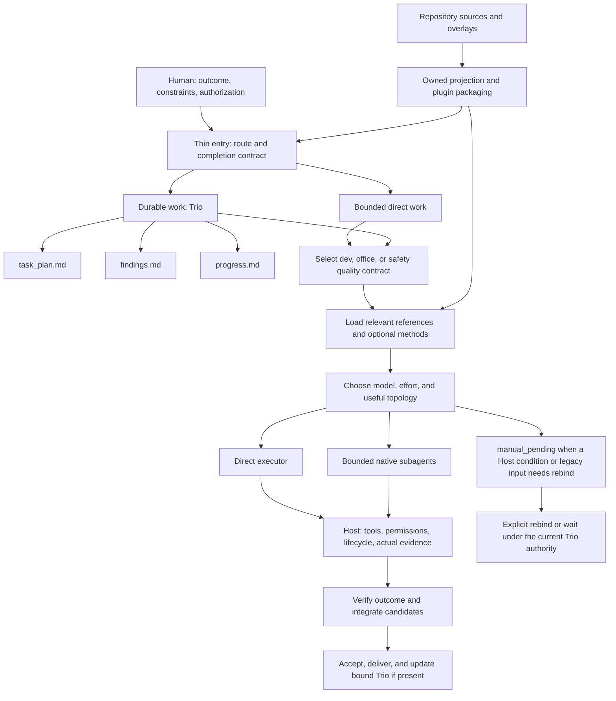
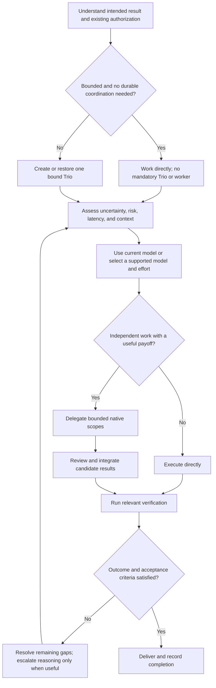

# Superpowering With Files

A lean, model-flexible harness for completing work accurately and efficiently. Human intent sets the outcome and boundaries; the agent chooses the smallest useful process, model, reasoning effort, and execution topology. The Host supplies tools, permissions, worker lifecycle, and authenticated runtime evidence.

## Codex plugin delivery (2026-09-26)

The complete Codex skill bundle is available as a **private local-evaluation release**, [`v2.1.0+codex.20260926`](https://github.com/ilderaj/swf-harness-codex-plugin/releases/tag/v2.1.0%2Bcodex.20260926). Authorized GitHub access is required. Its 42 ordinary skill entries and explicit optional Pen entry, resources, scripts, dependencies, and provenance are in the private package. Public redistribution of bundled third-party material has not been cleared, so this public repository does not contain that exact package source or release asset. See the [Codex plugin operator guide](docs/install/codex-plugin-private.md) for installation, upgrade, rollback, usage, and limitations.

Installing the plugin makes its skills discoverable; it does not replace every Harness surface. Each project must opt in separately through the package's `scripts/project.mjs` if it wants the managed `AGENTS.md` routing block, and a project that already owns its policy is detected instead of rewritten. The plugin does not install or authenticate MCP connectors, Host-owned skills, external runtimes, model access, or other IDE settings. In an enabled Codex project, request a skill explicitly (for example, `$harness-codex-plugin:simple-english`) or describe the task normally; automatic selection is model-driven and should be checked on important work. There is no single runtime command that invokes the entire plugin.

The plugin is the runtime entry for this Harness, and this machine has completed the cutover. The installed plugin is `2.1.0+codex.20260926`, installed from the hash-verified release archive. The legacy global `~/.codex/AGENTS.md` Trio block was replaced by the short plugin entry through the package's reversible `scripts/policy-migration.mjs`; the original bytes are kept in a receipt at `~/.codex/migrations/swf-plugin-policy-20260926/`. This repository's 560-byte `AGENTS.md` stays repository-owned and routes into `$harness-codex-plugin:trio`, and neither `dev` nor `main` materializes the project-local Trio/ChiefOps skill projection any more.

Removing the duplicate global block is measurable: for this project, `codex debug prompt-input` fell from 32,753 to 31,938 characters, `Trio Entry Policy` went from one occurrence to none, `trio/SKILL.md` references from three to one, and the skill entry count stayed at 82 with no bare `trio` or `chiefops` name next to the namespaced entries. Model-backed behaviour of the new package in the isolated clean container is still pending its test account's quota reset on 2026-09-30; the local Host cutover itself is verified. See the [daily workflow guide](docs/codex-plugin-daily-workflow.md) for intake, explicit skill invocation, project opt-in, upgrade, and rollback.

## What changed for Astra

- **Short entries, details on demand.** `AGENTS.md` and skill descriptions carry routing and completion rules. Detailed methods and governance live in referenced files, installed and checked with their owning skill.
- **Astra, Sol, Terra, and Luna can execute.** Model identity is independent from a Chief or worker role name. Explicit model and effort selections survive dispatch. Existing DeepSeek packets retain compatibility.
- **Process follows the task.** Bounded questions, comparisons, reviews, and small changes can finish directly. Durable, resumable work uses the Trio. Delegation is chosen when it reduces uncertainty or elapsed time enough to justify coordination.
- **Clear completion and authorization.** Direct execution can establish completion through relevant verification. Delegated results need integration and acceptance. Existing user authorization continues to apply within its scope; new effects or scope expansions require a fresh decision.
- **Risk-based verification.** Test changed behavior and material failure modes. Text edits do not automatically require TDD, screenshots, multiple reviewers, or a worktree.
- **Reproducible cleanup.** Optional methods have repository-owned sources; redundant local wrappers can be backed up and retired. Raw upstream corpora stay pinned; adaptations live in overlays.

This direction follows [OpenAI's latest model guide](https://developers.openai.com/api/docs/guides/latest-model) and [Eric Provencher's Astra skills discussion](https://x.com/pvncher/status/2095991462416490862), reviewed on 2026-09-06. These sources guide prompt design; they do not prove a local Host capability or performance improvement. See the [migration and acceptance notes](docs/astra-harness-upgrade.md).

## Architecture


```mermaid
flowchart TD
    Human[Human: outcome, constraints, authorization] --> Entry[Thin entry: route and completion contract]
    Entry --> Direct[Bounded direct work]
    Entry --> Tracked[Durable work: Trio]
    Tracked --> Plan[task_plan.md]
    Tracked --> Facts[findings.md]
    Tracked --> Progress[progress.md]
    Direct --> Quality[Select dev, office, or safety quality contract]
    Tracked --> Quality
    Quality --> Methods[Load relevant references and optional methods]
    Methods --> Choice[Choose model, effort, and useful topology]
    Choice --> Inline[Direct executor]
    Choice --> Native[Bounded native subagents]
    Choice --> Pending[manual_pending when a Host condition or legacy input needs rebind]
    Inline --> Host[Host: tools, permissions, lifecycle, actual evidence]
    Native --> Host
    Pending --> Resume[Explicit rebind or wait under the current Trio authority]
    Host --> Verify[Verify outcome and integrate candidates]
    Verify --> Done[Accept, deliver, and update bound Trio if present]
    Source[Repository sources and overlays] --> Projection[Owned projection and plugin packaging]
    Projection --> Entry
    Projection --> Methods
```

The three Trio files are the sole durable authority **for tracked tasks**. Host runtime events, installation receipts, optional-method assets, and verification reports are evidence or configuration, not additional task-state authorities.

| Layer | Source | Responsibility |
|---|---|---|
| Entry and routing skill | [`harness/trio/templates/entry-policy.md`](harness/trio/templates/entry-policy.md), [`trio`](harness/trio/skill/SKILL.md) | Scope, route, completion, capability selection |
| Quality contracts | [`dev`](harness/trio/capabilities/dev/SKILL.md), [`office`](harness/trio/capabilities/office/SKILL.md), [`safety`](harness/trio/capabilities/safety/SKILL.md) | Relevant quality checks and methods |
| Governance companion | [`chiefops`](harness/trio/governance/chiefops/SKILL.md) | Bound-task recovery, delegation, acceptance |
| Decision core | [`routing.mjs`](harness/trio/core/routing.mjs) | Packet binding, scope and permission adjudication |
| Decision-control runtime | [`decision.mjs`](harness/trio/core/decision.mjs), [`evidence.mjs`](harness/trio/core/evidence.mjs), [`shadow.mjs`](harness/trio/core/shadow.mjs) | Frozen semantic decision bundles, deterministic evidence adapters, shadow gates (inert; see [runtime doc](docs/decision-control-runtime.md)) |
| Host adapters | [`hosts/`](harness/trio/hosts/), [`plugins/dsh/`](plugins/dsh/) | Translate supported requests; preserve requested versus actual evidence |
| Distribution | [`projection.mjs`](harness/trio/projection.mjs), [`plugin-kit`](packages/plugin-kit/) | Owned writes, readback, reference files, portable packages |
| Optional methods | [`methods/`](harness/optional-skills/methods/) and upstream overlays | Focused review, debugging, TDD, modeling, planning |

## How decisions flow


```mermaid
flowchart TD
    Start[Understand intended result and existing authorization] --> Bound{Bounded and no durable coordination needed?}
    Bound -->|Yes| Quick[Work directly; no mandatory Trio or worker]
    Bound -->|No| Restore[Create or restore one bound Trio]
    Quick --> Assess[Assess uncertainty, risk, latency, and context]
    Restore --> Assess
    Assess --> Select[Use current model or select a supported model and effort]
    Select --> Parallel{Independent work with a useful payoff?}
    Parallel -->|No| Execute[Execute directly]
    Parallel -->|Yes| Delegate[Delegate bounded native scopes]
    Delegate --> Integrate[Review and integrate candidate results]
    Execute --> Check[Run relevant verification]
    Integrate --> Check
    Check --> Complete{Outcome and acceptance criteria satisfied?}
    Complete -->|No| Refine[Resolve remaining gaps; escalate reasoning only when useful]
    Refine --> Assess
    Complete -->|Yes| Deliver[Deliver and record completion]
```

Root active routing has only direct/native-first and `manual_pending`. A `visible_worker_required` value is legacy input: for every Host operation, return `manual_pending` with blocker `legacy_visible_worker_required_retired`, never restore a Host bridge or fall back to native, and require an explicit `primaryExecution=default` rebind under the current Trio authority before resuming. An explicit request for an independent visible task uses the Host's user-owned task workflow outside internal routing. Historical descriptors and role presets are evidence vocabulary only, not execution evidence.

## Model and reasoning choices

These are starting recommendations, not a benchmark or a forced role roster. Prefer the current model for small work; changing models has a coordination cost. Respect an explicit human choice and the Host's current catalog.

| Work | Useful starting point | Escalate when |
|---|---|---|
| Extraction, local text edits, bounded implementation | Luna, low or medium | Ambiguous requirements or repeated verification failures |
| Ordinary implementation and integration | Terra, medium or high | Cross-module effects or a difficult design decision |
| Broad engineering work or demanding coding | Sol, medium or high | Material uncertainty remains after focused investigation |
| Difficult architecture, reasoning, or cross-domain integration | Astra, medium or high | A specific unresolved issue justifies xhigh or max |
| Independent review | A supported model appropriate to the failure mode | Another perspective can change the decision |

For new assignments, record model and effort explicitly; omitted values retain legacy compatibility defaults. The retired Corleone roster and its role-file renderers have been removed, so no persona name is tied to a model or effort.

Choose effort independently from model and persona. `xhigh` and `max` are selective tools, not defaults. Astra API requests use `low`, `medium`, `high`, `xhigh`, or `max`; a Host-only `ultra` label must have an explicit supported contract. Do not infer an API mapping. Models accept bare IDs or supported `main/` and `p646e20/` Host prefixes; prefixes are not proof of the underlying model. Authenticated Host evidence is required for `actual` model and effort.

## Working and finishing

Quick tasks need no Trio. Tracked tasks use:

```text
planning/active/<task-id>/task_plan.md
planning/active/<task-id>/findings.md
planning/active/<task-id>/progress.md
```

Load durable context at task entry, after compaction, or when scope, evidence, ownership, or the next step changes. Avoid mechanical rereads after a fixed number of actions. Direct work is complete when the requested outcome and applicable verification are satisfied. A delegated worker returns a candidate; the integrating session accepts it and writes the bound Trio before claiming durable completion.

Scope, sandbox permissions, and approval are separate checks. User authorization persists within the authorized action and scope; routing or a skill cannot manufacture authorization. Repository protections and Host permissions remain effective. “Stop at a draft PR” and “implement, merge, and adopt” are different completion contracts.

## Repository source workflow

The following commands maintain this public repository's existing source/projection workflow. They do not install the private complete Codex plugin release above.

Current Codex skill delivery uses the privately distributed `harness-codex-plugin`. Confirm it with `codex plugin list --json` and validate the source package with `npm run plugin:verify`. The repository CLI retains `trio`, `checkpoint`, and `token-audit` for task work. See [plugin packages](docs/install/plugin-packages.md) and [release artifacts](docs/release-plugin-artifacts.md); [Codex projection installation](docs/install/codex.md) documents compatibility and recovery only.

Ordinary `./scripts/harness install`, `sync`, `doctor`, and `verify` reject the retired local projection path. For an intentional old-installation recovery, use `./scripts/harness legacy-projection <install|sync|doctor|verify>` and the original options. This compatibility path does not install or update the Codex plugin.

Optional methods and redundant legacy wrappers have a separate, explicit adoption command:

The optional SWF [`show-me`](harness/optional-skills/show-me/SKILL.md) explains code, architecture, changes and unfamiliar concepts through a suitable small visual. It adapts HumanLayer's approach with beginner-friendly language, source evidence and host-aware delivery; it is separate from the Matt companion and core governance. See the [adoption comparison](docs/research/show-me-adoption-20260906.md). Invoke `$show-me` with the topic, audience and preferred format when relevant.

The optional SWF [`ux-design`](harness/optional-skills/ux-design/SKILL.md) method covers user-facing visual work: screens, pages, dashboards, prototypes, demos, and slide or document layout. It fixes the reader and their task, requires observable design decisions and named anti-patterns before building, and verifies the rendered result instead of the intent; it pairs with a renderer such as `pen-design` when the Host exposes one. See the [adoption comparison](docs/research/ux-design-adoption-20260911.md). Invoke `$ux-design` with the artifact, audience and evidence when relevant.

```sh
node scripts/adopt-global-skills.mjs --home /absolute/home
node scripts/adopt-global-skills.mjs --home /absolute/home --apply
```

A first takeover of existing, unowned copies requires `--takeover` after reviewing the dry run. The command verifies backups and destination hashes, writes an installation receipt, and preserves unrelated skills. It does not install the Matt companion or modify plugin caches. Install the rebuilt Matt companion through its Host plugin manager and remove duplicate standalone copies only after validating that installation.

This repository's historical package build includes the native `harness-codex-plugin-<version>.tgz`, portable `harness-agent-plugins-<version>.tgz`, and opt-in Matt companion packages. Its eight-skill core package is not the 42-entry private release. The latter internalizes retained Matt methods and additional specialists; do not use the public build as an exact substitute. Codex is the only managed native target for the private release.

```sh
npm run verify:all
pnpm --dir plugins/dsh verify
npm run plugin:build
npm run plugin:smoke
```

The [detailed architecture](docs/architecture.md) and [human usage guide](docs/trio-v2/human-usage.md) describe the remaining contracts. Historical audit reports and diagrams are dated evidence; this README describes the current decision path.

For tracked-task recovery, use the explicit read-only summary only as navigation: [Trio recovery](docs/trio-recovery.md). It derives from the three authority files and does not prove acceptance or user-visible delivery.
