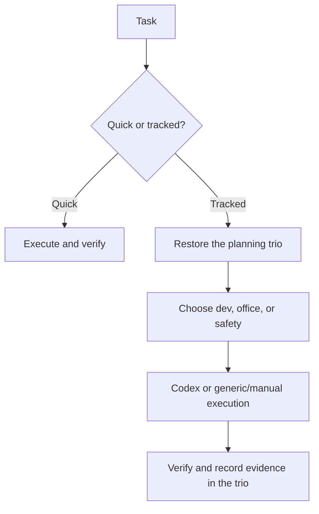

# superpowering-with-files

superpowering-with-files is a lightweight Trio workflow for local coding-agent work. It keeps durable task state in a planning trio, applies one capability pack at a time, and treats Codex as the managed native host. Other hosts use the generic/manual fallback.

## Core model


```mermaid
flowchart TD
    A["Task"] --> B{"Quick or tracked?"}
    B -- "Quick" --> C["Execute and verify"]
    B -- "Tracked" --> D["Restore the planning trio"]
    D --> E["Choose dev, office, or safety"]
    E --> F["Codex or generic/manual execution"]
    F --> G["Verify and record evidence in the trio"]
```

### Durable task authority

For every tracked task, the only durable task authority is:

```text
planning/active/<task-id>/task_plan.md
planning/active/<task-id>/findings.md
planning/active/<task-id>/progress.md
```

`task_plan.md` records the outcome, scope, and completion criteria. `findings.md` records verified facts and constraints. `progress.md` records execution and verification evidence.

Quick tasks do not need a trio. Tracked work restores the three files before a substantive round. A worker result is only a candidate until the main session accepts it and records the outcome in the trio.

### Capability packs

Select exactly one pack for a task:

- `dev` for implementation, debugging, tests, and code review.
- `office` for source-backed documents, spreadsheets, presentations, and PDFs.
- `safety` for destructive, security-sensitive, or external-effect decisions.

The packs guide quality behavior. They do not replace the planning trio or Host-owned worker lifecycle, permissions, and human gates.

### Host boundary

Codex is the only managed native target. Its plugin contains the Trio entry policy and the `dev`, `office`, and `safety` packs. Generic/manual fallback is guidance for hosts without a managed native artifact.

Requested model and reasoning effort are intent. Actual values remain unknown unless the Host authenticates them. The main session plans, integrates, and accepts; bounded workers execute assigned slices and return evidence.

## Public commands

The public command list is: `install`, `sync`, `doctor`, `trio`, `verify`, `checkpoint`, and `token-audit`.

Use `trio` to create or restore tracked task state. Use `verify` for the repository's supported verification surfaces. Use `checkpoint` before a scoped local recovery-sensitive change. These commands do not bypass Host or human gates for external, destructive, security-sensitive, merge, release, or publish actions.

## Codex plugin

The only packaged artifact is `harness-codex-plugin-<version>.tgz`. It contains `.codex-plugin/plugin.json` and exactly four Trio skills:

- `skills/trio/SKILL.md`
- `skills/trio/dev/SKILL.md`
- `skills/trio/office/SKILL.md`
- `skills/trio/safety/SKILL.md`

See [Codex installation](docs/install/codex.md), [plugin package installation](docs/install/plugin-packages.md), and [release artifacts](docs/release-plugin-artifacts.md).

## Boundaries

This repository documents the current local Trio contract. It does not claim that a user's existing global installation has been migrated. Keep a generic/manual host on its own documented setup path, and retain explicit human approval for external or irreversible actions.
