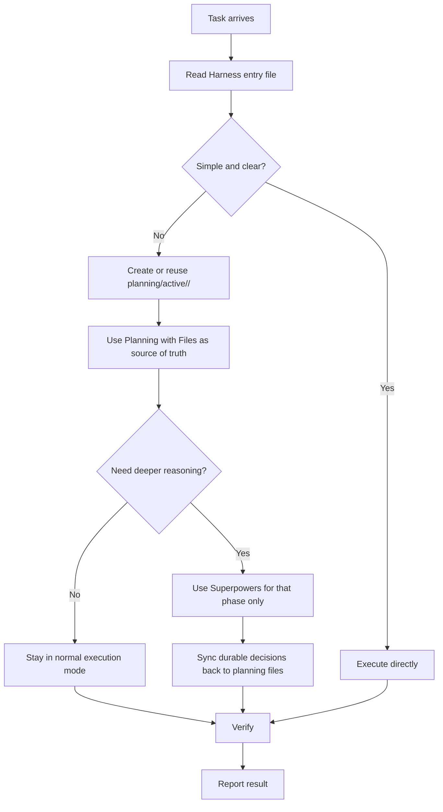
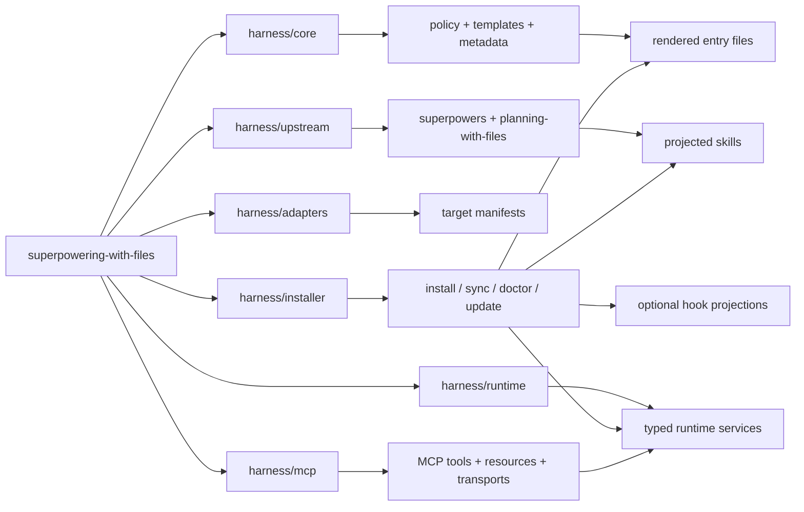

# superpowering-with-files

superpowering-with-files is a governance harness for local coding-agent workflows. It turns one shared policy into native instruction files, projected skills, and optional hooks for Codex, GitHub Copilot, Cursor, and Claude Code.

- `planning-with-files` owns durable task state.
- `superpowers` stays optional and temporary.
- Harness renders the same policy into each IDE's native shape.
- `safety` is opt-in for bypass / autopilot / long-running work.

Gemini CLI is not currently a supported installer target.

## Core Model


```mermaid
flowchart TD
	A["Task arrives"] --> B["Read Harness entry file"]
	B --> C{"Simple and clear?"}
	C -- "Yes" --> D["Execute directly"]
	C -- "No" --> E["Create or reuse planning/active/<task-id>/"]
	E --> F["Use Planning with Files as source of truth"]
	F --> G{"Need deeper reasoning?"}
	G -- "Yes" --> H["Use Superpowers for that phase only"]
	G -- "No" --> I["Stay in normal execution mode"]
	H --> J["Sync durable decisions back to planning files"]
	I --> K["Verify"]
	J --> K
	D --> K
	K --> L["Report result"]
```

### Task State

| Path | Role |
| --- | --- |
| `planning/active/<task-id>/task_plan.md` | active plan, phases, lifecycle |
| `planning/active/<task-id>/findings.md` | durable findings and constraints |
| `planning/active/<task-id>/progress.md` | session log, checks, changed files |
| `planning/archive/<timestamp>-<task-id>/` | closed tasks after lifecycle guard passes |

Rules:

1. `planning-with-files` is the only durable task-memory system.
2. Tracked tasks must use `planning/active/<task-id>/` even when implementation is straightforward.
3. Deep-reasoning work may use `superpowers`, but only as a temporary reasoning layer.
4. When Superpowers is actually used, the detailed companion plan lives in `docs/superpowers/plans/<date>-<task-id>.md` and syncs back to the active task.

## Quick Start

```bash
# workspace
./scripts/harness install --scope=workspace --targets=all --projection=link
./scripts/harness sync
./scripts/harness doctor

# user-global bootstrap / refresh
./scripts/harness adopt-global
./scripts/harness adoption-status
```

Notes:

- Rendered entry files default to the `always-on-core` profile.
- Use `--scope=both` when you want a shared user-global baseline plus repo-local entry files.
- User-global and `--scope=both` installs default to the lean `minimal-global` skill profile; use `--skills-profile=full` only when the target workspace intentionally needs the complete skill surface.

### Packed Plugins

Harness also ships packed plugin artifacts for Codex, Claude Code, Cursor, and GitHub Copilot.

- Download and install guide: [Harness packed plugin installation](docs/install/plugin-packages.md)
- Release asset inventory: [Harness plugin release artifacts](docs/release-plugin-artifacts.md)

## Workflow Lanes

Harness exposes operator-facing lanes:

- `plan`: tracked task setup, worktree base selection, and durable planning state
- `review`: plan review, diff review, PR review, and archive-readiness review
- `verify`: focused checks, full repository verification, projection dry-runs, and doctor output
- `reconcile`: align intent, actual changes, verification, and follow-up before finish/archive
- `finish`: branch push, merge back to `dev`, and task record updates
- `release`: `dev` to `main` promotion plus adoption and release-document alignment
- `archive`: explicit close-and-archive lifecycle flow

See [Workflows](docs/workflows.md) for the lane map, reconcile gate, and optional browser/eval contracts.

## Common Flows

### Verify a change

```bash
npm run verify
./scripts/harness verify --output=.harness/verification
./scripts/harness sync --dry-run
./scripts/harness doctor --check-only
```

`verify` and `doctor` include a budget ledger with per-target session costs
(`entry`, `skillDiscovery`, `skillBody`, `skillSource`, `planning`) and per-turn
costs (`hooks`, `planning`). Use that ledger before changing policy rendering,
skill profiles, hooks, or user-global adoption defaults.

### Update upstream baselines

```bash
./scripts/harness fetch
./scripts/harness update
```

### Enable hooks or safety

```bash
./scripts/harness install --scope=workspace --targets=all --projection=link --hooks=on
./scripts/harness install --scope=workspace --profile=safety --hooks=on
./scripts/harness sync
./scripts/harness doctor --check-only
```

## Repository Structure


```mermaid
flowchart LR
	Repo["superpowering-with-files"] --> Core["harness/core"]
	Repo --> Adapters["harness/adapters"]
	Repo --> Installer["harness/installer"]
	Repo --> Runtime["harness/runtime"]
	Repo --> MCP["harness/mcp"]
	Repo --> Upstream["harness/upstream"]

	Core --> Policy["policy + templates + metadata"]
	Adapters --> Manifests["target manifests"]
	Installer --> Sync["install / sync / doctor / update"]
	Runtime --> Services["typed runtime services"]
	MCP --> Facade["MCP tools + resources + transports"]
	Upstream --> Baselines["superpowers + planning-with-files"]

	Policy --> Entries["rendered entry files"]
	Baselines --> Skills["projected skills"]
	Sync --> Entries
	Sync --> Skills
	Sync --> Hooks["optional hook projections"]
	Sync --> Services
	Facade --> Services
```

- `harness/core`: policy, templates, schemas, projection metadata
- `harness/adapters`: target-specific manifests and native projection contracts
- `harness/installer`: CLI commands, state, projection logic, health checks
- `harness/runtime`: shared services for status, doctor, summaries, dry-runs, approvals, receipts, and registry/policy evaluation
- `harness/mcp`: MCP server registration, tools/resources, and stdio/HTTP transports
- `harness/upstream`: vendored `superpowers` and `planning-with-files` baselines

## MCP Runtime Facade

Harness now separates IDE projection from agent runtime access:

- Adapters remain responsible for projecting Harness rules into Codex, GitHub Copilot, Cursor, and Claude Code native entry points, skills, and hooks.
- Runtime services hold the typed business logic used by both CLI commands and MCP tools.
- The MCP layer is a runtime facade and control plane. It exposes Harness capabilities as audited tools and resources, but it does not replace or duplicate adapter projection logic.

## Projection Map

### Entry Files

| Target | Workspace entry | User-global entry |
| --- | --- | --- |
| Codex | `AGENTS.md` | `~/.codex/AGENTS.md` |
| GitHub Copilot | `.github/copilot-instructions.md` | `~/.copilot/instructions/harness.instructions.md` |
| Cursor | `.cursor/rules/harness.mdc` | user rules in Cursor settings |
| Claude Code | `CLAUDE.md` | `~/.claude/CLAUDE.md` |

### Skill Roots

| Target | Workspace skill root | User-global skill root | Strategy |
| --- | --- | --- | --- |
| Codex | `.agents/skills` | `~/.agents/skills` | materialized |
| GitHub Copilot | `.agents/skills` | `~/.agents/skills` | materialized |
| Cursor | `.agents/skills` | `~/.agents/skills` | materialized |
| Claude Code | `.claude/skills` | `~/.claude/skills` | materialized |

Codex, GitHub Copilot, and Cursor share `.agents/skills` / `~/.agents/skills` for skill projection. Claude Code remains on `.claude/skills`.
Claude Code support is layered: entry file and skills are projected by default, hooks are only configured when `--hooks=on`, local hook payload validation is reported separately from settings checks, and live runtime invocation evidence is reported independently when available.
For GitHub-origin cloud usage, keep the default table above and follow the optional deployment guidance in [GitHub Copilot installation](docs/install/copilot.md).

## Safety

The `safety` profile adds path-boundary checks, automatic checkpoints, and a worktree-first flow for risky or long-running agent sessions.

```bash
./scripts/harness worktree-preflight --task <task-id> --safety
./scripts/harness checkpoint-push --message="..."
```

More detail:

- [Safety architecture](docs/safety/architecture.md)
- [Vibe coding safety manual](docs/safety/vibe-coding-safety-manual.md)
- [Recovery playbook](docs/safety/recovery-playbook.md)

## Commands

```bash
./scripts/harness install
./scripts/harness sync
./scripts/harness doctor
./scripts/harness status
./scripts/harness fetch
./scripts/harness update
./scripts/harness verify --output=.harness/verification
./scripts/harness adopt-global
./scripts/harness adoption-status
./scripts/harness summary
./scripts/harness summary --task <task-id>
./scripts/harness worktree-preflight
./scripts/harness worktree-preflight --task <task-id>
./scripts/harness worktree-preflight --safety
./scripts/harness worktree-name --task <task-id> --namespace <prefix>
./scripts/harness checkpoint <path>
./scripts/harness checkpoint-push --message="..."
./scripts/harness cloud-bootstrap --target=codespaces
./scripts/harness link-personal --repo=<git-url>
```

## Docs

- [Architecture](docs/architecture.md)
- [Roadmap](docs/roadmap.md)
- [Backlog](docs/backlog.md)
- [Maintenance](docs/maintenance.md)
- [Workflows](docs/workflows.md)
- [Cloud Dev Harness operator guide](docs/cloud-dev-harness.md)
- [Cloud Dev parity and task contract](docs/cloud-dev-parity.md)
- [MCP read-only compatibility](docs/mcp-read-only-compatibility.md)
- [State convergence](docs/state-convergence.md)
- [Reconciliation](docs/reconciliation.md)
- [Adoption starter kit](docs/install/adoption-starter-kit.md)
- [Upstream update compatibility](docs/upstream-update-compatibility.md)
- [Office templates](docs/office-templates.md)
- [Release](docs/release.md)
- [Platform support](docs/install/platform-support.md)
- [Harness packed plugin installation](docs/install/plugin-packages.md)
- [Codex installation](docs/install/codex.md)
- [GitHub Copilot installation](docs/install/copilot.md)
- [Cursor installation](docs/install/cursor.md)
- [Claude Code installation](docs/install/claude-code.md)
- [Safety architecture](docs/safety/architecture.md)
- [Vibe coding safety manual](docs/safety/vibe-coding-safety-manual.md)
- [Recovery playbook](docs/safety/recovery-playbook.md)

## Upstream, License, Credit

Harness vendors two upstream systems and adds stricter local governance on top.

| Upstream | Original role | License | Harness usage |
| --- | --- | --- | --- |
| [`superpowers`](https://github.com/obra/superpowers) | agentic skills framework and workflow | MIT | optional reasoning layer for deep-reasoning phases |
| [`planning-with-files`](https://github.com/OthmanAdi/planning-with-files) | persistent markdown planning and session recovery | MIT | the only durable task-memory system |

Thanks to the upstream authors and communities whose work this repository builds on.


## Reconciliation Gate

For tracked coding and cloud-dev work, Harness uses the reconcile gate in `docs/reconciliation.md` after implementation/verification and before finish/archive. The gate keeps intended behavior, actual changes, verification evidence, and docs/backlog follow-up aligned without requiring large specs for trivial changes.
