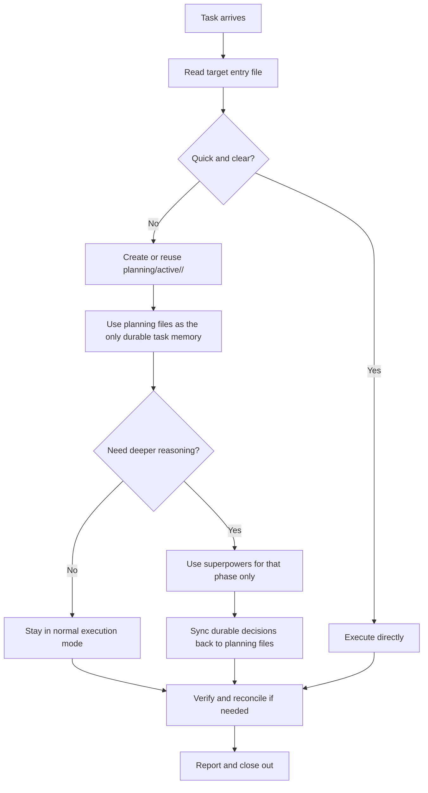

# superpowering-with-files

superpowering-with-files is a governance harness for local coding-agent workflows. It turns one shared policy into native entry files, projected skills, and optional hooks for Codex, GitHub Copilot, Cursor, and Claude Code.

Codex also carries a small concise-output behavior for process narration. It reduces redundant chat prose only; it does not replace or weaken `planning-with-files` durable task memory.

It is built around four rules:

- `planning-with-files` owns durable task state.
- `superpowers` stays optional and temporary.
- Harness projects one policy into each target's native shape.
- `safety` stays opt-in for risky or long-running work.

## Core Model

Harness separates entry guidance, durable task memory, optional reasoning, and platform projection.


```mermaid
flowchart TD
    A["Task arrives"] --> B["Read target entry file"]
    B --> C{"Quick and clear?"}
    C -- "Yes" --> D["Execute directly"]
    C -- "No" --> E["Create or reuse planning/active/<task-id>/"]
    E --> F["Use planning files as the only durable task memory"]
    F --> G{"Need deeper reasoning?"}
    G -- "Yes" --> H["Use superpowers for that phase only"]
    G -- "No" --> I["Stay in normal execution mode"]
    H --> J["Sync durable decisions back to planning files"]
    I --> K["Verify and reconcile if needed"]
    J --> K
    D --> K
    K --> L["Report and close out"]
```

### Durable task state

| Path | Role |
| --- | --- |
| `planning/active/<task-id>/task_plan.md` | phases, lifecycle, decisions |
| `planning/active/<task-id>/findings.md` | durable findings and constraints |
| `planning/active/<task-id>/progress.md` | session log, checks, changed files |
| `planning/active/<task-id>/reconciliation.md` | optional lifecycle artifact for standalone reconcile evidence and archive readiness |
| `planning/archive/<timestamp>-<task-id>/` | closed task history after lifecycle guard passes |

Rules:

1. `planning-with-files` is the only durable task-memory system.
2. `planning/active/<task-id>/` is the authoritative task-memory root; its required core planning trio is `task_plan.md`, `findings.md`, and `progress.md`.
3. `reconciliation.md` is an optional lifecycle artifact inside that same canonical task directory, not a second planning system.
4. Tracked tasks still use `planning/active/<task-id>/` even when implementation is straightforward.
5. Superpowers may assist deep-reasoning phases, but durable state always syncs back to the active task.
6. Reconcile sits between verify and finish/archive when a tracked task changes meaningful behavior, policy, workflow, or support contracts.

### Goal-like continuations

Harness keeps `/goal`, `/plan-goal`, and similar continuations native. It does not add a second runner.

At each substantive round:

1. reopen `task_plan.md`, `progress.md`, and `findings.md`
2. reclassify the round as `quick`, `tracked`, or `deep-reasoning`
3. keep quick rounds light
4. keep `planning/active/<task-id>/` authoritative for tracked rounds
5. use companion-plan + reviewer discipline only for deep-reasoning rounds

## Mode-Aware Verification Contract

Harness uses one shared proof vocabulary across six mode families.

| Mode Family | Where It Sits | Primary Proof | Existing Lane Or Gate Coverage |
| --- | --- | --- | --- |
| design/planning | task intake, `plan`, companion-plan authoring | review proof | `planning-with-files`, `goal2plan`, reviewer-gated companion plans |
| execution | implementation and narrow rollout slices | unit/invariant proof | focused tests, fixtures, diffs, targeted checks |
| review | plan review, diff review, PR review | review proof | `review` lane and reviewer gates |
| acceptance/verify | focused verification and user-visible checks | BDD/acceptance proof | `verify` lane, `npm run verify:all`, `./scripts/harness verify` |
| reconcile/lifecycle | between `verify` and `finish` / `archive` | lifecycle/governance proof | reconciliation gate, lifecycle status, `active-summary` |
| operations/release/adoption | `cloud-dev`, install/adoption flows, `finish`, `release` | operational proof | `sync --dry-run`, `doctor --check-only`, adoption and release checks |

The table summarizes proof-stack core vocabulary. When a tracked or deep-reasoning task declares a `Mode-Aware Verification Contract`, the minimal declared contract shape is seven fields: `Proof Target`, `Primary Proof`, `Backstop Proof`, `Escalation Trigger`, `Evidence Sink`, `Reconcile Rule`, and `Unacceptable Substitute`. Quick tasks stay lightweight and usually omit the declaration.
For `design/planning`, `review proof` stays primary. `lifecycle/governance proof` becomes the backstop when acceptance-design quality or durable task-state alignment is part of the residual risk.

Proof choice follows failure risk, not habit. Green unit or BDD results are not enough when the real risk is scope review, lifecycle drift, release safety, or adoption/recovery behavior. In those cases, review, reconciliation, or operational evidence becomes the primary proof instead of a nice-to-have extra.

## Quick Start

### Workspace install

```bash
./scripts/harness install --scope=workspace --targets=all --projection=link
./scripts/harness sync
./scripts/harness doctor
```

### User-global bootstrap or refresh

```bash
./scripts/harness adopt-global
./scripts/harness adoption-status
```

Notes:

- user-global and `--scope=both` installs default to the lean `minimal-global` skill profile
- use `--skills-profile=full` only when a workspace intentionally needs the complete skill surface
- `sync --dry-run` is the safe preview before any projection change

## Workflow Lanes

Harness exposes a small operator-facing lane map:

- `plan`: create or restore tracked task state and worktree context
- `cloud-dev`: stage remote-only work from `origin/dev` without mutating the local checkout
- `review`: inspect plans, diffs, PRs, and archive decisions
- `verify`: run focused checks, full verification, dry-runs, and doctor
- `reconcile`: align intent, actual changes, evidence, and follow-up before finish/archive
- `finish`: return scoped work to the recorded base and update task state
- `release`: align verified `dev`, release notes and artifacts, adoption state, and `main`
- `archive`: close and archive only after lifecycle and reconcile gates pass

Two helpers matter when the work stops being linear:

- `goal2plan` expands sparse `/goal` intake into a reviewed implementation plan before execution starts.
- `ChiefOps` adds a thin read-only governance lens for tracked work: restore the planning trio, read the board, classify the issue, and choose one bounded next slice.
- `autonomous-release-closure` drives review, promotion, cleanup, and adopt follow-through from current evidence instead of a one-shot release script.

### Optional simplicity helpers

Harness also carries a small set of repo-owned borrowings inspired by the `ponytail` analysis. They are not an upstream import, packaging sync, or benchmark harness copy.

- `overengineering-review` is an optional review lens for cuts such as `delete`, `stdlib`, `native`, `yagni`, and `shrink`.
- `simplification-ledger` is an optional read-only helper that scans deliberate simplification markers.
- `swf-simplify:` is the canonical V1 marker for recording a simplification ceiling and its upgrade trigger.

See [Workflows](docs/workflows.md) for where each mode family sits, which lane owns its primary proof, and when reconciliation or review is required because unit/BDD evidence is not enough.

## Implementation Shape

Harness has six implementation layers:

- `harness/core`: canonical policy, templates, metadata, schemas
- `harness/adapters`: target-specific projection contracts
- `harness/installer`: install, sync, doctor, status, update, adoption
- `harness/runtime`: shared services used by CLI and MCP
- `harness/mcp`: governed MCP facade over runtime services
- `harness/upstream`: vendored `superpowers` and `planning-with-files` baselines

The key separation is:

- adapters own platform projection
- runtime owns reusable behavior
- MCP exposes runtime as a compatibility/control surface
- upstream baselines stay upstream; local policy lives in Harness-owned layers

### Shared skill roots

| Target | Workspace skill root | User-global skill root | Strategy |
| --- | --- | --- | --- |
| Codex | `.agents/skills` | `~/.agents/skills` | materialized |
| GitHub Copilot | `.agents/skills` | `~/.agents/skills` | materialized |
| Cursor | `.agents/skills` | `~/.agents/skills` | materialized |
| Claude Code | `.claude/skills` | `~/.claude/skills` | materialized |

GitHub Copilot may switch the workspace root to `.github/skills` for the optional `github-cloud` deployment profile. That is a deployment-specific exception, not the shared default.

See [Architecture](docs/architecture.md) for the detailed layer and source-of-truth model.

## Common Commands

```bash
./scripts/harness install
./scripts/harness sync
./scripts/harness sync --dry-run
./scripts/harness doctor --check-only
./scripts/harness status
./scripts/harness verify --output=.harness/verification
./scripts/harness active-summary
./scripts/harness summary --task <task-id>
./scripts/harness chiefops board --task <task-id>
./scripts/harness chiefops board --task <task-id> --json
./scripts/harness worktree-preflight --task <task-id>
./scripts/harness worktree-name --task <task-id> --namespace <prefix>
./scripts/harness adopt-global
./scripts/harness adoption-status
./scripts/harness fetch
./scripts/harness update
npm run release:pack
```

## Read Next

### Start here

- [Workflows](docs/workflows.md) for the lane map
- [Adoption starter kit](docs/install/adoption-starter-kit.md) for safe rollout choices
- [Platform support](docs/install/platform-support.md) for target coverage and caveats

### Operate and maintain

- [Maintenance](docs/maintenance.md) for lifecycle audit, upkeep, sync/update/archive discipline
- [Release](docs/release.md) for promotion, release notes, and artifact publication
- [Reconciliation](docs/reconciliation.md) for source-of-truth conflict handling and archive readiness
- [State convergence](docs/state-convergence.md) for roadmap/backlog/planning alignment

### Understand the implementation

- [Architecture](docs/architecture.md) for implementation layers and boundaries
- [MCP read-only compatibility](docs/mcp-read-only-compatibility.md) for compatibility tiers and write-promotion gates
- [Cloud Dev Harness](docs/cloud-dev-harness.md) and [Cloud Dev parity](docs/cloud-dev-parity.md) for remote staging and evidence-gated cloud work

### Platform installs

- [Codex installation](docs/install/codex.md)
- [GitHub Copilot installation](docs/install/copilot.md)
- [Cursor installation](docs/install/cursor.md)
- [Claude Code installation](docs/install/claude-code.md)
- [Harness packed plugin installation](docs/install/plugin-packages.md)

## Status And Boundaries

- Supported installer-managed targets today: Codex, GitHub Copilot, Cursor, Claude Code
- Gemini CLI is not currently a supported installer target
- `safety` is opt-in, not the default baseline
- `cloud-dev` is a remote staging lane, not a replacement for local verification
- MCP is a compatibility/runtime facade, not a fifth projection adapter

## Upstream, License, Credit

Harness vendors two upstream systems and adds stricter local governance on top.

| Upstream | Original role | License | Harness usage |
| --- | --- | --- | --- |
| [`superpowers`](https://github.com/obra/superpowers) | agentic skills framework and workflow | MIT | optional reasoning layer for deep-reasoning phases |
| [`planning-with-files`](https://github.com/OthmanAdi/planning-with-files) | persistent markdown planning and session recovery | MIT | the only durable task-memory system |

Thanks to the upstream authors and communities whose work this repository builds on.
