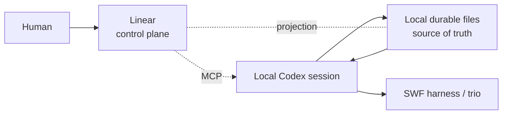

# Linear 工作控制面（SWF × Linear × 本地 Codex）

本页是人工可读的协议总览，说明本地 SWF 执行状态如何投影到 Linear，使人在 Linear 里就能回答"agent 在做什么、完成了什么、接下来是什么、卡在哪里、需要我决定什么"。机器可执行的部分在 [linear-work-control skill](../harness/core/skills/linear-work-control/SKILL.md)：SKILL.md 给执行体，[reference.md](../harness/core/skills/linear-work-control/reference.md) 给完整协议，[templates.md](../harness/core/skills/linear-work-control/templates.md) 给可发布面，[automation-workflows.md](../harness/core/skills/linear-work-control/automation-workflows.md) 给夜间与晨间工作流。

## 职责分离



- Linear 是面向人的控制面，只做投影；本地文件是唯一的执行权威。
- 本仓库不新增调度器、守护进程、数据库、Web 服务，也不实现自定义看板前端。
- Linear 写入只有一条路径：Host 提供的已认证 Linear MCP。
- 同步失败不得回写、回滚或污染本地状态。

## 绑定文件

按以下顺序解析：

1. `reports/linear/<task-id>/linear.json`（任务目录之外的元数据，任务目录因此保持恰好三个文件）；
2. `planning/active/<task-id>/linear.json`（早期位置，仅当外部文件不存在时读取）；
3. 目标 prompt 或操作者显式给出的路径；`resume-brief --binding <file>` 直接覆盖以上解析；
4. `.goal/LINEAR.json`（非 SWF 仓库）。

路径是否存在用 `lstat` 判定，而不是用"读取失败"判定：目录或断链软链接属于"存在但不可读"，一律 fail closed，不会静默回落到 legacy。绑定存在却读不出或解析失败时报 `**Binding:** invalid`。

没有绑定文件就是"这个任务不需要 Linear"，按纯本地目标继续，不要预先创建绑定。字段、必填项与禁止项见 [reference.md](../harness/core/skills/linear-work-control/reference.md) 第 2 节；禁止写 token / API key / password / secret 等任何凭据形态的字段，校验会直接失败。

```bash
node harness/core/skills/linear-work-control/scripts/linear-work-control.mjs validate-binding planning/active/<task-id>/linear.json
```

## 工作区守卫（写前必过）

任何 Linear 写入之前，先读当前已认证的工作区，再判定：

```bash
node harness/core/skills/linear-work-control/scripts/linear-work-control.mjs guard --binding <binding> --observed-workspace <slug>
```

| 结果 | 含义 | 动作 |
| --- | --- | --- |
| `ok` | 已认证工作区与绑定一致 | 允许写入 |
| `workspace-mismatch` | 认证到别的工作区 | 完全不写 Linear |
| `workspace-unknown` | 读不到工作区 | 读到之前不写 |
| `binding-disabled` | `enabled` 非 true | 按纯本地任务处理 |
| `binding-invalid` | 绑定未通过校验（`workspace.name` 缺失或非裸 slug、schemaVersion 漂移、未知键、凭据型键、非规范任务状态） | 先修绑定，任何 Linear 写入前必须先通过校验 |

判为拒绝时：先完成全部独立的本地工作，把不一致与"需要人做的最小动作"写入本地任务文件，再汇报。最小动作通常是重新把 Linear 连接授权到目标工作区，或在有意更换工作区后修正 `workspace.name`。

## 状态映射

本地运行状态是真相，Linear 只接收标准工作流状态加语义标签，因此不需要创建自定义工作流：

| 本地状态 | Linear 状态 | 语义标签 | 需要人 |
| --- | --- | --- | --- |
| `planned` | Backlog | — | 否 |
| `ready` | Todo | `agent-ready` | 否 |
| `running` | In Progress | `agent-running` | 否 |
| `waiting_human` | In Progress | `waiting-human` | 是 |
| `blocked` | In Progress | `blocked` | 是 |
| `review` | In Progress | `ready-review` | 需关注，但不阻塞队列 |
| `failed` | In Progress | `agent-failed` | 需关注，但不阻塞队列 |
| `done` | Done | — | 否 |
| `canceled` | Canceled | — | 否 |

所有受管 issue 另带 `swf-managed` 与 `executor:codex-local`，用来与无关 Linear 工作区分。不为 agent 创建假用户：human assignee 始终是人。

`map-state` 的 `humanActionRequired` 是"阻塞"标志，只有 `waiting_human` 与 `blocked` 为真——只有这两个状态会停住 agent 队列。`review` 与 `failed` 仍属于人的注意力范围，走各自视图，晨间交接也会读它们。

```bash
node harness/core/skills/linear-work-control/scripts/linear-work-control.mjs map-state waiting_human --json
node harness/core/skills/linear-work-control/scripts/linear-work-control.mjs labels
```

## 同步协议：本地在前，Linear 在后

每个有意义的检查点按同一顺序执行：写本地 worklog / `progress.md` → 写本地状态 / `task_plan.md` → 需要时刷新验证 → 落本地 blocker → 渲染人类快照 → 最后才发布或更新 Linear。

检查点只回答七件事：当前状态、完成多少、刚完成什么、正在做什么、接下来是什么、人是否需要动作、最近一次验证结果。发布方式是**更新同一条 status comment**（按 id 覆盖），而不是每个检查点新发一条评论；不要镜像 worklog，也不要按工具调用逐条发布。

## Blocker 与人的指令

顺序固定：先写本地 blocker，再投影到 Linear。发布的 blocker 必须包含上下文、确切问题、可选项、不回答的影响、恢复条件；状态用 `waiting_human`（需要人决策）或 `blocked`（外部条件）。

本地 blocker 的权威 ledger 是任务目录的 `progress.md`；早期写在 `blockers.md` 的条目只要文件还在就继续计入，两个位置都不会漏掉未闭合的 blocker。每条 blocker 带一行机器可读标记注释：`swf:blocker-state id=<id> state=<state>`（写成独占一行的 HTML 注释）。`resume-brief` 把非 `resolved`/`canceled`/`done` 的状态一律算作 open，标记写错也算 open —— **发布到 Linear 不等于关闭条目**，只有记录在案的人类决定才会关闭它。

标记可以缩进，也可以写成列表项（含任务勾选框）、有序列表、引用、强调或行内代码；**任何提到该标记词却不成形的行同样算 open**。形近写法（大小写、全角、零宽/软连字符等不可见字符、连字符变体、西里尔/希腊同形字母、token 中间多一个空格或被换行拆开）都能被识别并一律算 open；检测是尽力而为的，且两类机制不会叠加生效（例如一个未覆盖的同形字再加 token 内一个空格就可能漏检），因此 ledger 的说明正文不要照抄标记词本身，改为描述约定即可，并且每条 blocker 保留一行规范标记。候选判定按去空白后的 `swf:block` 前缀匹配，方向是只多报不漏报：正文里出现 `swf:blockchain` 这类前缀词也会被算作未闭合标记，所以正文**不要出现 `swf:block` 前缀**。

人在评论里用这些形式之一回复：

| 形式 | 作用 |
| --- | --- |
| `DECISION: <选项或自由回答>` | 回答 blocker 的问题 |
| `PAUSE` / `RESUME` / `CANCEL` | 控制任务 |
| `REPLAN: <新范围或约束>` | 请求改计划 |
| `PRIORITY: <urgent|high|normal|low>` | 调整队列顺序 |

恢复会话时先读本地文件，再拉 issue 与评论，把明确意图落成**本地持久状态**，然后才继续执行；不依赖原对话上下文。实质性范围变更走仓库既有的 replan 路径，而不是静默改写目标。

意图解析是机械的，不靠推断：

```bash
node harness/core/skills/linear-work-control/scripts/linear-work-control.mjs parse-human-input --file comment.md --json
```

除识别到的 decision / replan / priority / 控制动词外，未识别的文本行会被原样列出，不会被升级成决策。

## 完成语义

Linear `Done` 只表示"经验证的完成"：`done when` 条件满足、必要验证已执行并通过、没有未解决的阻塞。任一条件不满足就保持 issue 打开并停在 `review`：

```bash
node harness/core/skills/linear-work-control/scripts/linear-work-control.mjs completion-gate --input completion.json
```

## 注意力视图（人工一次性设置）

MCP 面没有创建自定义视图的工具，所以这八个视图由人创建一次：在 Linear 里新建视图、限定到 SWF 项目/团队、加上对应标签与状态过滤，然后保存并固定。

| 视图 | 用途 | 过滤概念 |
| --- | --- | --- |
| Needs Human | 今天必须由人处理的 | 标签 `waiting-human` 或 `blocked` |
| Agent Queue | agent 可以接的 | 标签 `agent-ready` |
| Running | 正在跑的 | 标签 `agent-running` |
| Ready for Review | 已完成、等人审阅的 | 标签 `ready-review` |
| Failed | agent 没能完成的 | 标签 `agent-failed` |
| Tonight | 夜间执行器可选的 | `agent-ready` + `nightly` |
| Scheduled | 已自动化的 | 标签 `nightly` |
| Recently Completed | 最近完成的 | 状态 Done，按更新时间排序 |

其中 `Needs Human` 是必须成立的：早上打开它，应能直接列出全部需要人介入的事项。

## 定时工作流

夜间执行器与晨间交接都是 Host 侧 Codex automation，prompt 不存仓库；版本化的 prompt 文本与创建步骤见 [automation-workflows.md](../harness/core/skills/linear-work-control/automation-workflows.md)。要点：

- 目标指向已注册的 SWF 项目、cwd 为仓库根、本地环境、并发为 1；
- 夜间先跑工作区守卫，再取至多一个 `swf-managed + agent-ready + nightly` 任务，排除 `waiting-human` / `blocked` / `ready-review`；
- 被 human 决策阻断时不停止整轮，改为记录 blocker 并继续其他独立任务；技术失败同样记录后继续安全的独立任务；
- 结尾发布一条晨间总结（完成 / 待审阅 / 待决策 / 失败 / 仍在跑 / 跳过 / 下一步）；
- 运行时间由操作者决定，本协议不发明固定时刻，automation 先建为暂停状态。

## 本地运行前提与验证边界

这是本地 MVP：夜间窗口需要机器不休眠、Codex app 可用、仓库可读、网络可用、Linear 连接已认证。没跑到就是观察结果，不是交付声明。automation 属于 Host 侧对象，创建成功不等于运行过；没有"立即运行某个 automation"入口，因此首次验证采用"按 prompt 手动等价执行 + 记录证据"，并把 configured / triggered / observed 三种声明分开。

## 能力边界

| 能力 | 状态 | 说明 |
| --- | --- | --- |
| workspace / team 读取 | 可用 | `linear_get_workspace`、`linear_list_teams` |
| project 读写 | 可用 | `linear_list_projects`、`linear_save_project` |
| issue 读写、子 issue | 可用 | `linear_save_issue` 的 `parentId` |
| 评论读写 | 可用 | `linear_list_comments`、`linear_save_comment` |
| 标签读取与创建 | 可用 | `linear_list_issue_labels`、`linear_save_issue_label` |
| 工作流状态读取与切换 | 可用 | `linear_list_issue_statuses`、`linear_save_issue` 的 `state` |
| 自定义视图创建 | 不可用 | 人工步骤，见上文 |

不要为了绕过视图缺口去搭 API 或 token 基础设施。

## 验证

```bash
node --test tests/core/linear-work-control-eval.test.mjs
npm run verify:core
```

覆盖绑定校验（含任意拼写的凭据型键拒绝、`www.`／大小写等形近工作区不能通过守卫）、九个状态映射、完成门禁、四类渲染器、同步顺序与失败语义；并 spawn CLI 固定 `guard` / `completion-gate` / `parse-human-input` / `resume-brief` 的退出码。Linear 侧链路（场景 A/B/C）仍需绑定工作区，不在该文件的证明范围内。
