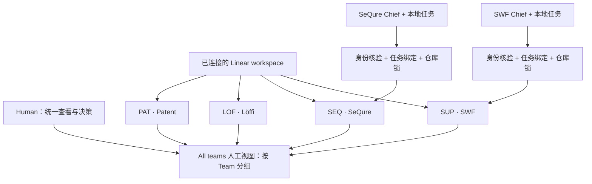
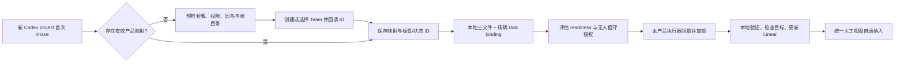

# 一个 Workspace，多产品独立执行，统一监督

## Project-first policy — 2026-09-21（当前规则）

同一 workspace 内复用稳定 Team，产品/交付流由独立 Project UUID 隔离；本节替代下文旧的一产品一Team、四Team容量门和不迁移历史票建议。当前完整规格见 [Project-first spec](../project-isolation-20260921/spec.md)。SWF 已按 Core、Render、Isolation、Decision 划分Project。新产品先核验root、workspace、共享Team权限与Project ownership marker，再创建/复用独立Project；不自动建Team。夜班授权、root guard和并发锁仍是独立门。SUP25–34后续实施采用此规则；旧内容仅作决策历史，不能作为相反执行指令。

> 评审草案，2026-09-18。本文件所有目标流程均为建议，不表示已实现。用户截图显示 SeQure、Löffi、Patent、SWF 四个 Codex project；名称不代表已建立 Linear 映射。本轮只交付方案与 ticket 草案。

## 1. 推荐决策
采用一个已连接的 Linear workspace；一个长期产品对应一个专属 Team；产品内部按目标、版本或工作流创建 Linear Projects；每个本地 tracked task 对应一条主 issue，必要时拆子 issue。保留 SUP 现有团队、issue 和项目，不迁移历史任务。

Codex project 是工作入口；Team 是本方案的产品归属边界；Linear Project 是交付组织方式；task binding 是执行目标。它们不能凭名称自动互认。Team 隔离是操作隔离，不是凭据隔离或安全沙箱；同一个连接可能有多个团队权限。

| Codex 产品入口 | 稳定产品键（建议） | Linear Team | Linear Projects 示例（不是待创建对象） |
|---|---|---|---|
| SWF | swf | 保留 SuperpoweringWithFiles / SUP | 保留 Agent Workbench MVP；后续独立目标 |
| SeQure | sequre | SeQure / SEQ（前缀需查重） | 产品建设、增长实验 |
| Löffi | loffi | Löffi / LOF（前缀需查重） | MVP、内容工作流 |
| Patent | patent | Patent / PAT（前缀需查重） | MVP、检索质量 |

不为每个 thread、ticket、Git 分支或临时目录创建 Team。同一产品多个仓库可以共用 Team，但每个任务仍绑定明确的可执行根目录。一个仓库若有多个产品，必须显式映射子目录，不能靠 cwd 最近名称猜测。

官方目前列明 Free 最多 2 Teams、Basic 5、Business/Enterprise unlimited。四产品四 Team 需先核对当前套餐及创建权限；不得静默把剩余产品塞进 SUP，也不自动购买或升级。来源：[Teams](https://linear.app/docs/teams)。

## 2. Show me：谁看全局，谁只执行自己的任务

箭头代表建议的写入/汇总范围。全局视图可以看全部；单个执行器只领自己绑定的任务。Löffi、Patent 同样采用独立执行入口，图中省略重复方框。Chief 不获得跨产品派工权。

无法创建 Team 时停在 D，提供准确人工步骤；不得跳过 D，不能把“建了 Codex project”报告成“Linear 已接入”。暂时不可用的 Linear 不阻止独立的本地工作，但不会接收远程队列。

## 3. 当前事实与差距

本轮只读 MCP 确认 workspace `superpoweringwithfiles`，仅 SUP Team 和既有 MVP Project。现有绑定支持 workspace/team/project/issue，guard 仅核 workspace；因此复制错的 team/project binding 可能通过。源码：[helper](../../../harness/core/skills/linear-work-control/lib/linear-work-control.mjs)、[协议](../../../harness/core/skills/linear-work-control/reference.md)、[Chief](../../../harness/trio/governance/chiefops/SKILL.md)。

现有夜班已经在提示中限定 bound project，但没有本轮核实到的原子领取/仓库互斥实现；限制写在 prompt 不等于运行时保证。现有自动化只覆盖 SWF，不能据此宣称四产品都自动运行。

标签查询：无 team 参数仅出现三个通用标签；指定 SUP 返回九个管理标签加通用标签，表明现有管理标签很可能为团队级。对象未返回 teamId，迁移前须显式确认。

当前可调用工具无 Team 创建、custom view 创建工具。可由获授权的 UI 操作完成一次性设置，也可人工操作后回读；若 UI 不可用，保留 setup-needed，不宣称全自动。

纠正前轮结论：Linear Project 可以跨团队，但本方案有意限定产品专属 Projects；同名团队标签可在 UI 聚合，API 不会自动按同名合并；不是所有跨团队任务都会相互阻止归档。来源：[Projects](https://linear.app/docs/projects)、[Labels](https://linear.app/docs/labels)。

## 4. 身份与配置契约（拟新增 v2）

两个层次即可，避免引入新的任务数据库：

1. 仓库 `.harness/linear/project.json`：稳定 productKey、workspaceId、teamId、允许的 Linear projectIds、Host projectId（可用时）、根目录标识、标签与状态 ID 映射、接入模式及调度引用。没有进度、blocker 或任务结果。
2. `reports/linear/<task-id>/linear.json`：productKey、taskId、teamId、projectId、issueId、statusCommentId、配置版本引用。记录必要的同步游标，不取代三文件。

根目录绝对路径属于本机映射，不直接写进公开 Linear 内容；仓库稳定身份与本机路径分开，worktree 指向经批准的共同根。对非 Git 文档项目同样支持显式 root ID。复制仓库或配置到新产品不能自动继承身份，首次运行须验证本机注册和根目录。

Schema v2 明确向后兼容读取 v1。v1 可继续原有 SWF 显式任务同步，但禁止作为跨产品自动领任务的依据；升级时回读实际 Team/Project/issue，记录迁移结果。缺失、损坏、未知版本、重复 productKey、多个匹配结果分别报错，不自动回退 SUP。旧 `.goal/LINEAR.json` 和 task 内 legacy 文件只作为已识别兼容入口，不产生多个写主本。

不在全局技能里硬编码所有产品。全局技能定义协议；每个产品持有自己的配置。可有本机“已接入产品目录”供汇总发现，但只是可重建的配置索引，不存任务状态，也不能替代任务授权。

## 5. 写入与执行隔离

每次领取、恢复和外部写入前校验以下链路：

`当前执行根 / Host project → productKey → workspace ID → team ID → 允许的 project ID → issue ID → taskId`

创建 issue 前验证 team 与 project 的归属及允许关系；更新 issue 前回读 issue 当前 team/project；更新 comment 验证 comment 属于目标 issue。父子任务默认同产品，同团队；跨产品协作采用关联链接，不共享执行 binding。用户人工移动 issue 后，下次写入报 target-drift，不跟随移动继续执行。

仅给 guard 传一个“observed-team”不够：复制来的 binding 也可能自洽，必须与独立的执行根配置交叉校验。写入后回读目标及变更结果；若目标在检查与写入间被移动，记录 drift 并停止后续同步。MCP 不提供事务时，这不是强事务隔离，不能夸称彻底消除竞态。

查询必须带 teamId + 允许 projectIds + eligibility，取回后再次逐条核验。标签只表示状态或授权条件，永远不当作路由键。误贴 `nightly` 的外来 issue 仍不会被领取。

同一 canonical repo/worktree 家族使用一个跨进程本地原子锁：领取前获取，记录 owner/run/task、有效性与恢复凭据；续期丢失则停止写入；过期不能直接抢占，先核实旧 owner 已停止。多个不同 repo 可独立运行；首版限定一台机器负责一个产品的无人值守任务，多机分布式调度不在范围内。锁是暂态协调元数据，不是第四份任务状态。

## 6. Chief、执行器与 Human 职责

| 角色 | 职责 | 不承担 |
|---|---|---|
| 产品 Chief | 确认产品归属；首次接入；intake 去重；范围、验收、依赖与授权；选择有界切片；委派后的验收 | 常驻调度器、跨项目抢任务、凭名称修改绑定 |
| 本地执行器 | 读取三文件；核验身份；获取锁；按范围执行；验证；发布检查点 | 用 Linear 状态覆盖本地决策；自己扩大授权 |
| linear-work-control | schema、guard、映射、幂等同步、错误分类 | 执行业务任务或保存凭据 |
| Host automation | 在已授权时间/项目启动执行，提供运行证据 | 代替 Chief 判断可执行性 |
| 全局汇总器 | 读取已接入产品，按产品展示结果、异常和时效 | 派工、修改业务 issue、将未响应项目视为完成 |
| Human | 接入策略、执行授权、关键决策与验收门 | 每次重述已有授权或手工搬运进度 |

保留直接执行可自行验证完成、委派主执行需 Chief acceptance 的既有语义。Linear Done 仍需真实验证与所有相关门通过。Chief intake 展示一行归属摘要：产品 / 根目录 / Team / Project / Issue / 执行方式 / 授权来源。

## 7. 新产品自动接入与恢复

触发点选“首次显式要求 Linear 管理的 tracked intake”，而不是监控 Codex sidebar。现有证据没有证明存在 project-created 事件。未接入产品不会因普通问答自动建 Team；用户明确说“此产品接入 Linear”即可授权接入流程，不重复问同一授权。

流程：识别根目录 → 查现有映射 → 查询套餐/权限/同名 → 精确复用或创建 Team → 回读 ID → 选择/创建当前交付 Project → 建标签状态映射 → 原子保存配置 → 创建/匹配任务 issue 与评论 → 回读 → 接入完成。每步记录已创建 ID，断线重试先查证，避免重复创建。同名但无法证明归属时请求一次归属决定。

无人值守独立配置：默认 `manual`。可选择产品级 standing authorization，记录允许的动作、时窗、资源上限、到期/撤销方式和外部动作门；未选则继续逐任务确认 `nightly`。接入授权不等于夜班授权。任务有 blockers 或未满足 readiness 时，无论有何标签都不能运行。

新产品新增一个 execution automation（确有无人值守需求时）；无需强制再建一份 Morning Handoff。全局早报可替代产品早报的可见性功能，执行仍各自隔离。先保留 SWF 已有两个任务，验证新汇总等价后才退役重复早报。

## 8. Human 统一监督

优先复用 Linear 原生 All teams Custom Views，不另建 WebApp，也不把付费 Insights Dashboard 当作前提。共享 `agent-managed` 和现有语义标签；视图按 Team 分组。选择 All teams + managed 条件，不固定四个 Team 白名单，新接入产品打上规范标签后自然出现。API 汇总仍按已注册产品逐一查询，不能扫全 workspace 后直接执行。

最小四个入口：
- Needs Human：waiting-human / blocked，明确“需要你决定什么”。
- Active：ready、running、ready-review，并显示产品与当前状态。
- Exceptions：agent-failed；配合早报呈现同步失败、绑定错误、最后更新时间。
- Recent Done：已通过完成门的最近完成任务。

原有八个视图可保留；不批量重建。Needs Human、Active、Exceptions、Recent Done 是首页优先级。一个任务一条持续更新的状态评论，含当前状态、最近成果、下一步、Human action、验证结果与最后成功同步时间。

Linear 同步失败时不能指望失败信息也能写进 Linear：在本地记录并通过已授权 Host 通知渠道告知；全局汇总显示产品 unavailable/stale，不能显示空队列即健康。全局早报逐产品标识读取失败、数据年龄和覆盖范围；正常无变化保持安静。跨产品统一查看不会增加执行权。

标签迁移：新增 workspace 级 agent-managed；现有 swf-managed 保留历史，过渡期读双标签，新写中性标签。语义标签优先 workspace 级复用；若同名 team label 已存在，先核对 ID、引用视图与范围，不删除历史标签。API 始终用已解析 ID。

来源：[Custom Views](https://linear.app/docs/custom-views)、[Labels](https://linear.app/docs/labels)。UI 同名聚合不是 API 语义；新方案以 ID 映射保证一致。

## 9. 渐进上线与回退

R0：review 本方案与 tickets；确认 Team 套餐、根目录、产品身份及自动化策略。
R1：本地 v2 schema + guard + dry-run + 锁；不改变现有写入。
R2：用 SWF 现有目标迁移并核对，不移动 issue；通过旧数据兼容验证。
R3：选一个新产品试点（建议 SeQure，尚未授权接入）；验证正确路由与反向拒绝、断线恢复、重复 intake。
R4：接入 Löffi、Patent；全局视图及早报核验；记录新产品操作模板。
R5：授权启用无人值守；必须看到真实运行、检查点、错误通知与 Human 决策恢复。配置成功不算运行完成。

回退：暂停受影响的产品执行 automation；撤回 v2 启用配置并保留 v1 与映射备份；保留所有新建 issue/Team 供核对，不自动删除或迁移；其它产品继续。回退期间不能重新启用没有隔离能力的跨产品自动领取。

## 10. Review 的具体选项

建议一次确认：一产品一 Team；产品内多个 Linear Projects；首次 intake 接入；agent-managed 中性标签；产品执行分开、全局监督合并；默认手动、无人值守独立授权；先 SWF + 一个新产品试点。

待实施前核实：套餐支持 ≥4 Teams；新 Team 的名称/前缀；各产品根目录与 Host project ID；Team 创建方式的可用性；既有视图及标签引用；夜班是否允许产品级持续授权。上述未知不阻止 review，也不允许假装已经完成接入。

规格和执行拆分见 [specs-and-tickets.md](specs-and-tickets.md)。
