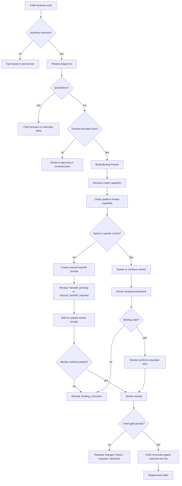

# ChiefOps V0b Thread Control Overlay Design

## Status

Revised draft for multi-agent design review.

This is a constrained design spec, not an implementation plan. It records the V0b product and protocol boundaries that must be preserved before planning implementation work.

This spec is a contract source, not an implementation-status report. Any shipped runtime, CLI, docs, or tests must still be verified against this contract before claiming feature completeness.

## Goal

ChiefOps V0b gives a chief session a capability-adaptive way to observe, spawn, continue, hand off, abandon, or respawn worker sessions where platform capabilities exist, and otherwise degrade honestly to manual handoff or blocker receipts while keeping durable truth in the existing planning trio.

The design must support coding and office work, reduce wrong-trio and wrong-source failures, and stay economical by routing work to the cheapest safe model capability.

## Non-Goals

- Do not replace `planning/active/<task-id>/` as the source of truth.
- Do not create a second durable task registry.
- Do not introduce worker heartbeat runtime.
- Do not auto-publish, release, merge, deploy, archive, or write external systems without an approval gate.
- Do not rely on fixed model names in durable workflow rules.
- Do not pretend thread control succeeded when the platform cannot perform it.
- Do not create an always-on scheduler, autonomous worker queue, or separate worker backlog.
- Do not let subagents become hidden durable workers or bypass the Binding Packet / Receipt contract.

## Selected V0b Shape

V0b targets a real thread control overlay, with honest fallback.

- `native_control`: use platform-supported create, observe, message, continue, and handoff.
- `partial_control`: use supported actions and degrade missing actions individually.
- `manual_handoff`: generate a ready-to-paste worker prompt plus expected receipt shape, then wait for a real paste-back receipt.
- `unsupported`: stop with a blocker receipt.

In every mode, the same binding packet and receipt shape must be written back to the authoritative trio.

Manual handoff prompt generation is a pending state only. It may write `manual_handoff_required` or `handoff_pending`, but it must not write `started`, `binding_verified`, `done`, or acceptance evidence until a worker receipt is pasted back and identity-matched.

## Authority Binding Resolution

Before any tracked or worker flow, chief must resolve the target authority explicitly.

Allowed authority sources:

- explicit `authorityTaskId + planningRoot`
- a previously verified Binding Packet for the same worker and task
- human confirmation of the target trio

Fail-closed conditions:

- multiple active tasks exist and no explicit authority is provided
- `planningRoot` is missing or points outside the expected authority root
- `task_plan.md`, `findings.md`, and `progress.md` do not belong to the same `planning/active/<task-id>/`
- the selected trio title, status, source surface, or proof target contradicts the requested work
- an index entry points to a different trio than the per-trio coordination note

Quick/direct tasks may answer without a trio when no durable task state is needed. Once a task enters tracked, worker, cross-trio, office-source, or release/publish flow, the authority must be resolved before building a Binding Packet.

## Authority Model

The authoritative state remains file-truth:

- `planning/active/<task-id>/task_plan.md`
- `planning/active/<task-id>/findings.md`
- `planning/active/<task-id>/progress.md`
- optional receipts, PRs, approvals, release evidence, or publish evidence

Thread/session state is control plane only. It can help chief communicate with workers, but it cannot redefine scope, lifecycle, proof status, source authority, or acceptance.

## Worker And Subagent Relationship

Workers and subagents are not mutually exclusive, but they operate at different layers.

- A worker is a session or thread-level owner for one bounded slice, with a Binding Packet, expected Receipt, and chief gate.
- A subagent is a disposable tactic used by the chief or worker for narrow investigation, review, or parallel checking inside an already-bound owner context.
- A subagent must inherit the same `authorityTaskId`, proof target, non-goals, source boundaries, and evidence sink as its owning chief or worker.
- A subagent must not create a new planning trio, write worker mapping, update lifecycle state, or act as an independent durable execution owner.
- A worker may use subagents only when the Assignment Packet allows the tactic or when the subagent work is read-only and does not widen the slice.
- Chief may spawn subagents directly for read-only design review, plan review, compatibility review, or focused evidence gathering without creating a worker session.

Priority rule:

- use chief direct execution for quick work;
- use chief-owned subagents for bounded read-only review or decision support;
- use workers for bounded execution or proof work that benefits from session ownership;
- use worker-owned subagents only for narrow tactical decomposition inside that worker-owned slice.

If a subagent discovers work outside the current authority, it must report a candidate finding to its owner. The owner then decides whether to keep it local, route it to the current trio, create or reuse a child trio, or escalate to planning.

## Mapping Storage

V0b uses per-trio authoritative mapping plus a generated global index.

- Source of truth: coordination notes in the target trio, especially `progress.md`.
- Derived view: generated global index for chief overview.
- Conflict rule: if index and trio disagree, the trio wins and chief must reconcile.
- Forbidden: lifecycle decisions, proof acceptance, or worker authority written only into the index.

The generated index should be rebuildable from trio records.

Minimum index fields:

- `authorityTaskId`
- `planningRoot`
- `workerId`
- `controlRef`: redacted `threadId` / `sessionId` ref or short hash
- `status`
- `lastCheckInAt`
- `currentSlice`
- `proofTarget`
- `evidenceSink`
- `indexGeneratedAt`
- `sourceProgressRef`

The index may only be generated from parseable per-trio coordination blocks. It must not be hand-edited into a competing registry.

Coordination blocks are the durable serialization of the canonical Binding Packet and Receipt schemas. They must not use a smaller or divergent schema.

Coordination block envelope:

````text
<!-- chiefops:v0b:<binding|receipt> blockId=<id> contentHash=<sha256:...> -->
```yaml
...
```
<!-- /chiefops:v0b:<binding|receipt> -->
````

Block rules:

- `blockId` format: `<authorityTaskId>.<binding|receipt>.<stable-id>`.
- `stable-id` comes from `bindingId` or `receiptId`.
- `contentHash` is computed from canonical YAML inside the fenced block only.
- Canonicalization sorts object keys, preserves array order, normalizes line endings to `\n`, trims trailing whitespace, and excludes the envelope.
- `sourceProgressRef` points to the authoritative progress coordination block last observed by the worker, not to an index row or a line number alone.
- Generated indexes must rebuild only from blocks whose envelope hash matches the canonical block content.

Minimum coordination block types:

```yaml
type: ChiefOpsWorkerBinding
schemaVersion: chiefops.v0b
bindingId: ...
action: ...
authorityTaskId: ...
planningRoot: ...
chiefThreadId: ...
workerId: ...
controlRef: ...
bindingVersion: ...
currentSlice: ...
proofTarget: ...
evidenceSink: ...
capabilityClass: ...
reasoningEffort: ...
budgetReason: ...
upgradeTrigger: ...
riskClass: ...
workType: ...
authorityMode: ...
allowedOps: []
requiresHumanApproval: ...
status: bound
sourceProgressRef: ...
observedAt: ...
createdAt: ...
```

```yaml
type: ChiefOpsWorkerReceipt
schemaVersion: chiefops.v0b
receiptId: ...
receiptType: ...
authorityTaskId: ...
workerId: ...
controlRef: ...
bindingVersion: ...
currentSlice: ...
proofTarget: ...
evidenceSink: ...
capabilityClass: ...
reasoningEffort: ...
budgetReason: ...
upgradeTrigger: ...
riskClass: ...
status: ...
summary: ...
evidenceRefs: []
nextSuggestedAction: ...
supersedesReceiptId: null
sourceProgressRef: ...
observedAt: ...
createdAt: ...
```

Duplicate `workerId`, `bindingId`, `receiptId`, or `bindingVersion` conflicts must trigger reconcile. Abandoned or replaced workers need a superseding receipt instead of deleting history.

`bindingToken` is runtime-sensitive identity material. Durable records, generated indexes, and manual handoff prompts should use `bindingVersion` plus redacted `controlRef`; if a platform requires a token, store only a redacted token ref or hash and never commit the raw token.

## Cross-Trio Discovery

Chief may discover related work while operating one authority trio. Discovery must not silently move the current worker, subagent, or chief into another task.

Decision table:

| Discovery shape | Chief action | Durable record |
|---|---|---|
| Local note, typo, or small follow-up | Keep in current trio | `progress.md` note or follow-up item |
| Same goal and bounded execution work | Add execution unit or worker under current trio | current trio coordination block |
| Separate objective, lifecycle, owner, source set, publish target, or acceptance gate | Create or reuse child trio after approval | parent progress note + child trio |
| Architecture, proof, or scope impact is unclear | Route to planning / `goal2plan` | companion plan or planning record |
| Lifecycle cleanup or archive question | Chief-owned lifecycle/reconcile review | finding plus lifecycle/reconcile note |
| Worker or subagent finds unrelated work | Return `new_trio_candidate` | chief route decision before action |

Parent/child records must include enough information to prevent wrong-trio execution:

- parent records `childTaskId`, `coordinationReason`, `returnEvidenceExpected`, and whether the parent is blocked or continuing;
- child records `parentTaskId`, `originatingFindingRef`, `handoffContract`, and expected return evidence;
- workers remain bound to exactly one `authorityTaskId` at a time;
- hooks may suggest context but must fail closed when `authorityTaskId` is absent, ambiguous, or inconsistent with the Binding Packet.

## Spawn Authority

Chief may auto-spawn low-risk workers only when every condition is true:

- same repo and same authority root
- existing bound trio or explicitly bound current unit
- one bounded slice
- clear `currentSlice`, `proofTarget`, and `evidenceSink`
- non-destructive
- non-publish
- non-release
- no external system write
- concurrency stays within the current ceiling
- model resolver can satisfy the requested capability class
- worker can complete binding handshake before work

Chief must ask the human before:

- creating a new trio from discovery
- exceeding concurrency ceiling
- crossing repo or authority root
- release, publish, send, merge, deploy, archive, or destructive operations
- external system writes
- ambiguous source of truth, publish target, or approval gate
- high-cost model escalation beyond the declared budget
- resurrecting a stale worker when file truth conflicts with old session context

Chief must stop for review when binding fails, source truth is unclear, index and trio conflict, deep work lacks a reviewed plan, or the worker would need to improvise architecture, compliance, publication, or release judgment.

## Concurrency

Default V0b concurrency is one active worker per authority task.

- Default: `1`
- Soft max with approval: `2`
- Hard max for V0b: `3`

Parallel workers require explicit approval through the configured gate. A reviewed plan may justify or propose concurrency, and may authorize it only when the configured approval gate allows plan-based authorization. If the configured gate is human approval, raising the active ceiling still requires that human approval. Each worker must have a non-overlapping slice, separate proof target, separate evidence sink, visible index entry, and enough chief context budget for reconciliation.

A reviewed plan may authorize concurrency only. It does not authorize release, publish, send, merge, deploy, archive, destructive operations, or external system writes. Those actions still require the relevant human or approval gate.

If more than three workers seem necessary, split work into multiple trios or write a deeper plan.

## Inactive Worker Handling

Chief should continue a worker only when it is safe.

Continue requires:

- valid platform control handle
- matching `authorityTaskId` and `workerId`
- no material trio drift since last check-in
- no contradictory receipt, PR state, approval state, or lifecycle state
- next instruction is a bounded continuation of the same slice

Respawn is required when the thread is unavailable, old context may be stale, file truth materially changed, ambiguity was resolved in the trio, the task needs a fresh model/source/proof target, or binding/index/cross-trio conflict appears.

Abandon is required when the slice is no longer needed, the worker went off-scope, output is unverifiable or unsafe, or continuing would trust session memory over file truth.

Material trio drift includes changes to lifecycle status, `currentSlice`, `proofTarget`, `evidenceSink`, `approvalGate`, `sourceSet`, `systemOfRecord`, `publishTarget`, or any superseding receipt. Binding and receipt records should include `sourceProgressRef` and `observedAt` so continue decisions can compare what the worker last saw against current file truth.

Minimum `sourceProgressRef` shape:

```yaml
sourceProgressRef:
  file: planning/active/<task-id>/progress.md
  blockId: ...
  startLine: null
  contentHash: sha256:...
  observedAt: ...
```

Continue gate must compare the current block hash with the observed hash. A line move alone is not drift if the block id and content hash still match. A hash mismatch, missing block, superseding receipt, lifecycle change, or source-authority field change is material drift.

## Binding Packet

The Binding Packet is chief's contract to the worker.

Required fields:

- `schemaVersion`
- `bindingId`
- `action`
- `authorityTaskId`
- `planningRoot`
- `chiefThreadId`
- `workerId`
- `controlRef`, nullable only before spawn returns a platform handle
- `currentSlice`
- `proofTarget`
- `evidenceSink`
- `capabilityClass`
- `reasoningEffort`
- `budgetReason`
- `upgradeTrigger`
- `riskClass`
- `workType`
- `authorityMode`
- `allowedOps`
- `requiresHumanApproval`
- `createdAt`
- `bindingVersion`
- `sourceProgressRef`
- `observedAt`

Optional fields:

- `parentTaskId`
- `sourceSet`
- `systemOfRecord`
- `publishTarget`
- `approvalGate`
- `nonGoals`
- `expectedCheckInBy`
- `rollbackPlanRef`

Worker must verify the binding before work. If verification fails, worker returns `binding_mismatch` and stops.

`upgradeTrigger` is required but may be `none`. This keeps model-choice rationale durable without forcing escalation.

Conditional office-work requirements:

- `workType: office` or `authorityMode: source_authority` requires `sourceSet` and `systemOfRecord` before asserting final truth.
- `allowedOps` containing `write`, `publish`, or `send` requires `publishTarget`, `approvalGate`, and `rollbackPlanRef`.
- `allowedOps` containing only `inspect`, `draft`, or `propose` may leave `publishTarget` null.

## Receipts

Worker receipts must echo the binding identity.

Required fields:

- `schemaVersion`
- `receiptId`
- `receiptType`
- `authorityTaskId`
- `workerId`
- `controlRef`
- `bindingVersion`
- `currentSlice`
- `proofTarget`
- `evidenceSink`
- `capabilityClass`
- `reasoningEffort`
- `budgetReason`
- `upgradeTrigger`
- `riskClass`
- `sourceProgressRef`
- `observedAt`
- `status`
- `summary`
- `evidenceRefs`
- `nextSuggestedAction`
- `createdAt`

Standard receipt types:

- `binding_verified`
- `binding_mismatch`
- `started`
- `check_in`
- `blocked`
- `done`
- `new_trio_candidate`
- `abandoned`
- `respawn_recommended`
- `manual_handoff_required`
- `handoff_pending`
- `capability_unavailable`
- `resolver_failed`

Markdown coordination notes may wrap these fields, but the key/value shape must remain parseable enough for index generation.

Receipt status semantics:

| Receipt type | Legal source | Status class | Chief gate implication |
|---|---|---|---|
| `manual_handoff_required` | chief capability check | pending | no worker started |
| `handoff_pending` | chief generated prompt | pending | wait for pasted receipt |
| `binding_verified` | real worker handshake | non-terminal | worker may begin bounded slice |
| `started` | real worker after verified binding | non-terminal | no acceptance |
| `check_in` | real worker observation or pasted receipt | non-terminal | gate may request changes or continue |
| `blocked` | worker or chief fallback | terminal-for-slice until chief reroutes | cannot accept outcome |
| `done` | real worker with evidence refs | terminal-for-slice | eligible for Chief Gate, not acceptance by itself |
| `binding_mismatch` | worker or pasted receipt validation | terminal-for-slice | block and chief review |
| `new_trio_candidate` | worker or subagent via owner | non-terminal discovery | chief route decision required |
| `abandoned` | chief or worker after gate decision | terminal-for-slice | no acceptance |
| `respawn_recommended` | chief or worker | non-terminal routing | chief decides respawn or abandon |
| `capability_unavailable` | capability check | terminal for requested control action | manual or block |
| `resolver_failed` | model resolver | terminal for requested worker action | choose approved alternate or block |

`done` never means accepted. Acceptance requires Chief Gate pass and reconciliation into the authoritative trio.

## Office Work Authority

Office work requires source authority, not just task authority.

Office-work authority fields:

- `sourceSet`: structured materials the worker may inspect or cite
- `systemOfRecord`: authoritative source when materials disagree
- `publishTarget`: declared final destination, nullable in draft-only work
- `allowedOps`: `inspect`, `draft`, `propose`, `write`, `publish`, or `send`

Minimum source shape:

```yaml
sourceSet:
  - ref: src-1
    kind: local_file | drive_doc | sheet | email | ticket | url | pasted_context
    locator: redacted-or-repo-relative-ref
    accessScope: inspect | cite | write
    freshness: observed-at-or-unknown
systemOfRecord:
  ref: src-1
  reason: authoritative copy for this task
sourceRefs:
  - ref: src-1
    claim: short claim or checked area
publishRef:
  ref: publish-1
  target: redacted destination or repo-relative path
  status: draft | written | published | sent | blocked
```

`systemOfRecord.ref` must point to a `sourceSet.ref` unless the packet explicitly names an external authority with a reason. If it cannot be resolved, the worker must return a source-authority blocker.

Schema enums:

- `workType`: `coding`, `office`, `release`, `review`, `research`
- `authorityMode`: `task_authority`, `source_authority`, `release_authority`
- `allowedOps`: one or more of `inspect`, `draft`, `propose`, `write`, `publish`, `send`

Rules:

- no `publishTarget`: draft only
- no `systemOfRecord`: summarize uncertainty, do not assert final truth
- conflicting sources: return conflict and ask chief to reconcile
- stakeholder-visible or external-facing output: require `approvalGate`
- `publishTarget` is not write permission
- `write`, `publish`, or `send` require `allowedOps`, `approvalGate`, and `rollbackPlanRef`
- office receipts in `source_authority` mode must include `sourceRefs`
- office receipts for `write`, `publish`, or `send` must include `publishRef` or a blocker reason

Receipts should include `sourceRefs` and `publishRef` when applicable, without inlining sensitive material.

## Model Resolver

V0b includes a lightweight model resolver CLI.

Resolver inputs:

- `capabilityClass`
- `reasoningEffort`
- `budgetReason`
- `upgradeTrigger`

Resolver outputs:

- `requestedCapabilityClass`
- `resolvedModelAtRun`
- fallback or downgrade explanation when needed

Capability class vocabulary:

- `frontier_reasoning`: planning, architecture, ambiguous scope, high-risk review
- `balanced_execution`: everyday implementation, synthesis, medium-risk review
- `economy_mechanical`: approved-plan mechanical work, formatting, clerical steps
- `fast_check`: narrow validation, extraction, checklist review

CLI contract:

- input: JSON Binding Packet model fields plus an optional model inventory path
- inventory source: configured host inventory, explicit JSON file, or environment-provided capability list
- success exit code `0`: emits `requestedCapabilityClass`, `resolvedModelAtRun`, `reasoningEffort`, `budgetReason`, `downgradeApplied`, `upgradeApplied`, and `explanation`
- failure exit code `2`: requested class unavailable or inventory invalid; emits `resolver_failed` reason and no model
- policy exit code `3`: downgrade or upgrade would cross the declared budget or approval gate
- no silent downgrade for `frontier_reasoning` or high-risk review work

Resolver non-goals:

- no autonomous cost optimizer
- no hidden dynamic escalation
- no model-specific workflow branches in the core protocol
- no hard dependency on one vendor SKU or future model name

If no available model satisfies the requested capability class, spawn or continue stops with `resolver_failed` or `blocked`.

## Platform Capability Matrix

| Requested action | Native capability present | Partial capability fallback | No capability fallback | Deterministic receipt rule |
|---|---|---|---|---|
| `spawn_worker` | create worker thread/session | generate handoff prompt when manual handoff is allowed | block when manual handoff is not allowed | `started` only after real worker receipt; otherwise `handoff_pending` or `capability_unavailable` |
| `observe_worker` | read thread/session state | use last per-trio receipt and index entry when receipt identity matches | mark observation unavailable | `check_in` only from real worker observation; otherwise `capability_unavailable` |
| `send_instruction` | send message to worker | produce manual continue prompt when binding is valid and no material drift exists | block if binding is invalid or material drift exists | `manual_handoff_required`, `handoff_pending`, or real worker receipt |
| `continue_worker` | resume existing handle when binding is valid and no material drift exists | manual continue prompt when binding is valid and no material drift exists | recommend respawn when slice still matters; abandon when slice no longer matters or is unsafe | `handoff_pending`, `respawn_recommended`, `abandoned`, or real worker receipt |
| `handoff_worker` | platform handoff support | manual handoff prompt when safe transfer is possible | block when safe transfer is impossible | `manual_handoff_required` or `capability_unavailable` |

`manual_handoff_required` and `handoff_pending` are not evidence that a worker has started or completed work.

## Chief Gate

Worker receipts are evidence, not acceptance.

Chief gate is reached only after intake and route, and every accepted outcome must reconcile back to the authoritative trio.

After receiving a worker receipt, chief must gate it against:

- Binding Packet identity
- `proofTarget`
- `evidenceSink`
- `nonGoals`
- `allowedOps`
- `approvalGate`
- source authority
- lifecycle state
- risk class

Gate outcomes:

- `accept`: write accepted evidence and reconcile trio
- `request_changes`: continue or respawn worker with a bounded correction
- `block`: record blocker and stop
- `respawn`: abandon stale or polluted context and create a fresh worker packet
- `abandon`: mark the slice unnecessary or unsafe
- `new_trio_candidate`: record discovery and route through chief decision

Only a gated outcome may update acceptance, lifecycle, publish, release, or close state.

Minimum accept conditions:

- receipt identity matches the Binding Packet, including `authorityTaskId`, `workerId`, `bindingVersion`, `proofTarget`, and `evidenceSink`;
- receipt type is `done`, not merely `started`, `check_in`, `handoff_pending`, or `binding_verified`;
- `evidenceRefs` are present and point to the declared evidence sink or approved source refs;
- `nonGoals`, `allowedOps`, `riskClass`, and lifecycle state are not contradicted;
- office/source-authority work includes `sourceRefs`, and `systemOfRecord` is resolved;
- write/publish/send work includes `publishRef` or an explicit blocker reason, plus approval and rollback/undo evidence when required;
- release/merge/archive/destructive outcomes have the relevant approval gate and lifecycle/release evidence.

If any minimum accept condition is missing, the Chief Gate must choose `request_changes`, `block`, `respawn`, `abandon`, or `new_trio_candidate`; it must not write acceptance state.

## Mode-Aware Proof Contract

Every implementation plan derived from this spec must include an explicit proof contract when the work is tracked or deep-reasoning. The proof contract must use the repo-owned seven-field shape:

- `Proof Target`: the exact contract, behavior, or risk boundary being validated.
- `Primary Proof`: the evidence most likely to catch the highest-risk failure for that mode.
- `Backstop Proof`: secondary evidence for adjacent risk.
- `Escalation Trigger`: the condition that stops execution, narrows scope, or requires review.
- `Evidence Sink`: where the proof result is recorded.
- `Reconcile Rule`: how proof outcomes update the authoritative trio or follow-up ownership.
- `Unacceptable Substitute`: evidence that looks green but does not close the relevant risk.

For this spec, the primary proof is review proof. Unit or fixture tests are backstops until they specifically exercise authority binding, source authority, receipt identity, platform fallback, and lifecycle boundaries.

## Redaction And Privacy

Packets, receipts, indexes, and review artifacts must avoid unnecessary sensitive data.

Forbidden in durable records:

- secrets, tokens, API keys, session secrets, or auth headers
- raw PII unless explicitly required by the task and approved
- full personal local paths when repo-relative paths are enough
- private external document URLs when an opaque ref or short citation is enough
- raw thread/session handles when a redacted handle or short hash is enough

Generated indexes that may be committed must be sanitized. External source references should record only the minimum citation/ref and access scope needed for audit.

## Lifecycle Boundaries

Session state, index state, and worker receipts cannot close, archive, release, publish, or accept a task by themselves.

Rules:

- close/archive must use the existing lifecycle gate for `planning/active/<task-id>/`
- archive requires the task to be explicitly closed and archive eligible
- erroneous receipts are superseded by correction notes, not deleted
- external write/publish/send requires approval and rollback/undo path
- if rollback/undo is unavailable, chief must downgrade to draft or propose mode
- reconcile must record how worker evidence changed task state, or why it did not

## Core Flow



## Error Handling

- Binding mismatch stops worker execution.
- Index/trio conflict triggers reconcile and trio wins.
- Capability unavailable produces blocker or manual handoff receipt.
- Resolver failure stops model-dependent worker actions.
- Stale worker may be continued once only if binding and file truth still match.
- Wrong source authority blocks publish/write in office work.
- Deep or ambiguous work without a reviewed plan routes back to planning.
- Manual handoff prompt generation is pending only until a real worker receipt is pasted back and identity-matched.
- Receipt identity mismatch blocks gate acceptance.
- Missing redaction boundary blocks durable index or receipt publication.
- Lifecycle transition without lifecycle gate is invalid.

## Verification Contract

Primary proof for this design is review proof: the spec must preserve authority boundaries, routing gates, and failure behavior.

Backstop proof for implementation planning should include:

- schema validation for packets and receipts
- fixture tests for index rebuild from per-trio notes
- dry-run tests for capability fallback
- dry-run tests for model resolver failure
- manual fallback prompt inspection
- office source authority guard checks
- authority binding fail-closed tests
- receipt identity mismatch tests
- Chief gate accept/request-changes/block tests
- redaction/sanitization tests
- lifecycle boundary tests

Unacceptable substitutes:

- green unit tests that do not exercise wrong-trio prevention
- generated index working while trio sync is wrong
- worker output accepted without matching receipt identity
- model resolver silently choosing an underpowered model
- manual handoff treated as native thread control

## Design Review Gate

This spec is ready for implementation planning after review approval and closure of required review findings.
