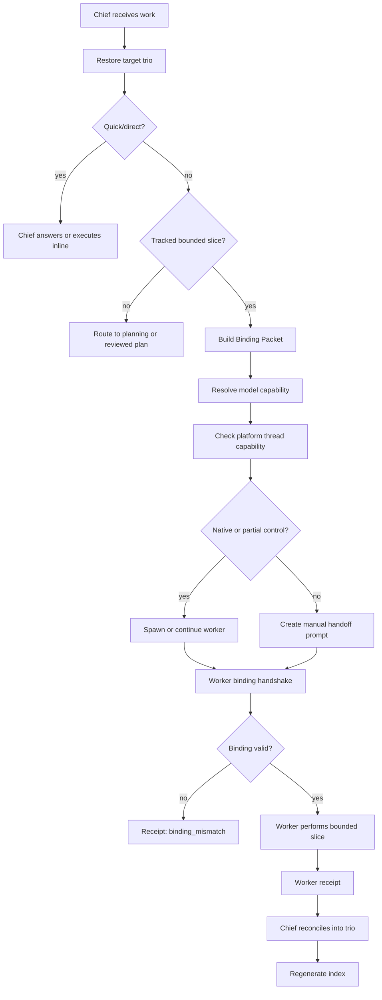

# ChiefOps V0b Thread Control Overlay Design

## Status

Draft for user review.

This is a constrained design spec, not an implementation plan. It records the V0b product and protocol boundaries that must be preserved before planning implementation work.

## Goal

ChiefOps V0b gives a chief session a real, capability-adaptive way to observe, spawn, continue, hand off, abandon, or respawn worker sessions while keeping durable truth in the existing planning trio.

The design must support coding and office work, reduce wrong-trio and wrong-source failures, and stay economical by routing work to the cheapest safe model capability.

## Non-Goals

- Do not replace `planning/active/<task-id>/` as the source of truth.
- Do not create a second durable task registry.
- Do not introduce worker heartbeat runtime.
- Do not auto-publish, release, merge, deploy, archive, or write external systems without an approval gate.
- Do not rely on fixed model names in durable workflow rules.
- Do not pretend thread control succeeded when the platform cannot perform it.

## Selected V0b Shape

V0b targets a real thread control overlay, with honest fallback.

- `native_control`: use platform-supported create, observe, message, continue, and handoff.
- `partial_control`: use supported actions and degrade missing actions individually.
- `manual_handoff`: generate a ready-to-paste worker prompt plus expected receipt shape.
- `unsupported`: stop with a blocker receipt.

In every mode, the same binding packet and receipt shape must be written back to the authoritative trio.

## Authority Model

The authoritative state remains file-truth:

- `planning/active/<task-id>/task_plan.md`
- `planning/active/<task-id>/findings.md`
- `planning/active/<task-id>/progress.md`
- optional receipts, PRs, approvals, release evidence, or publish evidence

Thread/session state is control plane only. It can help chief communicate with workers, but it cannot redefine scope, lifecycle, proof status, source authority, or acceptance.

## Mapping Storage

V0b uses per-trio authoritative mapping plus a generated global index.

- Source of truth: coordination notes in the target trio, especially `progress.md`.
- Derived view: generated global index for chief overview.
- Conflict rule: if index and trio disagree, the trio wins and chief must reconcile.
- Forbidden: lifecycle decisions, proof acceptance, or worker authority written only into the index.

The generated index should be rebuildable from trio records.

Minimum index fields:

- `authorityTaskId`
- `planningRoot`
- `workerId`
- `threadId` or `sessionId`
- `status`
- `lastCheckInAt`
- `currentSlice`
- `proofTarget`
- `evidenceSink`
- `indexGeneratedAt`
- `sourceProgressRef`

## Spawn Authority

Chief may auto-spawn low-risk workers only when every condition is true:

- same repo and same authority root
- existing bound trio or explicitly bound current unit
- one bounded slice
- clear `currentSlice`, `proofTarget`, and `evidenceSink`
- non-destructive
- non-publish
- non-release
- no external system write
- concurrency stays within the current ceiling
- model resolver can satisfy the requested capability class
- worker can complete binding handshake before work

Chief must ask the human before:

- creating a new trio from discovery
- exceeding concurrency ceiling
- crossing repo or authority root
- release, publish, send, merge, deploy, archive, or destructive operations
- external system writes
- ambiguous source of truth, publish target, or approval gate
- high-cost model escalation beyond the declared budget
- resurrecting a stale worker when file truth conflicts with old session context

Chief must stop for review when binding fails, source truth is unclear, index and trio conflict, deep work lacks a reviewed plan, or the worker would need to improvise architecture, compliance, publication, or release judgment.

## Concurrency

Default V0b concurrency is one active worker per authority task.

- Default: `1`
- Soft max with approval: `2`
- Hard max for V0b: `3`

Parallel workers require explicit human approval or a reviewed plan. Each worker must have a non-overlapping slice, separate proof target, separate evidence sink, visible index entry, and enough chief context budget for reconciliation.

If more than three workers seem necessary, split work into multiple trios or write a deeper plan.

## Inactive Worker Handling

Chief should continue a worker only when it is safe.

Continue requires:

- valid platform control handle
- matching `authorityTaskId` and `workerId`
- no material trio drift since last check-in
- no contradictory receipt, PR state, approval state, or lifecycle state
- next instruction is a bounded continuation of the same slice

Respawn is required when the thread is unavailable, old context may be stale, file truth materially changed, ambiguity was resolved in the trio, the task needs a fresh model/source/proof target, or binding/index/cross-trio conflict appears.

Abandon is required when the slice is no longer needed, the worker went off-scope, output is unverifiable or unsafe, or continuing would trust session memory over file truth.

## Binding Packet

The Binding Packet is chief's contract to the worker.

Required fields:

- `schemaVersion`
- `action`
- `authorityTaskId`
- `planningRoot`
- `chiefThreadId`
- `workerId`
- `threadId` or `sessionId`, nullable only before spawn returns a handle
- `currentSlice`
- `proofTarget`
- `evidenceSink`
- `capabilityClass`
- `riskClass`
- `requiresHumanApproval`
- `createdAt`
- `bindingToken` or `bindingVersion`

Optional fields:

- `parentTaskId`
- `sourceSet`
- `systemOfRecord`
- `publishTarget`
- `approvalGate`
- `allowedOps`
- `nonGoals`
- `upgradeTrigger`
- `expectedCheckInBy`

Worker must verify the binding before work. If verification fails, worker returns `binding_mismatch` and stops.

## Receipts

Worker receipts must echo the binding identity.

Required fields:

- `schemaVersion`
- `receiptType`
- `authorityTaskId`
- `workerId`
- `threadId` or `sessionId`
- `currentSlice`
- `status`
- `summary`
- `evidenceRefs`
- `nextSuggestedAction`
- `createdAt`

Standard receipt types:

- `binding_verified`
- `binding_mismatch`
- `started`
- `check_in`
- `blocked`
- `done`
- `new_trio_candidate`
- `abandoned`
- `respawn_recommended`
- `manual_handoff_required`
- `capability_unavailable`
- `resolver_failed`

Markdown coordination notes may wrap these fields, but the key/value shape must remain parseable enough for index generation.

## Office Work Authority

Office work requires source authority, not just task authority.

Required office-work fields:

- `sourceSet`: materials the worker may inspect or cite
- `systemOfRecord`: authoritative source when materials disagree
- `publishTarget`: allowed final write or publish destination

Rules:

- no `publishTarget`: draft only
- no `systemOfRecord`: summarize uncertainty, do not assert final truth
- conflicting sources: return conflict and ask chief to reconcile
- stakeholder-visible or external-facing output: require `approvalGate`

Receipts should include `sourceRefs` and `publishRef` when applicable, without inlining sensitive material.

## Model Resolver

V0b includes a lightweight model resolver CLI.

Resolver inputs:

- `capabilityClass`
- `reasoningEffort`
- `budgetReason`
- `upgradeTrigger`

Resolver outputs:

- `requestedCapabilityClass`
- `resolvedModelAtRun`
- fallback or downgrade explanation when needed

Resolver non-goals:

- no autonomous cost optimizer
- no hidden dynamic escalation
- no model-specific workflow branches in the core protocol
- no hard dependency on one vendor SKU or future model name

If no available model satisfies the requested capability class, spawn or continue stops with `resolver_failed` or `blocked`.

## Core Flow

## Error Handling

- Binding mismatch stops worker execution.
- Index/trio conflict triggers reconcile and trio wins.
- Capability unavailable produces blocker or manual handoff receipt.
- Resolver failure stops model-dependent worker actions.
- Stale worker may be continued once only if binding and file truth still match.
- Wrong source authority blocks publish/write in office work.
- Deep or ambiguous work without a reviewed plan routes back to planning.

## Verification Contract

Primary proof for this design is review proof: the spec must preserve authority boundaries, routing gates, and failure behavior.

Backstop proof for implementation planning should include:

- schema validation for packets and receipts
- fixture tests for index rebuild from per-trio notes
- dry-run tests for capability fallback
- dry-run tests for model resolver failure
- manual fallback prompt inspection
- office source authority guard checks

Unacceptable substitutes:

- green unit tests that do not exercise wrong-trio prevention
- generated index working while trio sync is wrong
- worker output accepted without matching receipt identity
- model resolver silently choosing an underpowered model
- manual handoff treated as native thread control

## Design Review Gate

This spec is ready for user review. After approval, the next step is to write an implementation plan that decomposes V0b into narrow build units.
