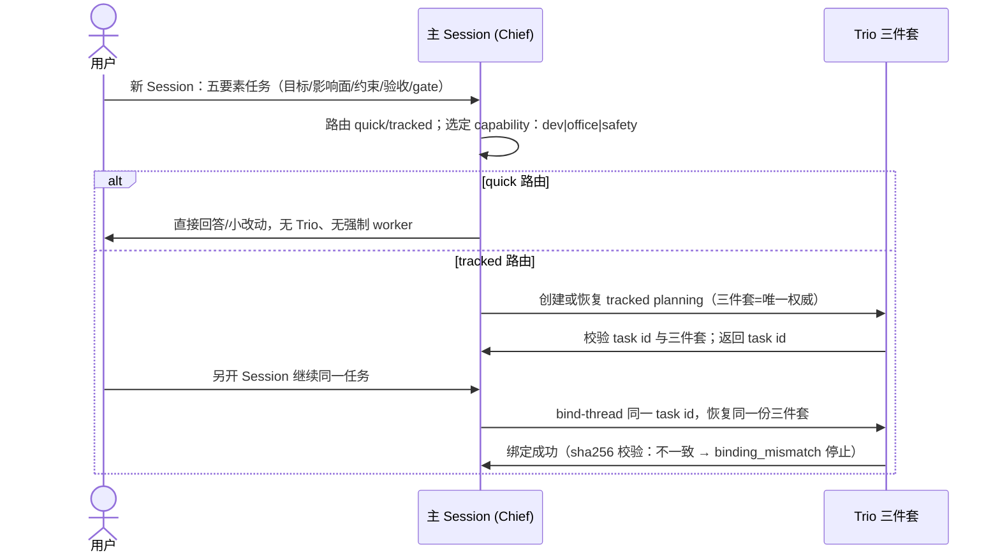
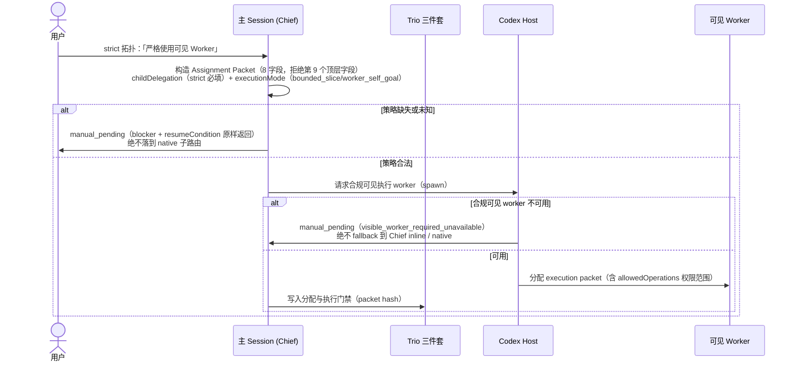
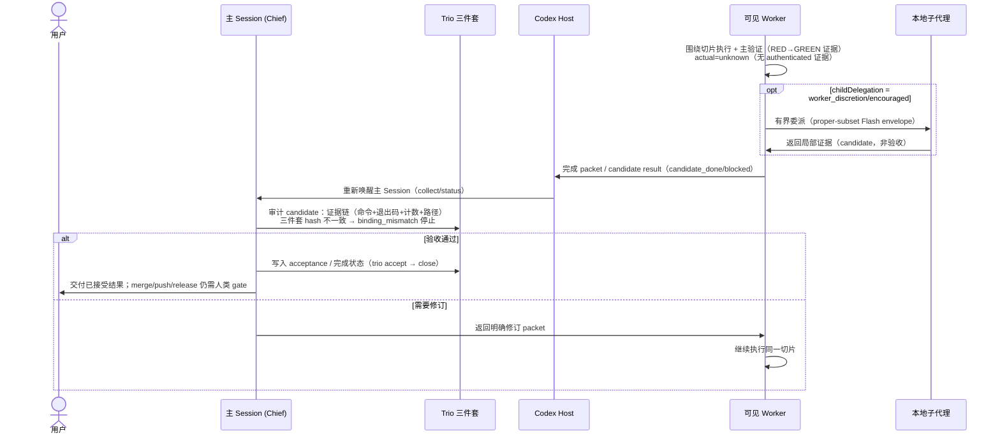
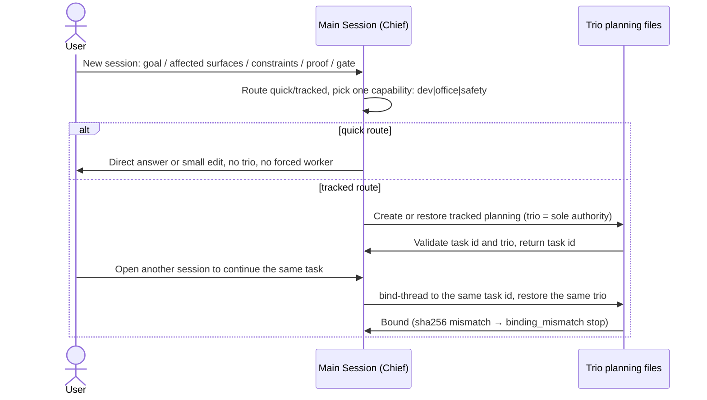
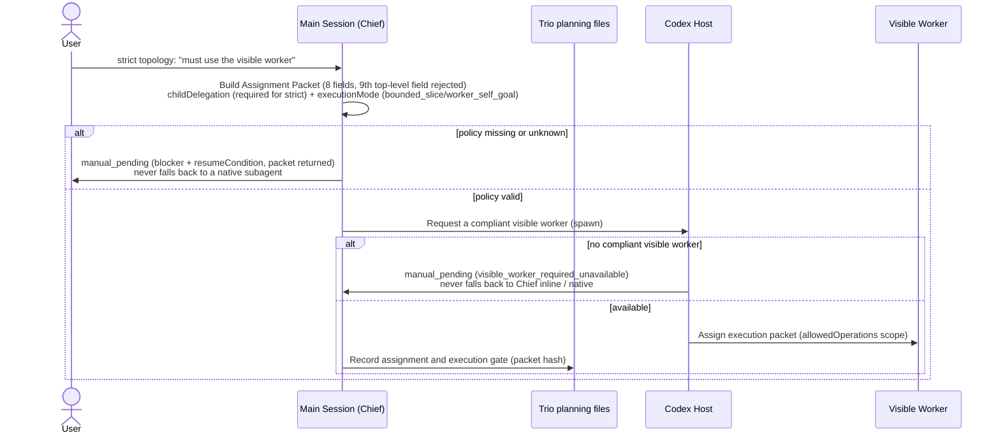
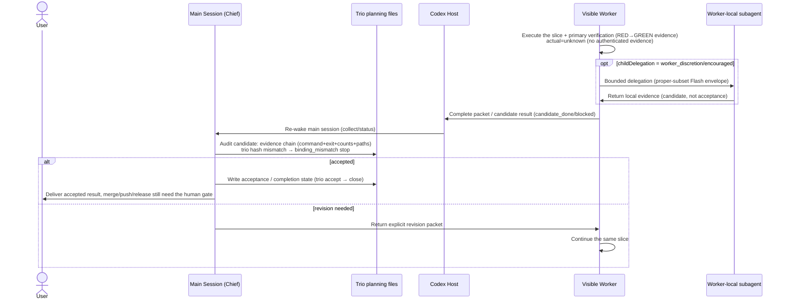

# 基本作业流程（Trio v2 时序图）

> 本文是 Trio v2 基本作业流程的图版，与 [human-usage.md](human-usage.md) 配套。三张时序图依次覆盖：**路由与绑定 → strict 派单 → 执行、验收与修订**。图源即下方 mermaid 代码块（GitHub 原生渲染）；修改时直接编辑代码块，并保持与 `human-usage.md` 的术语一致。

## 图 1：路由与绑定

quick/tracked 路由与 Trio 三件套的创建/恢复、`bind-thread` 绑定；三件套 sha256 与派单不一致即 `binding_mismatch` 停止。

## 图 2：strict 拓扑与派单门禁

strict 必须显式声明 `childDelegation`；策略缺失/未知、合规可见 worker 不可用都只走 `manual_pending`，绝不落到 native 子路由或 Chief inline 执行。

## 图 3：执行、验收与修订

worker 围绕切片做生产变更 + 主验证，产出 candidate；Chief 审计证据链后验收回写，或返回明确修订 packet；worker 本地子委托仅在 packet 显式允许（`worker_discretion`/`encouraged`）时可用。

## 贯穿注记

- **权限三层门禁 `adjudicatePermission`**：scope（`allowedOperations.files` 唯一授权；越界/物化输出 `generated_target` → blocked）→ sandbox（需 authenticated + packetDigest；writableRoots 覆盖目标）→ approval（绝不扩大 allowed paths；Full Access/审批/auto-review 不扩权）。
- **`manual_pending` 处置三选一**：① 人工提供/操作合规可见的 Don Michael worker（精确 packet 手动 bind）② 显式释放 strict 拓扑（改回 native-first default 路由）③ 等待/判定 blocked。
- **Host 生命周期桥未实现**：authenticated role/packet/actual、spawn/continue/status/interrupt/collect、动态 child 拒绝缺失时，`manual_pending` 是设计内诚实出口，不本地模拟、不绕过。

## 实现溯源

- 本地 fail-closed 路由契约：`harness/trio/core/routing.mjs`（Assignment Packet 八字段、`childDelegation`/`executionMode` 门禁、`adjudicatePermission` 三层权限、workRole/经济路由）。
- Corleone 请求角色：`harness/trio/hosts/codex.mjs`（`CORLEONE_ROSTER`、`selectCorleoneRole` 与 `renderCorleoneRosterConfig`；Flash high/xhigh/max）。默认执行路由为 native-first；`visible_worker_required` 只选择 Don Michael。
- 绑定校验与 ChiefOps 治理：`harness/trio/governance/chiefops/SKILL.md`。
- 人类操作面与边界：`docs/trio-v2/human-usage.md`。

## 英文版图源（README 静态图）

README 中的三张英文时序图由此渲染为 `docs/trio-v2/trio-workflow-*.png`（同一流程的英文版，供 README 引用；中文版见上文）。注意：mermaid 11.x 的时序图消息文本不能含 ASCII 分号 `;`，请使用逗号或全角 `；`。

