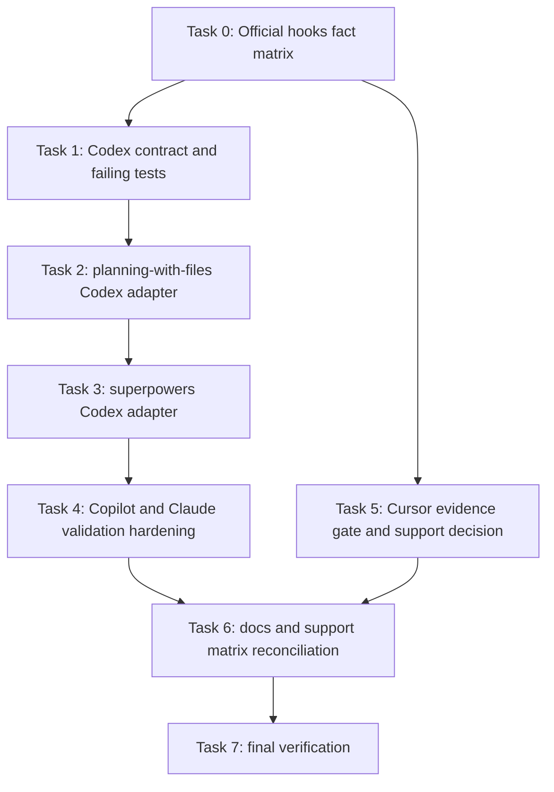

# Codex Hooks And Cross-IDE Hook Projection Implementation Plan

> **For agentic workers:** REQUIRED SUB-SKILL: Use superpowers:subagent-driven-development (recommended) or superpowers:executing-plans to implement this plan task-by-task. Steps use checkbox (`- [ ]`) syntax for tracking.

**Goal:** 基于各 IDE 官方 hooks 文档，为 HarnessTemplate 补齐 Codex hooks adapter，并只对有官方文档支撑的 hooks 投影链路做校正、验证和加固。

**Architecture:** 继续沿用 Harness 的 metadata-driven projection 架构，不把平台细节散落到 `sync`。所有实施前提都必须先落到“官方 hooks 事实矩阵”里：只有官方文档明确描述了路径、事件、配置容器或兼容行为的目标，才允许在计划中设计 adapter 或健康校验。Codex 不直接复用 upstream hook 资产，而是新增 Harness-owned wrapper adapter，保证上游 baseline 可替换、目标平台输出契约清晰。对官方证据不足的目标，计划只允许做支持声明收缩、文档降级或保守维持，不允许扩展实现。

**Tech Stack:** Node.js ESM, `node:test`, JSON hook configs, POSIX shell scripts, Harness installer/health pipeline.

---

## Current State
Status: active
Archive Eligible: no
Close Reason:

## Scope And Constraints

- 本计划只输出实现方案，不直接执行代码修改。
- 本计划的 hooks 事实来源只允许来自官方文档。
- 计划必须覆盖：
  - Codex hooks support 接入；
  - Codex 官方 `skills` / `hooks` 路径纠偏；
  - Copilot、Claude Code hooks 投影和 health/status 校验加固；
  - Cursor hooks 证据复核；若缺少官方 docs 级依据，则只允许降级支持叙述或保守维持；
  - 文档、矩阵、测试、installer metadata 一致化。
- 不修改 `harness/upstream/*` 的 vendor baseline 语义；如需针对 Codex 输出适配，优先新增 Harness-owned wrapper。

## Execution Controls

- Worktree base: `dev @ c4297b928f6e0e0d9d7825c123d008b60d59637e`.
- 主工作区当前包含本计划文件的未提交改动；执行前必须把 `planning/active/codex-hook-rationale-review/` 的最新文件同步到隔离 worktree。
- 本计划中的任务级 commit 步骤已改为 checkpoint。执行时只在 Task 7 通过全部验证后创建一个实现提交，避免中间提交和最终提交重复。
- Cursor hooks 不得在没有官方 docs 级依据时继续扩展实现。若证据缺口仍存在，只更新 docs/status 的支持声明，不改变 Cursor hook adapter 的行为。

## File Structure

- Modify: `harness/core/metadata/platforms.json`
  统一 Codex skill root / hook root 的官方路径契约。
- Modify: `harness/core/skills/index.json`
  把 hook descriptor 从“隐含脚本集合”升级为“显式 target adapter contract”。
- Modify: `harness/installer/lib/hook-projection.mjs`
  支持 Codex，并允许每个 target 定义不同 config 文件、script 列表、config format。
- Modify: `harness/installer/commands/sync.mjs`
  减少 target-specific hardcode，把 hook adaptation 收敛到 descriptor 或 wrapper。
- Modify: `harness/installer/lib/health.mjs`
  从 marker 校验升级为 capability-aware 校验。
- Modify: `harness/installer/lib/hook-config.mjs`
  保持 merge 逻辑简洁，同时允许更细粒度的校验辅助函数。
- Create: `harness/core/hooks/planning-with-files/codex-hooks.json`
  Codex planning hook config。
- Modify: `harness/core/hooks/planning-with-files/scripts/task-scoped-hook.sh`
  新增 Codex 输出分支，严格贴合官方 hook JSON 结构。
- Create: `harness/core/hooks/superpowers/codex-hooks.json`
  Codex superpowers hook config。
- Create: `harness/core/hooks/superpowers/scripts/session-start`
  Codex 专用 session-start wrapper，输出官方 Codex hook payload。
- Create: `harness/core/hooks/superpowers/scripts/run-hook.cmd`
  与现有 hook projection contract 保持一致；可做最小 wrapper。
- Modify: `docs/install/codex.md`
- Modify: `docs/install/copilot.md`
- Modify: `docs/install/cursor.md`
- Modify: `docs/compatibility/hooks.md`
- Modify: `docs/architecture.md`
- Modify: `README.md`
- Modify: `tests/adapters/hook-projection.test.mjs`
- Modify: `tests/adapters/sync-hooks.test.mjs`
- Modify: `tests/installer/health.test.mjs`
- Modify: `tests/installer/hook-config.test.mjs`
- Modify: `tests/installer/paths.test.mjs`
- Modify: `tests/adapters/sync-skills.test.mjs`
- Create: `tests/hooks/task-scoped-hook.test.mjs`
- Create: `tests/hooks/superpowers-codex-hook.test.mjs`

## Finishing Criteria

- `Codex` 在 `hookMode: on` 时会被 planner 标为 `planned`，不再是 `unsupported`。
- `sync` 会把 Codex hooks 写到 `<repo>/.codex/hooks.json` 或 `~/.codex/hooks.json`，并投影对应脚本。
- `task-scoped-hook.sh` 对 Codex 输出 `hookSpecificOutput` 结构；`PreToolUse` / `PostToolUse` 不伪装成比官方更强的能力。
- `superpowers` 对 Codex 使用 Harness-owned wrapper，而不是直接假设 upstream `session-start` 的输出能兼容 Codex。
- Copilot、Claude Code 的 hooks 继续可投影，并有 focused tests 证明 config、script、marker、事件名、目标路径都正确。
- Cursor 的最终状态必须与官方 docs 证据一致：
  - 若找到官方 docs，则按 docs 纠正实现和验证；
  - 若没有 docs 级依据，则文档和状态输出必须明确它是 evidence gap，不再把当前实现细节表述成已验证契约。
- `readHarnessHealth()` 对 hooks 的校验能区分：
  - `unsupported`
  - `missing`
  - `problem`
  - `ok`
  且能验证事件和脚本路径，而不仅仅是 marker。
- Codex 的 skills 文档和 metadata 与官方 `.agents/skills` / `~/.agents/skills` 对齐。
- `npm run verify` 通过。

## Task Graph



### Task 0: Build The Official Hooks Fact Matrix

**Files:**
- Modify: `planning/active/codex-hook-rationale-review/findings.md`
- Modify: `planning/active/codex-hook-rationale-review/progress.md`
- Modify: `docs/architecture.md`

- [ ] **Step 1: Record only doc-backed hooks facts per IDE**

Add a matrix that separates official facts from Harness-owned conventions:

```md
| Target | Official doc-backed facts | Not yet doc-backed |
| --- | --- | --- |
| Codex | `.codex/hooks.json`, `~/.codex/hooks.json`, `SessionStart`, `UserPromptSubmit`, `PreToolUse`, `PostToolUse`, `Stop`, feature flag, Windows disabled | exact Harness file naming under `.codex/hooks/*` |
| Copilot / VS Code | `.github/hooks/*.json`, `~/.copilot/hooks`, PascalCase events, Claude config compatibility, Copilot CLI lowerCamelCase compatibility | exact Harness filename inside hook folder |
| Claude Code | `.claude/settings.json`, `.claude/settings.local.json`, `~/.claude/settings.json`, stdout context behavior for `SessionStart`/`UserPromptSubmit` | none needed before implementation |
| Cursor | no directly cited official docs facts captured yet | paths, event names, JSON schema, matcher semantics |
```

- [ ] **Step 2: Re-run the official-source audit and verify every retained fact has a citation**

Run:

```bash
rg -n "Codex|Copilot|Claude|Cursor" planning/active/codex-hook-rationale-review/findings.md docs/architecture.md
```

Expected:

```text
Only doc-backed statements remain as implementation premises.
```

- [ ] **Step 3: Checkpoint**

```bash
git diff -- planning/active/codex-hook-rationale-review/findings.md planning/active/codex-hook-rationale-review/progress.md docs/architecture.md
```

### Task 1: Codex Contract And Failing Tests

**Files:**
- Modify: `harness/core/metadata/platforms.json`
- Modify: `harness/core/skills/index.json`
- Modify: `tests/installer/paths.test.mjs`
- Modify: `tests/adapters/hook-projection.test.mjs`
- Modify: `tests/adapters/sync-skills.test.mjs`

- [ ] **Step 1: Write the failing Codex contract tests**

Add focused assertions for official Codex roots and planned hooks:

```js
test('resolveSkillRoots uses official Codex .agents skill roots', () => {
  assert.deepEqual(resolveSkillRoots('/repo', '/home/user', 'workspace', 'codex'), [
    '/repo/.agents/skills'
  ]);
  assert.deepEqual(resolveSkillRoots('/repo', '/home/user', 'user-global', 'codex'), [
    '/home/user/.agents/skills'
  ]);
});

test('planHookProjections returns planned Codex planning hook config', async () => {
  const plans = await planHookProjections({
    rootDir: process.cwd(),
    homeDir: '/home/user',
    scope: 'workspace',
    target: 'codex',
    hookMode: 'on'
  });
  const planning = plans.find((plan) => plan.parentSkillName === 'planning-with-files');

  assert.equal(planning.status, 'planned');
  assert.equal(planning.configTarget, path.join(process.cwd(), '.codex/hooks.json'));
});
```

- [ ] **Step 2: Run the focused tests and verify they fail**

Run:

```bash
npm run test -- tests/installer/paths.test.mjs tests/adapters/hook-projection.test.mjs tests/adapters/sync-skills.test.mjs
```

Expected:

```text
FAIL ... expected '/repo/.agents/skills'
FAIL ... expected status 'planned' for codex planning hook
```

- [ ] **Step 3: Update platform metadata and hook descriptor contract**

Adjust Codex roots and move hook descriptors toward explicit target adapters:

```json
"codex": {
  "displayName": "Codex",
  "entryFiles": ["AGENTS.md"],
  "skillRoots": {
    "workspace": [".agents/skills"],
    "global": [".agents/skills"]
  },
  "hookRoots": {
    "workspace": [".codex"],
    "global": [".codex"]
  }
}
```

```json
"planning-with-files": {
  "hooks": {
    "codex": {
      "source": "harness/core/hooks/planning-with-files",
      "config": "codex-hooks.json",
      "scripts": ["task-scoped-hook.sh"],
      "events": ["SessionStart", "UserPromptSubmit", "Stop"]
    }
  }
}
```

- [ ] **Step 4: Run the same focused tests and verify metadata/planner contract passes**

Run:

```bash
npm run test -- tests/installer/paths.test.mjs tests/adapters/hook-projection.test.mjs tests/adapters/sync-skills.test.mjs
```

Expected:

```text
PASS ... resolveSkillRoots uses official Codex .agents skill roots
PASS ... planHookProjections returns planned Codex planning hook config
PASS ... sync projects workspace entries and skills
```

- [ ] **Step 5: Checkpoint**

```bash
git diff -- harness/core/metadata/platforms.json harness/core/skills/index.json tests/installer/paths.test.mjs tests/adapters/hook-projection.test.mjs tests/adapters/sync-skills.test.mjs
```

### Task 2: Add The planning-with-files Codex Adapter

**Files:**
- Create: `harness/core/hooks/planning-with-files/codex-hooks.json`
- Modify: `harness/core/hooks/planning-with-files/scripts/task-scoped-hook.sh`
- Modify: `harness/installer/lib/hook-projection.mjs`
- Modify: `tests/adapters/hook-projection.test.mjs`
- Modify: `tests/adapters/sync-hooks.test.mjs`
- Create: `tests/hooks/task-scoped-hook.test.mjs`

- [ ] **Step 1: Write failing Codex planning-hook behavior tests**

Add a sync test and a shell-output test:

```js
test('sync installs codex planning hooks when hookMode is on', async () => {
  await writeState(root, {
    schemaVersion: 1,
    scope: 'workspace',
    projectionMode: 'link',
    hookMode: 'on',
    targets: { codex: { enabled: true, paths: [path.join(root, 'AGENTS.md')] } },
    upstream: {}
  });

  await withCwd(root, () => sync([]));
  const hooks = JSON.parse(await readFile(path.join(root, '.codex/hooks.json'), 'utf8'));
  assert.ok(hooks.hooks.SessionStart);
  assert.ok(hooks.hooks.UserPromptSubmit);
  assert.ok(hooks.hooks.Stop);
});
```

```js
test('task-scoped-hook emits Codex hookSpecificOutput payload', async () => {
  const { stdout } = await execFileAsync('bash', [
    scriptPath,
    'codex',
    'user-prompt-submit'
  ], { cwd: fixtureRoot });

  const payload = JSON.parse(stdout);
  assert.equal(payload.hookSpecificOutput.hookEventName, 'UserPromptSubmit');
  assert.match(payload.hookSpecificOutput.additionalContext, /ACTIVE PLAN/);
});
```

- [ ] **Step 2: Run the focused tests and verify failure**

Run:

```bash
npm run test -- tests/adapters/sync-hooks.test.mjs tests/hooks/task-scoped-hook.test.mjs tests/adapters/hook-projection.test.mjs
```

Expected:

```text
FAIL ... ENOENT: no such file or directory, open '.codex/hooks.json'
FAIL ... payload.hookSpecificOutput is undefined
```

- [ ] **Step 3: Add Codex planning hook config and Codex output branch**

Create the config:

```json
{
  "hooks": {
    "SessionStart": [
      {
        "hooks": [
          {
            "type": "command",
            "command": "sh -c '[ -f .codex/hooks/task-scoped-hook.sh ] && bash .codex/hooks/task-scoped-hook.sh codex session-start || bash \"$HOME/.codex/hooks/task-scoped-hook.sh\" codex session-start'"
          }
        ],
        "description": "Harness-managed planning-with-files hook"
      }
    ],
    "UserPromptSubmit": [
      {
        "hooks": [
          {
            "type": "command",
            "command": "sh -c '[ -f .codex/hooks/task-scoped-hook.sh ] && bash .codex/hooks/task-scoped-hook.sh codex user-prompt-submit || bash \"$HOME/.codex/hooks/task-scoped-hook.sh\" codex user-prompt-submit'"
          }
        ],
        "description": "Harness-managed planning-with-files hook"
      }
    ],
    "Stop": [
      {
        "hooks": [
          {
            "type": "command",
            "command": "sh -c '[ -f .codex/hooks/task-scoped-hook.sh ] && bash .codex/hooks/task-scoped-hook.sh codex stop || bash \"$HOME/.codex/hooks/task-scoped-hook.sh\" codex stop'"
          }
        ],
        "description": "Harness-managed planning-with-files hook"
      }
    ]
  }
}
```

Update the shell script with an explicit Codex branch:

```bash
    codex)
      printf '{"hookSpecificOutput":{"hookEventName":"%s","additionalContext":%s}}\n' "$hook_event" "$escaped"
      ;;
```

And normalize event names:

```bash
  pre-tool-use)
    emit_context "$context" "PreToolUse"
    ;;
  post-tool-use)
    emit_context "[planning-with-files] Update $progress with what you just did. If the phase changed, update $plan." "PostToolUse"
    ;;
```

- [ ] **Step 4: Update planner to project Codex scripts under `.codex/hooks`**

Refactor script lists away from hardcoded assumptions:

```js
const scriptRoot = hookConfig.scriptRoot
  ? path.join(sourceRoot, hookConfig.scriptRoot)
  : path.join(sourceRoot, 'scripts');

return {
  kind: 'hook',
  parentSkillName,
  target,
  eventNames: hookConfig.events ?? [],
  configSource: path.join(sourceRoot, hookConfig.config),
  configTarget: hookConfigTarget(root, target, parentSkillName),
  configFormat: 'hooks',
  scriptSourcePaths: hookConfig.scripts.map((file) => path.join(scriptRoot, file)),
  scriptTargetRoot: scriptTargetRoot(root, target),
  status: 'planned'
};
```

For Claude Code, preserve the existing `settings` merge branch explicitly:

```js
configFormat: target === 'claude-code' ? 'settings' : 'hooks'
```

- [ ] **Step 5: Run focused tests and verify Codex planning hook passes**

Run:

```bash
npm run test -- tests/adapters/hook-projection.test.mjs tests/adapters/sync-hooks.test.mjs tests/hooks/task-scoped-hook.test.mjs
```

Expected:

```text
PASS ... sync installs codex planning hooks when hookMode is on
PASS ... task-scoped-hook emits Codex hookSpecificOutput payload
```

- [ ] **Step 6: Checkpoint**

```bash
git diff -- harness/core/hooks/planning-with-files/codex-hooks.json harness/core/hooks/planning-with-files/scripts/task-scoped-hook.sh harness/installer/lib/hook-projection.mjs tests/adapters/hook-projection.test.mjs tests/adapters/sync-hooks.test.mjs tests/hooks/task-scoped-hook.test.mjs
```

### Task 3: Add The superpowers Codex Adapter

**Files:**
- Create: `harness/core/hooks/superpowers/codex-hooks.json`
- Create: `harness/core/hooks/superpowers/scripts/session-start`
- Create: `harness/core/hooks/superpowers/scripts/run-hook.cmd`
- Modify: `harness/core/skills/index.json`
- Modify: `harness/installer/commands/sync.mjs`
- Modify: `tests/adapters/sync-hooks.test.mjs`
- Create: `tests/hooks/superpowers-codex-hook.test.mjs`

- [ ] **Step 1: Write failing Codex superpowers hook tests**

Add a sync test and a payload test:

```js
test('sync installs codex superpowers hook alongside planning hook', async () => {
  await withCwd(root, () => sync([]));
  const hooks = JSON.parse(await readFile(path.join(root, '.codex/hooks.json'), 'utf8'));
  assert.ok(hooks.hooks.SessionStart);
  assert.match(JSON.stringify(hooks), /Harness-managed superpowers hook/);
});
```

```js
test('superpowers codex session-start emits hookSpecificOutput payload', async () => {
  const { stdout } = await execFileAsync('bash', [sessionStartScript], { cwd: fixtureRoot });
  const payload = JSON.parse(stdout);
  assert.equal(payload.hookSpecificOutput.hookEventName, 'SessionStart');
  assert.match(payload.hookSpecificOutput.additionalContext, /using-superpowers/);
});
```

- [ ] **Step 2: Run the focused tests and verify they fail**

Run:

```bash
npm run test -- tests/adapters/sync-hooks.test.mjs tests/hooks/superpowers-codex-hook.test.mjs
```

Expected:

```text
FAIL ... missing Harness-managed superpowers hook
FAIL ... hookSpecificOutput is undefined
```

- [ ] **Step 3: Create a Harness-owned Codex wrapper instead of reusing upstream output blindly**

Create Codex config:

```json
{
  "hooks": {
    "SessionStart": [
      {
        "hooks": [
          {
            "type": "command",
            "command": "sh -c '[ -f .codex/hooks/session-start ] && sh .codex/hooks/session-start || sh \"$HOME/.codex/hooks/session-start\"'"
          }
        ],
        "description": "Harness-managed superpowers hook"
      }
    ]
  }
}
```

Create a dedicated wrapper that reads the upstream skill and emits Codex-shaped JSON:

```bash
using_superpowers_content=$(cat "${PLUGIN_ROOT}/../../upstream/superpowers/skills/using-superpowers/SKILL.md")
session_context="<EXTREMELY_IMPORTANT>\nYou have superpowers.\n\n${using_superpowers_escaped}\n</EXTREMELY_IMPORTANT>"
printf '{"hookSpecificOutput":{"hookEventName":"SessionStart","additionalContext":"%s"}}\n' "$session_context"
```

- [ ] **Step 4: Remove target-specific superpowers hardcode from `sync.mjs` where possible**

Replace this style:

```js
if (projection.parentSkillName === 'superpowers' && projection.target === 'cursor') {
  // mutate command inline
}
```

with descriptor-driven or wrapper-driven projection so `sync` no longer knows Codex-specific superpowers command text.

- [ ] **Step 5: Run focused tests and verify Codex superpowers adapter passes**

Run:

```bash
npm run test -- tests/adapters/sync-hooks.test.mjs tests/hooks/superpowers-codex-hook.test.mjs
```

Expected:

```text
PASS ... sync installs codex superpowers hook alongside planning hook
PASS ... superpowers codex session-start emits hookSpecificOutput payload
```

- [ ] **Step 6: Checkpoint**

```bash
git diff -- harness/core/hooks/superpowers/codex-hooks.json harness/core/hooks/superpowers/scripts/session-start harness/core/hooks/superpowers/scripts/run-hook.cmd harness/core/skills/index.json harness/installer/commands/sync.mjs tests/adapters/sync-hooks.test.mjs tests/hooks/superpowers-codex-hook.test.mjs
```

### Task 4: Harden Copilot And Claude Hook Health And Adaptation

**Files:**
- Modify: `harness/installer/lib/health.mjs`
- Modify: `harness/installer/lib/hook-config.mjs`
- Modify: `tests/installer/health.test.mjs`
- Modify: `tests/installer/hook-config.test.mjs`
- Modify: `tests/adapters/sync-hooks.test.mjs`

- [ ] **Step 1: Write failing health tests for event-level validation**

Add tests that prove marker-only checks are too weak:

```js
test('readHarnessHealth reports problem when Codex hook config is missing Stop event', async () => {
  await writeFile(
    path.join(root, '.codex/hooks.json'),
    JSON.stringify({ hooks: { SessionStart: [] } }, null, 2)
  );
  const health = await readHarnessHealth(root, '/home/user');
  const planning = health.targets.codex.hooks.find((hook) => hook.parentSkillName === 'planning-with-files');
  assert.equal(planning.status, 'problem');
  assert.match(planning.message, /missing required event Stop/);
});
```

```js
test('readHarnessHealth reports problem when expected Claude hook script path is missing', async () => {
  const hook = health.targets['claude-code'].hooks.find((entry) => entry.parentSkillName === 'superpowers');
  assert.equal(hook.status, 'missing');
  assert.match(hook.message, /run-hook\.cmd/);
});
```

- [ ] **Step 2: Run tests and verify failure**

Run:

```bash
npm run test -- tests/installer/health.test.mjs tests/installer/hook-config.test.mjs tests/adapters/sync-hooks.test.mjs
```

Expected:

```text
FAIL ... missing required event Stop
FAIL ... expected missing script path to be reported
```

- [ ] **Step 3: Add capability-aware inspection helpers**

Introduce small helpers instead of embedding logic inline:

```js
function requiredHookEvents(projection) {
  return projection.eventNames ?? [];
}

function hookConfigHasEvent(config, eventName) {
  return Array.isArray(config.hooks?.[eventName]) && config.hooks[eventName].length > 0;
}
```

Then use them in `inspectHook()`:

```js
for (const eventName of requiredHookEvents(projection)) {
  if (!hookConfigHasEvent(config, eventName)) {
    return { ...projection, status: 'problem', message: `Hook config is missing required event ${eventName}.` };
  }
}
```

- [ ] **Step 4: Ensure existing IDE adaptations still pass under stricter checks**

Keep focused assertions for:

```js
assert.ok(hooks.hooks.sessionStart);
assert.ok(hooks.hooks.preToolUse);
assert.match(JSON.stringify(settings.hooks), /Harness-managed planning-with-files hook/);
assert.match(JSON.stringify(settings.hooks), /Harness-managed superpowers hook/);
```

This prevents the stricter health rules from silently breaking Copilot or Claude Code while Codex is added.

- [ ] **Step 5: Run the hardened validation suite**

Run:

```bash
npm run test -- tests/installer/health.test.mjs tests/installer/hook-config.test.mjs tests/adapters/sync-hooks.test.mjs
```

Expected:

```text
PASS ... readHarnessHealth reports problem when Codex hook config is missing Stop event
PASS ... existing copilot and claude hook sync tests remain green
```

- [ ] **Step 6: Checkpoint**

```bash
git diff -- harness/installer/lib/health.mjs harness/installer/lib/hook-config.mjs tests/installer/health.test.mjs tests/installer/hook-config.test.mjs tests/adapters/sync-hooks.test.mjs
```

### Task 5: Cursor Evidence Gate And Support Decision

**Files:**
- Modify: `docs/install/cursor.md`
- Modify: `docs/compatibility/hooks.md`
- Modify: `docs/architecture.md`
- Modify: `tests/installer/health.test.mjs`

- [ ] **Step 1: Confirm whether Cursor has a docs-level hooks contract**

Use only official docs search results already captured for this task. If no Cursor docs page with hook path/schema/event details is available, treat that as an evidence gap instead of filling gaps from current implementation.

- [ ] **Step 2: Add a failing expectation that Cursor evidence level is explicit**

```js
test('Cursor hooks are marked provisional when official hook docs are not cited', async () => {
  const health = await readHarnessHealth(root, '/home/user');
  const planning = health.targets.cursor.hooks.find((hook) => hook.parentSkillName === 'planning-with-files');

  assert.equal(planning.evidenceLevel, 'provisional');
  assert.match(planning.message, /official Cursor hook documentation has not been verified/);
});
```

The implementation choice may end up being:

- keep current Cursor adapter behavior but mark its hook projections as `evidenceLevel: "provisional"`, or
- downgrade Cursor hook support to `unsupported` until official docs are available.

- [ ] **Step 3: Update docs and support matrix according to evidence**

If official docs are still unavailable, the docs must stop presenting Cursor hook support as verified fact. Use language like:

```md
Cursor hook projection exists in Harness, but this repository does not currently cite a Cursor official hooks documentation page that verifies the path/schema contract. Treat it as provisional until verified.
```

- [ ] **Step 4: Checkpoint**

```bash
git diff -- docs/install/cursor.md docs/compatibility/hooks.md docs/architecture.md tests/installer/health.test.mjs
```

### Task 6: Reconcile Docs, Matrix, And Installer Narratives

**Files:**
- Modify: `docs/install/codex.md`
- Modify: `docs/install/copilot.md`
- Modify: `docs/install/cursor.md`
- Modify: `docs/compatibility/hooks.md`
- Modify: `docs/architecture.md`
- Modify: `README.md`

- [ ] **Step 1: Write failing documentation consistency checks**

Add or extend a lightweight doc assertion test if the repo already has one; otherwise use `rg`-based verification steps in the task:

```bash
rg -n "Codex.*Unsupported|Hooks are not projected for Codex|\\.codex/skills" README.md docs harness
```

Expected:

```text
docs/install/codex.md: Hooks are not projected for Codex ...
docs/install/codex.md: .codex/skills
docs/compatibility/hooks.md: planning-with-files task-scoped hook | Unsupported
```

- [ ] **Step 2: Update docs to reflect capability-based support**

Codex install doc should say:

```md
Codex hooks are experimental and require `codex_hooks = true` in `config.toml`.

Workspace hook config:

```text
.codex/hooks.json
.codex/hooks/*
```

Skill roots follow the official Codex `.agents/skills` contract:

```text
.agents/skills
~/.agents/skills
```
```

Compatibility matrix should distinguish official support from Harness convention:

```md
| `planning-with-files` task-scoped hook | Supported (official docs, limited Codex event semantics) | Supported (official docs) | Provisional until docs verified | Supported (official docs) |
| `superpowers` session-start hook | Supported via Harness wrapper | Unsupported | Provisional until docs verified | Supported |
```

- [ ] **Step 3: Re-run the doc consistency search and verify stale claims are gone**

Run:

```bash
rg -n "Hooks are not projected for Codex|\\.codex/skills|planning-with-files task-scoped hook \\| Unsupported|Cursor.*Supported" README.md docs harness
```

Expected:

```text
no matches
```

- [ ] **Step 4: Checkpoint**

```bash
git diff -- docs/install/codex.md docs/install/copilot.md docs/install/cursor.md docs/compatibility/hooks.md docs/architecture.md README.md
```

### Task 7: Final Verification

**Files:**
- Test: `tests/adapters/hook-projection.test.mjs`
- Test: `tests/adapters/sync-hooks.test.mjs`
- Test: `tests/installer/health.test.mjs`
- Test: `tests/hooks/task-scoped-hook.test.mjs`
- Test: `tests/hooks/superpowers-codex-hook.test.mjs`
- Test: `tests/adapters/sync-skills.test.mjs`

- [ ] **Step 1: Run the targeted verification suite**

Run:

```bash
npm run test -- tests/adapters/hook-projection.test.mjs tests/adapters/sync-hooks.test.mjs tests/installer/health.test.mjs tests/hooks/task-scoped-hook.test.mjs tests/hooks/superpowers-codex-hook.test.mjs tests/adapters/sync-skills.test.mjs
```

Expected:

```text
PASS ... Codex planning hook
PASS ... Codex superpowers hook
PASS ... Copilot/Claude hook sync and health checks
PASS ... Cursor support claims match the official-evidence gate
```

- [ ] **Step 2: Run the full repo verification**

Run:

```bash
npm run verify
```

Expected:

```text
PASS
```

- [ ] **Step 3: Run formatting / whitespace safety check**

Run:

```bash
git diff --check
```

Expected:

```text
no output
```

- [ ] **Step 4: Final commit**

```bash
git add harness/core/metadata/platforms.json harness/core/skills/index.json harness/core/hooks/planning-with-files/codex-hooks.json harness/core/hooks/planning-with-files/scripts/task-scoped-hook.sh harness/core/hooks/superpowers/codex-hooks.json harness/core/hooks/superpowers/scripts/session-start harness/core/hooks/superpowers/scripts/run-hook.cmd harness/installer/lib/hook-projection.mjs harness/installer/commands/sync.mjs harness/installer/lib/health.mjs harness/installer/lib/hook-config.mjs docs/install/codex.md docs/install/copilot.md docs/install/cursor.md docs/compatibility/hooks.md docs/architecture.md README.md tests/adapters/hook-projection.test.mjs tests/adapters/sync-hooks.test.mjs tests/installer/health.test.mjs tests/installer/hook-config.test.mjs tests/installer/paths.test.mjs tests/adapters/sync-skills.test.mjs tests/hooks/task-scoped-hook.test.mjs tests/hooks/superpowers-codex-hook.test.mjs
git commit -m "feat: add codex hooks and harden cross-ide hook projection"
```

## Self-Review

### Spec Coverage

- Codex hooks support: covered by Task 1-3.
- 其他 IDE hooks 投影和 adapt 复核与优化: covered by Task 4-5.
- 架构合理、简洁、可维护: covered by metadata-driven descriptor refactor in Task 1 and wrapper-based Codex adapter in Task 3.
- 不直接执行、只先出 plan: satisfied by this document.

### Placeholder Scan

- 未使用 `TBD` / `TODO` / “implement later”。
- 每个代码步骤都给了明确片段、路径和命令。
- 没有依赖“类似 Task N”的跳转描述。

### Type Consistency

- Codex skill roots 统一使用 `.agents/skills` / `~/.agents/skills`。
- Codex hook roots 统一使用 `.codex/hooks.json` + `.codex/hooks/*`。
- `planning-with-files` 与 `superpowers` 均通过 `parentSkillName` marker 进入 merge/health 体系，避免新增第二套 ownership 规则。
