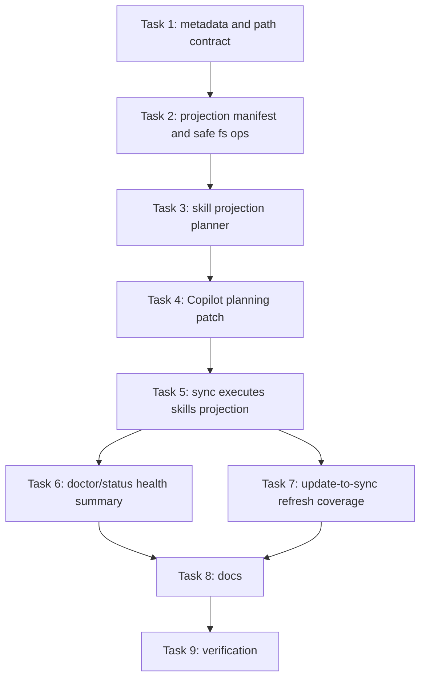

# Entry And Skills Governance Harness Implementation Plan

> **For agentic workers:** REQUIRED SUB-SKILL: Use superpowers:subagent-driven-development (recommended) or superpowers:executing-plans to implement this plan task-by-task. Steps use checkbox (`- [ ]`) syntax for tracking.

**Goal:** 让 HarnessTemplate 的 `sync`、`doctor`、`status`、`update` 形成真正的 entry + skills 投影闭环，并安全处理 Copilot 的 `planning-with-files` materialized copy。

**Architecture:** `harness/upstream/*` 继续作为可替换 baseline；`harness/core/metadata` 只声明平台读取路径和 projection metadata；`harness/installer/lib` 负责生成 projection plan、执行 link/materialize/render、安全冲突处理和健康检查。`update` 只更新 upstream baseline，后续 `sync` 从更新后的 baseline 重新投影到各 IDE 实际读取目录。

**Tech Stack:** Node.js ESM, `node:test`, JSON metadata, POSIX-compatible filesystem operations, Harness CLI.

---

## Current State

Status: active
Archive Eligible: no
Close Reason: Implementation complete in isolated worktree; awaiting review and integration.

## 2026-04-13 Plan Review Update

- Current codebase already includes the previous entry + skills projection implementation from commits `8587b66` and `d7dfcf8`.
- Do not re-execute Tasks 1-9 below unless a regression is found; they now describe completed work and verification history.
- The remaining user goal is cross-IDE hook projection for `superpowers` and `planning-with-files`.
- New implementation work starts at Task 10 in the "Hooks Projection Addendum" section.
- Plan review base: `dev @ d7dfcf86f952545a026ea26f4965e35e78a261cc`.
- Current plan state: waiting for human review before any implementation.

## 2026-04-13 Hooks Execution Result

- Implementation complete on branch `codex/hooks-projection`.
- Execution worktree: `/Users/jared/.config/superpowers/worktrees/HarnessTemplate/codex-hooks-projection`.
- Worktree base: `dev @ d7dfcf86f952545a026ea26f4965e35e78a261cc`.
- Critical design correction: Codex hook config format is not verified in this repository, so Codex hooks are reported as `unsupported` instead of being fake-installed.
- Verification complete:
  - `npm run verify` passed with 74 tests.
  - Hook-on temporary installation smoke passed for Codex, Copilot, Cursor, and Claude Code; supported adapters were installed and unsupported adapters did not fail `doctor`.
  - Hook-off temporary installation smoke passed; default Cursor install did not create hook config or hook script paths.
  - Manual planning hook smoke passed for zero active tasks, one active task, and multiple active tasks.
- Merged back to local `dev`:
  - Implementation commit: `d8da24d feat: add optional cross-IDE hook projection`.
  - Merge commit: `d1cfce2`.
  - Post-merge `npm run verify` passed with 74 tests.

## Worktree Context

- Worktree base: `dev @ 7c5bcfe4eb61f3b23ab82bc21bec78c7a727bfe4`
- 执行阶段使用隔离 worktree：`/Users/jared/.config/superpowers/worktrees/HarnessTemplate/codex-entry-skills-governance`。
- 如果执行本计划前需要隔离 worktree，先运行：

```bash
./scripts/harness worktree-preflight
git worktree add <path> -b codex/entry-skills-governance dev
```

## Finishing Criteria

- `sync` 会渲染 entry files，并为每个 enabled target 投影 `superpowers` 和 `planning-with-files`。
- `sync --conflict=reject` 遇到非 Harness-owned 目标文件或目录会拒绝覆盖。
- `sync --conflict=backup` 遇到非 Harness-owned 目标文件或目录会先备份，再写入 projection。
- Copilot 的 `planning-with-files` materialized copy 会真实写入 `.github/skills/planning-with-files` 或 `~/.copilot/skills/planning-with-files`，并执行 Harness-owned patch。
- `doctor` 会检查每个 IDE 的 entry 是否存在、skills 是否存在、symlink 是否指向正确 source、Copilot materialized copy 是否存在且包含 patch marker。
- `status` 会展示每个 IDE 的 entry + skills 状态，而不是只输出裸 state JSON。
- `update` 更新 `harness/upstream/*` 后，下一次 `sync` 会用更新后的 baseline 覆盖 Harness-owned skill projections。
- `npm run verify` 通过。
- README 和 compatibility docs 删除“skills 尚未 wired into sync”的旧说明，并说明冲突处理、Copilot materialize 路径和 doctor/status 行为。

## Execution Result

- Implementation complete on branch `codex/entry-skills-governance`.
- Verification complete:
  - `npm run verify` passed with 56 tests.
  - Temporary projection smoke passed for Codex, Copilot, Cursor, and Claude Code.
  - Conflict smoke passed: default sync rejected non-Harness-owned Copilot skill path; `--conflict=backup` backed it up and completed.
  - `git diff --check` passed after Markdown whitespace cleanup.

## File Structure

- Modify: `harness/core/metadata/platforms.json`
  增加每个平台 workspace/global 的 `skillRoots`。
- Modify: `harness/core/skills/index.json`
  增加 `layout`、`targetName` 和 Copilot patch marker metadata。
- Modify: `harness/core/state-schema/state.schema.json`
  增加 projection manifest 相关状态说明时保持 state v1 兼容。
- Create: `harness/installer/lib/projection-manifest.mjs`
  记录 Harness-owned projection paths，用于安全替换和 doctor 检查。
- Modify: `harness/installer/lib/paths.mjs`
  增加 skills root/path resolver。
- Modify: `harness/installer/lib/fs-ops.mjs`
  增加 safe write/copy/link helpers、目录 materialize、冲突备份。
- Modify: `harness/installer/lib/skill-projection.mjs`
  从 strategy lookup 扩展为完整 projection planner。
- Create: `harness/installer/lib/copilot-planning-patch.mjs`
  对 Copilot materialized `planning-with-files` 执行实际 patch。
- Create: `harness/installer/lib/health.mjs`
  产出 doctor/status 共享的 entry + skills 健康状态。
- Modify: `harness/installer/commands/sync.mjs`
  执行 entry + skills projection。
- Modify: `harness/installer/commands/doctor.mjs`
  使用 health summary 进行检查。
- Modify: `harness/installer/commands/status.mjs`
  输出 IDE 维度状态摘要。
- Modify: `harness/installer/commands/install.mjs`
  继续只写 state，但校验 projection mode 与 targets，为 sync 留出 conflict mode。
- Create: `tests/helpers/harness-fixture.mjs`
  为 command tests 创建临时 Harness root。
- Modify: `tests/installer/paths.test.mjs`
- Modify: `tests/installer/fs-ops.test.mjs`
- Modify: `tests/adapters/skill-projection.test.mjs`
- Modify: `tests/adapters/sync.test.mjs`
- Create: `tests/adapters/sync-skills.test.mjs`
- Create: `tests/installer/health.test.mjs`
- Modify: `tests/core/skill-index.test.mjs`
- Modify: `README.md`
- Modify: `docs/architecture.md`
- Modify: `docs/compatibility/copilot-planning-with-files.md`
- Modify: `docs/install/codex.md`
- Modify: `docs/install/copilot.md`
- Modify: `docs/install/cursor.md`
- Modify: `docs/install/claude-code.md`

## Task Graph



### Task 1: Metadata And Path Contract

**Files:**
- Modify: `harness/core/metadata/platforms.json`
- Modify: `harness/core/skills/index.json`
- Modify: `harness/installer/lib/paths.mjs`
- Modify: `tests/installer/paths.test.mjs`
- Modify: `tests/core/skill-index.test.mjs`

- [ ] **Step 1: Write failing path tests**

Add to `tests/installer/paths.test.mjs`:

```js
import { resolveSkillRoots, resolveSkillTargetPaths } from '../../harness/installer/lib/paths.mjs';

test('resolveSkillRoots returns workspace skill root for Copilot', () => {
  assert.deepEqual(resolveSkillRoots('/repo', '/home/user', 'workspace', 'copilot'), [
    '/repo/.github/skills'
  ]);
});

test('resolveSkillRoots returns global skill root for Codex', () => {
  assert.deepEqual(resolveSkillRoots('/repo', '/home/user', 'user-global', 'codex'), [
    '/home/user/.codex/skills'
  ]);
});

test('resolveSkillTargetPaths maps a single skill into each selected root', () => {
  assert.deepEqual(
    resolveSkillTargetPaths('/repo', '/home/user', 'both', 'cursor', {
      layout: 'single',
      targetName: 'planning-with-files'
    }),
    [
      '/repo/.cursor/skills/planning-with-files',
      '/home/user/.cursor/skills/planning-with-files'
    ]
  );
});

test('resolveSkillTargetPaths maps collection children into the skill root', () => {
  assert.deepEqual(
    resolveSkillTargetPaths('/repo', '/home/user', 'workspace', 'claude-code', {
      layout: 'collection',
      childNames: ['using-superpowers', 'writing-plans']
    }),
    [
      '/repo/.claude/skills/using-superpowers',
      '/repo/.claude/skills/writing-plans'
    ]
  );
});
```

- [ ] **Step 2: Run path tests and verify failure**

Run:

```bash
npm run test -- tests/installer/paths.test.mjs
```

Expected: FAIL with missing exports `resolveSkillRoots` and `resolveSkillTargetPaths`.

- [ ] **Step 3: Update platform metadata**

Modify each platform in `harness/core/metadata/platforms.json`:

```json
"codex": {
  "displayName": "Codex",
  "entryFiles": ["AGENTS.md"],
  "skillRoots": {
    "workspace": [".codex/skills"],
    "global": [".codex/skills"]
  },
  "supportsGlobal": true,
  "supportsWorkspace": true,
  "skillsStrategy": "link-preferred"
}
```

Use these `skillRoots` values for the remaining targets:

```json
"copilot": {
  "skillRoots": {
    "workspace": [".github/skills"],
    "global": [".copilot/skills"]
  }
},
"cursor": {
  "skillRoots": {
    "workspace": [".cursor/skills"],
    "global": [".cursor/skills"]
  }
},
"claude-code": {
  "skillRoots": {
    "workspace": [".claude/skills"],
    "global": [".claude/skills"]
  }
}
```

- [ ] **Step 4: Update skill index metadata**

Modify `harness/core/skills/index.json`:

```json
"superpowers": {
  "source": "https://github.com/obra/superpowers",
  "baselinePath": "harness/upstream/superpowers/skills",
  "layout": "collection",
  "projection": {
    "default": "link",
    "copilot": "link",
    "cursor": "link",
    "codex": "link",
    "claude-code": "link"
  }
},
"planning-with-files": {
  "source": "https://github.com/OthmanAdi/planning-with-files",
  "baselinePath": "harness/upstream/planning-with-files",
  "layout": "single",
  "targetName": "planning-with-files",
  "projection": {
    "default": "link",
    "copilot": "materialize",
    "cursor": "link",
    "codex": "link",
    "claude-code": "link"
  },
  "patches": {
    "copilot": {
      "type": "copilot-planning-with-files",
      "marker": "Harness Copilot planning-with-files patch"
    }
  }
}
```

- [ ] **Step 5: Implement path resolvers**

Add to `harness/installer/lib/paths.mjs`:

```js
function resolveSkillRootEntries(target) {
  const platform = platforms[target];
  if (!platform) throw new Error(`Unknown target: ${target}`);
  if (!platform.skillRoots) throw new Error(`Target ${target} does not define skillRoots.`);
  return platform.skillRoots;
}

export function resolveSkillRoots(rootDir, homeDir, scope, target) {
  const roots = resolveSkillRootEntries(target);
  const results = [];

  if (scope === 'workspace' || scope === 'both') {
    results.push(...expand(rootDir, roots.workspace ?? []));
  }

  if (scope === 'user-global' || scope === 'both') {
    results.push(...expand(homeDir, roots.global ?? []));
  }

  return results;
}

export function resolveSkillTargetPaths(rootDir, homeDir, scope, target, descriptor) {
  const roots = resolveSkillRoots(rootDir, homeDir, scope, target);

  if (descriptor.layout === 'single') {
    return roots.map((root) => path.join(root, descriptor.targetName));
  }

  if (descriptor.layout === 'collection') {
    return roots.flatMap((root) => descriptor.childNames.map((childName) => path.join(root, childName)));
  }

  throw new Error(`Unsupported skill layout: ${descriptor.layout}`);
}
```

- [ ] **Step 6: Update skill index tests**

Add to `tests/core/skill-index.test.mjs`:

```js
test('skill index declares layouts required for filesystem projection', async () => {
  const index = JSON.parse(await readFile('harness/core/skills/index.json', 'utf8'));

  assert.equal(index.skills.superpowers.layout, 'collection');
  assert.equal(index.skills['planning-with-files'].layout, 'single');
  assert.equal(index.skills['planning-with-files'].targetName, 'planning-with-files');
  assert.equal(index.skills['planning-with-files'].patches.copilot.type, 'copilot-planning-with-files');
});
```

- [ ] **Step 7: Run focused tests**

Run:

```bash
npm run test -- tests/installer/paths.test.mjs tests/core/skill-index.test.mjs
```

Expected: PASS.

- [ ] **Step 8: Commit**

```bash
git add harness/core/metadata/platforms.json harness/core/skills/index.json harness/installer/lib/paths.mjs tests/installer/paths.test.mjs tests/core/skill-index.test.mjs
git commit -m "feat: define skill projection paths"
```

### Task 2: Projection Manifest And Safe Filesystem Operations

**Files:**
- Create: `harness/installer/lib/projection-manifest.mjs`
- Modify: `harness/installer/lib/fs-ops.mjs`
- Modify: `tests/installer/fs-ops.test.mjs`

- [ ] **Step 1: Write failing safe write tests**

Add to `tests/installer/fs-ops.test.mjs`:

```js
import { mkdir, readlink } from 'node:fs/promises';
import {
  linkDirectoryProjection,
  materializeDirectoryProjection,
  writeRenderedProjection
} from '../../harness/installer/lib/fs-ops.mjs';

test('writeRenderedProjection rejects non-owned existing file by default', async () => {
  const dir = await mkdtemp(path.join(os.tmpdir(), 'harness-fs-'));
  try {
    const target = path.join(dir, 'AGENTS.md');
    await writeFile(target, 'user content');

    await assert.rejects(
      writeRenderedProjection({
        targetPath: target,
        content: 'generated',
        ownedTargets: new Set(),
        conflictMode: 'reject'
      }),
      /Refusing to overwrite non-Harness-owned path/
    );
  } finally {
    await rm(dir, { recursive: true, force: true });
  }
});

test('writeRenderedProjection backs up non-owned existing file when requested', async () => {
  const dir = await mkdtemp(path.join(os.tmpdir(), 'harness-fs-'));
  try {
    const target = path.join(dir, 'AGENTS.md');
    await writeFile(target, 'user content');

    const result = await writeRenderedProjection({
      targetPath: target,
      content: 'generated',
      ownedTargets: new Set(),
      conflictMode: 'backup',
      now: () => '20260413T010203'
    });

    assert.equal(await readFile(target, 'utf8'), 'generated');
    assert.equal(await readFile(result.backupPath, 'utf8'), 'user content');
    assert.match(path.basename(result.backupPath), /AGENTS\.md\.harness-backup-20260413T010203/);
  } finally {
    await rm(dir, { recursive: true, force: true });
  }
});

test('linkDirectoryProjection replaces owned path with symlink to source', async () => {
  const dir = await mkdtemp(path.join(os.tmpdir(), 'harness-fs-'));
  try {
    const source = path.join(dir, 'source');
    const target = path.join(dir, 'target');
    await mkdir(source, { recursive: true });
    await writeFile(path.join(source, 'SKILL.md'), 'skill');

    await linkDirectoryProjection({
      sourcePath: source,
      targetPath: target,
      ownedTargets: new Set([target]),
      conflictMode: 'reject'
    });

    assert.equal(await readlink(target), source);
  } finally {
    await rm(dir, { recursive: true, force: true });
  }
});

test('materializeDirectoryProjection copies a directory tree', async () => {
  const dir = await mkdtemp(path.join(os.tmpdir(), 'harness-fs-'));
  try {
    const source = path.join(dir, 'source');
    const target = path.join(dir, 'target');
    await mkdir(path.join(source, 'scripts'), { recursive: true });
    await writeFile(path.join(source, 'SKILL.md'), 'skill');
    await writeFile(path.join(source, 'scripts/check.sh'), 'echo ok');

    await materializeDirectoryProjection({
      sourcePath: source,
      targetPath: target,
      ownedTargets: new Set(),
      conflictMode: 'reject'
    });

    assert.equal(await readFile(path.join(target, 'SKILL.md'), 'utf8'), 'skill');
    assert.equal(await readFile(path.join(target, 'scripts/check.sh'), 'utf8'), 'echo ok');
  } finally {
    await rm(dir, { recursive: true, force: true });
  }
});
```

- [ ] **Step 2: Run fs tests and verify failure**

Run:

```bash
npm run test -- tests/installer/fs-ops.test.mjs
```

Expected: FAIL with missing safe projection exports.

- [ ] **Step 3: Add projection manifest helper**

Create `harness/installer/lib/projection-manifest.mjs`:

```js
import { mkdir, readFile, rename, unlink, writeFile } from 'node:fs/promises';
import path from 'node:path';
import { randomUUID } from 'node:crypto';

export const PROJECTION_MANIFEST_RELATIVE_PATH = '.harness/projections.json';

export function projectionManifestPath(rootDir) {
  return path.join(rootDir, PROJECTION_MANIFEST_RELATIVE_PATH);
}

export async function readProjectionManifest(rootDir) {
  try {
    const manifest = JSON.parse(await readFile(projectionManifestPath(rootDir), 'utf8'));
    if (manifest.schemaVersion !== 1 || !Array.isArray(manifest.entries)) {
      throw new Error('Invalid projection manifest.');
    }
    return manifest;
  } catch (error) {
    if (error && error.code === 'ENOENT') {
      return { schemaVersion: 1, entries: [] };
    }
    throw error;
  }
}

export async function writeProjectionManifest(rootDir, manifest) {
  const filePath = projectionManifestPath(rootDir);
  await mkdir(path.dirname(filePath), { recursive: true });
  const tempPath = `${filePath}.${process.pid}.${Date.now()}.${randomUUID()}.tmp`;

  try {
    await writeFile(tempPath, `${JSON.stringify(manifest, null, 2)}\n`);
    await rename(tempPath, filePath);
  } catch (error) {
    try {
      await unlink(tempPath);
    } catch {
      // Best-effort cleanup only.
    }
    throw error;
  }
}

export function ownedTargetSet(manifest) {
  return new Set(manifest.entries.map((entry) => path.resolve(entry.targetPath)));
}

export function upsertProjectionEntry(manifest, entry) {
  const targetPath = path.resolve(entry.targetPath);
  return {
    schemaVersion: 1,
    entries: [
      ...manifest.entries.filter((existing) => path.resolve(existing.targetPath) !== targetPath),
      { ...entry, targetPath }
    ].sort((left, right) => left.targetPath.localeCompare(right.targetPath))
  };
}
```

- [ ] **Step 4: Implement safe fs projection helpers**

Modify `harness/installer/lib/fs-ops.mjs`:

```js
import { copyFile, cp, lstat, mkdir, readFile, rename, rm, symlink, writeFile } from 'node:fs/promises';
import path from 'node:path';

async function pathExists(targetPath) {
  try {
    return await lstat(targetPath);
  } catch (error) {
    if (error && error.code === 'ENOENT') return null;
    throw error;
  }
}

function backupPathFor(targetPath, now) {
  return `${targetPath}.harness-backup-${now()}`;
}

async function prepareProjectionTarget({ targetPath, ownedTargets, conflictMode, now = () => new Date().toISOString().replace(/[-:]/g, '').replace(/\..+$/, '') }) {
  const stat = await pathExists(targetPath);
  if (!stat) {
    await mkdir(path.dirname(targetPath), { recursive: true });
    return { backupPath: undefined };
  }

  const resolvedTarget = path.resolve(targetPath);
  if (ownedTargets.has(resolvedTarget)) {
    await rm(targetPath, { recursive: true, force: true });
    await mkdir(path.dirname(targetPath), { recursive: true });
    return { backupPath: undefined };
  }

  if (conflictMode === 'backup') {
    const backupPath = backupPathFor(targetPath, now);
    await rename(targetPath, backupPath);
    await mkdir(path.dirname(targetPath), { recursive: true });
    return { backupPath };
  }

  throw new Error(`Refusing to overwrite non-Harness-owned path: ${targetPath}`);
}

export async function writeRenderedProjection(options) {
  const result = await prepareProjectionTarget(options);
  await writeFile(options.targetPath, options.content);
  return result;
}

export async function materializeDirectoryProjection(options) {
  const result = await prepareProjectionTarget(options);
  await cp(options.sourcePath, options.targetPath, { recursive: true });
  return result;
}

export async function linkDirectoryProjection(options) {
  const result = await prepareProjectionTarget(options);
  const type = process.platform === 'win32' ? 'junction' : 'dir';
  await symlink(options.sourcePath, options.targetPath, type);
  return result;
}
```

Keep the existing `writeRenderedFile`, `materializeFile`, and `linkPath` exports temporarily, but implement them by calling the new helpers with `ownedTargets: new Set([targetPath])` so old tests still pass.

- [ ] **Step 5: Run fs tests**

Run:

```bash
npm run test -- tests/installer/fs-ops.test.mjs
```

Expected: PASS.

- [ ] **Step 6: Commit**

```bash
git add harness/installer/lib/projection-manifest.mjs harness/installer/lib/fs-ops.mjs tests/installer/fs-ops.test.mjs
git commit -m "feat: protect projection writes"
```

### Task 3: Skill Projection Planner

**Files:**
- Modify: `harness/installer/lib/skill-projection.mjs`
- Modify: `tests/adapters/skill-projection.test.mjs`

- [ ] **Step 1: Write failing planner tests**

Add to `tests/adapters/skill-projection.test.mjs`:

```js
test('planSkillProjections expands superpowers collection children', async () => {
  const plan = await planSkillProjections({
    rootDir: process.cwd(),
    homeDir: '/home/user',
    scope: 'workspace',
    target: 'codex'
  });

  const usingSuperpowers = plan.find((entry) => entry.skillName === 'using-superpowers');
  assert.ok(usingSuperpowers);
  assert.equal(usingSuperpowers.parentSkillName, 'superpowers');
  assert.equal(usingSuperpowers.strategy, 'link');
  assert.match(usingSuperpowers.sourcePath, /harness\/upstream\/superpowers\/skills\/using-superpowers$/);
  assert.match(usingSuperpowers.targetPath, /\.codex\/skills\/using-superpowers$/);
});

test('planSkillProjections materializes Copilot planning-with-files', async () => {
  const plan = await planSkillProjections({
    rootDir: process.cwd(),
    homeDir: '/home/user',
    scope: 'workspace',
    target: 'copilot'
  });

  const planning = plan.find((entry) => entry.skillName === 'planning-with-files');
  assert.equal(planning.strategy, 'materialize');
  assert.equal(planning.patch.type, 'copilot-planning-with-files');
  assert.match(planning.targetPath, /\.github\/skills\/planning-with-files$/);
});
```

- [ ] **Step 2: Run projection tests and verify failure**

Run:

```bash
npm run test -- tests/adapters/skill-projection.test.mjs
```

Expected: FAIL with missing export `planSkillProjections`.

- [ ] **Step 3: Implement planner**

Modify `harness/installer/lib/skill-projection.mjs`:

```js
import { readdir, readFile } from 'node:fs/promises';
import path from 'node:path';
import { resolveSkillTargetPaths } from './paths.mjs';

async function loadSkillIndex(rootDir) {
  return JSON.parse(await readFile(path.join(rootDir, 'harness/core/skills/index.json'), 'utf8'));
}

async function collectionChildNames(sourcePath) {
  const entries = await readdir(sourcePath, { withFileTypes: true });
  return entries
    .filter((entry) => entry.isDirectory())
    .map((entry) => entry.name)
    .sort();
}

function strategyFor(skill, target) {
  const strategy = skill.projection[target] || skill.projection.default;
  if (!strategies.has(strategy)) throw new Error(`Unsupported projection strategy: ${strategy}`);
  return strategy;
}

export async function planSkillProjections({ rootDir, homeDir, scope, target }) {
  const index = await loadSkillIndex(rootDir);
  const projections = [];

  for (const [parentSkillName, skill] of Object.entries(index.skills).sort(([left], [right]) => left.localeCompare(right))) {
    const sourceRoot = path.join(rootDir, skill.baselinePath);
    const strategy = strategyFor(skill, target);

    if (skill.layout === 'collection') {
      const childNames = await collectionChildNames(sourceRoot);
      const targetPaths = resolveSkillTargetPaths(rootDir, homeDir, scope, target, {
        layout: 'collection',
        childNames
      });

      for (const childName of childNames) {
        for (const targetPath of targetPaths.filter((candidate) => path.basename(candidate) === childName)) {
          projections.push({
            kind: 'skill',
            parentSkillName,
            skillName: childName,
            target,
            strategy,
            sourcePath: path.join(sourceRoot, childName),
            targetPath,
            patch: undefined
          });
        }
      }
      continue;
    }

    if (skill.layout === 'single') {
      for (const targetPath of resolveSkillTargetPaths(rootDir, homeDir, scope, target, skill)) {
        projections.push({
          kind: 'skill',
          parentSkillName,
          skillName: skill.targetName,
          target,
          strategy,
          sourcePath: sourceRoot,
          targetPath,
          patch: skill.patches ? skill.patches[target] : undefined
        });
      }
      continue;
    }

    throw new Error(`Unsupported skill layout: ${skill.layout}`);
  }

  return projections;
}
```

Keep `projectionForSkill` as a compatibility wrapper for existing callers.

- [ ] **Step 4: Run projection tests**

Run:

```bash
npm run test -- tests/adapters/skill-projection.test.mjs
```

Expected: PASS.

- [ ] **Step 5: Commit**

```bash
git add harness/installer/lib/skill-projection.mjs tests/adapters/skill-projection.test.mjs
git commit -m "feat: plan skill filesystem projections"
```

### Task 4: Copilot Planning-With-Files Patch

**Files:**
- Create: `harness/installer/lib/copilot-planning-patch.mjs`
- Modify: `tests/adapters/skill-projection.test.mjs`

- [ ] **Step 1: Write failing patch test**

Add to `tests/adapters/skill-projection.test.mjs`:

```js
import { applyCopilotPlanningPatch } from '../../harness/installer/lib/copilot-planning-patch.mjs';

test('applyCopilotPlanningPatch materializes Copilot-specific skill content', async () => {
  const dir = await mkdtemp(path.join(os.tmpdir(), 'harness-copilot-patch-'));
  try {
    const target = path.join(dir, 'planning-with-files');
    await materializeDirectoryProjection({
      sourcePath: path.join(process.cwd(), 'harness/upstream/planning-with-files'),
      targetPath: target,
      ownedTargets: new Set(),
      conflictMode: 'reject'
    });

    await applyCopilotPlanningPatch(target);
    const skill = await readFile(path.join(target, 'SKILL.md'), 'utf8');

    assert.match(skill, /Harness Copilot planning-with-files patch/);
    assert.doesNotMatch(skill, /\$\{CLAUDE_PLUGIN_ROOT\}/);
    assert.match(skill, /\.github\/skills\/planning-with-files/);
  } finally {
    await rm(dir, { recursive: true, force: true });
  }
});
```

- [ ] **Step 2: Run patch test and verify failure**

Run:

```bash
npm run test -- tests/adapters/skill-projection.test.mjs
```

Expected: FAIL with missing module `copilot-planning-patch.mjs`.

- [ ] **Step 3: Implement patch helper**

Create `harness/installer/lib/copilot-planning-patch.mjs`:

```js
import { readFile, writeFile } from 'node:fs/promises';
import path from 'node:path';

const MARKER = 'Harness Copilot planning-with-files patch';

function copilotSkillRootSnippet() {
  return [
    'COPILOT_PLANNING_WITH_FILES_ROOT="${GITHUB_COPILOT_SKILL_ROOT:-.github/skills/planning-with-files}"',
    'if [ ! -f "$COPILOT_PLANNING_WITH_FILES_ROOT/scripts/session-catchup.py" ] && [ -n "${HOME:-}" ]; then',
    '  COPILOT_PLANNING_WITH_FILES_ROOT="$HOME/.copilot/skills/planning-with-files"',
    'fi'
  ].join('\n');
}

export async function applyCopilotPlanningPatch(targetDir) {
  const skillPath = path.join(targetDir, 'SKILL.md');
  const original = await readFile(skillPath, 'utf8');
  const patched = original
    .replaceAll('${CLAUDE_PLUGIN_ROOT}', '$COPILOT_PLANNING_WITH_FILES_ROOT')
    .replace(
      '# Planning with Files',
      [
        `# ${MARKER}`,
        '',
        'This materialized copy is maintained by Harness for GitHub Copilot.',
        'It keeps task state under `planning/active/<task-id>/` and resolves helper scripts from the Copilot skill directory.',
        '',
        '```bash',
        copilotSkillRootSnippet(),
        '```',
        '',
        '# Planning with Files'
      ].join('\n')
    );

  await writeFile(skillPath, patched);
}

export { MARKER as COPILOT_PLANNING_PATCH_MARKER };
```

- [ ] **Step 4: Run patch tests**

Run:

```bash
npm run test -- tests/adapters/skill-projection.test.mjs
```

Expected: PASS.

- [ ] **Step 5: Commit**

```bash
git add harness/installer/lib/copilot-planning-patch.mjs tests/adapters/skill-projection.test.mjs
git commit -m "feat: patch Copilot planning skill"
```

### Task 5: Sync Executes Skills Projection

**Files:**
- Modify: `harness/installer/commands/sync.mjs`
- Create: `tests/helpers/harness-fixture.mjs`
- Create: `tests/adapters/sync-skills.test.mjs`
- Modify: `tests/adapters/sync.test.mjs`

- [ ] **Step 1: Create test fixture helper**

Create `tests/helpers/harness-fixture.mjs`:

```js
import { cp, mkdir, mkdtemp, rm } from 'node:fs/promises';
import os from 'node:os';
import path from 'node:path';

export async function createHarnessFixture() {
  const root = await mkdtemp(path.join(os.tmpdir(), 'harness-fixture-'));
  await mkdir(path.join(root, 'scripts'), { recursive: true });
  await cp(path.join(process.cwd(), 'harness'), path.join(root, 'harness'), { recursive: true });
  await cp(path.join(process.cwd(), 'scripts'), path.join(root, 'scripts'), { recursive: true });
  await cp(path.join(process.cwd(), 'package.json'), path.join(root, 'package.json'));
  return root;
}

export async function removeHarnessFixture(root) {
  await rm(root, { recursive: true, force: true });
}

export async function withCwd(dir, fn) {
  const previous = process.cwd();
  process.chdir(dir);
  try {
    return await fn();
  } finally {
    process.chdir(previous);
  }
}
```

- [ ] **Step 2: Write failing sync skills tests**

Create `tests/adapters/sync-skills.test.mjs`:

```js
import { test } from 'node:test';
import assert from 'node:assert/strict';
import { lstat, readFile, readlink, writeFile } from 'node:fs/promises';
import path from 'node:path';
import { sync } from '../../harness/installer/commands/sync.mjs';
import { writeState } from '../../harness/installer/lib/state.mjs';
import { createHarnessFixture, removeHarnessFixture, withCwd } from '../helpers/harness-fixture.mjs';

test('sync projects workspace entries and skills', async () => {
  const root = await createHarnessFixture();
  try {
    await writeState(root, {
      schemaVersion: 1,
      scope: 'workspace',
      projectionMode: 'link',
      targets: {
        codex: { enabled: true, paths: [path.join(root, 'AGENTS.md')] },
        copilot: { enabled: true, paths: [path.join(root, '.github/copilot-instructions.md')] }
      },
      upstream: {}
    });

    await withCwd(root, () => sync([]));

    assert.match(await readFile(path.join(root, 'AGENTS.md'), 'utf8'), /Harness Policy For Codex/);
    assert.equal((await lstat(path.join(root, '.codex/skills/using-superpowers'))).isSymbolicLink(), true);
    assert.match(await readlink(path.join(root, '.codex/skills/using-superpowers')), /harness\/upstream\/superpowers\/skills\/using-superpowers$/);

    const copilotPlanning = await readFile(path.join(root, '.github/skills/planning-with-files/SKILL.md'), 'utf8');
    assert.match(copilotPlanning, /Harness Copilot planning-with-files patch/);
  } finally {
    await removeHarnessFixture(root);
  }
});

test('sync rejects non-owned skill target by default', async () => {
  const root = await createHarnessFixture();
  try {
    await writeState(root, {
      schemaVersion: 1,
      scope: 'workspace',
      projectionMode: 'link',
      targets: {
        copilot: { enabled: true, paths: [path.join(root, '.github/copilot-instructions.md')] }
      },
      upstream: {}
    });
    await writeFile(path.join(root, '.github/skills/planning-with-files'), 'user file');

    await assert.rejects(withCwd(root, () => sync([])), /Refusing to overwrite non-Harness-owned path/);
  } finally {
    await removeHarnessFixture(root);
  }
});

test('sync backs up non-owned skill target when requested', async () => {
  const root = await createHarnessFixture();
  try {
    await writeState(root, {
      schemaVersion: 1,
      scope: 'workspace',
      projectionMode: 'link',
      targets: {
        copilot: { enabled: true, paths: [path.join(root, '.github/copilot-instructions.md')] }
      },
      upstream: {}
    });
    await writeFile(path.join(root, '.github/skills/planning-with-files'), 'user file');

    await withCwd(root, () => sync(['--conflict=backup']));

    const skill = await readFile(path.join(root, '.github/skills/planning-with-files/SKILL.md'), 'utf8');
    assert.match(skill, /Harness Copilot planning-with-files patch/);
  } finally {
    await removeHarnessFixture(root);
  }
});
```

- [ ] **Step 3: Run sync skills tests and verify failure**

Run:

```bash
npm run test -- tests/adapters/sync-skills.test.mjs
```

Expected: FAIL because `sync` still only writes entry files.

- [ ] **Step 4: Implement sync projection execution**

Modify `harness/installer/commands/sync.mjs`:

```js
import { writeProjectionManifest, readProjectionManifest, ownedTargetSet, upsertProjectionEntry } from '../lib/projection-manifest.mjs';
import { linkDirectoryProjection, materializeDirectoryProjection, writeRenderedProjection } from '../lib/fs-ops.mjs';
import { planSkillProjections } from '../lib/skill-projection.mjs';
import { applyCopilotPlanningPatch } from '../lib/copilot-planning-patch.mjs';

function readOption(args, name, fallback) {
  const prefix = `--${name}=`;
  const value = args.find((arg) => arg.startsWith(prefix));
  return value ? value.slice(prefix.length) : fallback;
}

async function applySkillProjection(projection, ownedTargets, conflictMode) {
  if (projection.strategy === 'link') {
    await linkDirectoryProjection({
      sourcePath: projection.sourcePath,
      targetPath: projection.targetPath,
      ownedTargets,
      conflictMode
    });
  } else if (projection.strategy === 'materialize') {
    await materializeDirectoryProjection({
      sourcePath: projection.sourcePath,
      targetPath: projection.targetPath,
      ownedTargets,
      conflictMode
    });
    if (projection.patch?.type === 'copilot-planning-with-files') {
      await applyCopilotPlanningPatch(projection.targetPath);
    }
  } else {
    throw new Error(`Unsupported projection strategy: ${projection.strategy}`);
  }
}
```

Then update `sync(args = [])` to:

```js
export async function sync(args = []) {
  const rootDir = process.cwd();
  const homeDir = os.homedir();
  const state = await readState(rootDir);
  const conflictMode = readOption(args, 'conflict', 'reject');
  if (!['reject', 'backup'].includes(conflictMode)) {
    throw new Error(`Invalid conflict mode: ${conflictMode}`);
  }

  let manifest = await readProjectionManifest(rootDir);
  const ownedTargets = ownedTargetSet(manifest);
  const targets = Object.keys(state.targets).filter((target) => state.targets[target].enabled);

  for (const target of targets) {
    const adapter = await loadAdapter(rootDir, target);
    const content = await renderEntry(rootDir, target);
    const entries = entriesForScope(rootDir, homeDir, adapter, state.scope);

    for (const entry of entries) {
      await writeRenderedProjection({ targetPath: entry, content, ownedTargets, conflictMode });
      manifest = upsertProjectionEntry(manifest, {
        kind: 'entry',
        target,
        strategy: 'render',
        sourcePath: adapter.template,
        targetPath: entry
      });
      ownedTargets.add(path.resolve(entry));
    }

    for (const projection of await planSkillProjections({ rootDir, homeDir, scope: state.scope, target })) {
      await applySkillProjection(projection, ownedTargets, conflictMode);
      manifest = upsertProjectionEntry(manifest, projection);
      ownedTargets.add(path.resolve(projection.targetPath));
    }
  }

  await writeProjectionManifest(rootDir, manifest);
  console.log(`Synced ${targets.length} target(s): ${targets.join(', ')}`);
}
```

- [ ] **Step 5: Run sync tests**

Run:

```bash
npm run test -- tests/adapters/sync.test.mjs tests/adapters/sync-skills.test.mjs
```

Expected: PASS.

- [ ] **Step 6: Commit**

```bash
git add harness/installer/commands/sync.mjs tests/helpers/harness-fixture.mjs tests/adapters/sync.test.mjs tests/adapters/sync-skills.test.mjs
git commit -m "feat: sync skills into IDE directories"
```

### Task 6: Doctor And Status Health Summary

**Files:**
- Create: `harness/installer/lib/health.mjs`
- Modify: `harness/installer/commands/doctor.mjs`
- Modify: `harness/installer/commands/status.mjs`
- Create: `tests/installer/health.test.mjs`

- [ ] **Step 1: Write failing health tests**

Create `tests/installer/health.test.mjs`:

```js
import { test } from 'node:test';
import assert from 'node:assert/strict';
import path from 'node:path';
import { readHarnessHealth } from '../../harness/installer/lib/health.mjs';
import { sync } from '../../harness/installer/commands/sync.mjs';
import { writeState } from '../../harness/installer/lib/state.mjs';
import { createHarnessFixture, removeHarnessFixture, withCwd } from '../helpers/harness-fixture.mjs';

test('readHarnessHealth reports entry and skill status per target', async () => {
  const root = await createHarnessFixture();
  try {
    await writeState(root, {
      schemaVersion: 1,
      scope: 'workspace',
      projectionMode: 'link',
      targets: {
        codex: { enabled: true, paths: [path.join(root, 'AGENTS.md')] },
        copilot: { enabled: true, paths: [path.join(root, '.github/copilot-instructions.md')] }
      },
      upstream: {}
    });

    await withCwd(root, () => sync([]));
    const health = await readHarnessHealth(root, '/home/user');

    assert.equal(health.targets.codex.entries[0].status, 'ok');
    assert.equal(health.targets.codex.skills.find((skill) => skill.skillName === 'using-superpowers').status, 'ok');
    assert.equal(health.targets.copilot.skills.find((skill) => skill.skillName === 'planning-with-files').status, 'ok');
    assert.equal(health.problems.length, 0);
  } finally {
    await removeHarnessFixture(root);
  }
});
```

- [ ] **Step 2: Run health tests and verify failure**

Run:

```bash
npm run test -- tests/installer/health.test.mjs
```

Expected: FAIL with missing module `health.mjs`.

- [ ] **Step 3: Implement health summary**

Create `harness/installer/lib/health.mjs`:

```js
import { access, lstat, readFile, readlink } from 'node:fs/promises';
import path from 'node:path';
import { entriesForScope, loadAdapter } from './adapters.mjs';
import { planSkillProjections } from './skill-projection.mjs';
import { readState } from './state.mjs';
import { COPILOT_PLANNING_PATCH_MARKER } from './copilot-planning-patch.mjs';

async function exists(filePath) {
  try {
    await access(filePath);
    return true;
  } catch {
    return false;
  }
}

async function inspectSkill(projection) {
  if (!(await exists(projection.targetPath))) {
    return { ...projection, status: 'missing', message: 'Skill projection is missing.' };
  }

  if (projection.strategy === 'link') {
    const stat = await lstat(projection.targetPath);
    if (!stat.isSymbolicLink()) {
      return { ...projection, status: 'problem', message: 'Expected a symlink.' };
    }
    const linkTarget = await readlink(projection.targetPath);
    if (path.resolve(path.dirname(projection.targetPath), linkTarget) !== path.resolve(projection.sourcePath)) {
      return { ...projection, status: 'problem', message: 'Symlink points to the wrong source.' };
    }
    return { ...projection, status: 'ok' };
  }

  if (projection.patch?.type === 'copilot-planning-with-files') {
    const text = await readFile(path.join(projection.targetPath, 'SKILL.md'), 'utf8').catch(() => '');
    if (!text.includes(COPILOT_PLANNING_PATCH_MARKER)) {
      return { ...projection, status: 'problem', message: 'Copilot materialized copy is missing the Harness patch marker.' };
    }
  }

  return { ...projection, status: 'ok' };
}

export async function readHarnessHealth(rootDir, homeDir) {
  const state = await readState(rootDir);
  const targets = {};
  const problems = [];

  for (const target of Object.keys(state.targets).filter((name) => state.targets[name].enabled)) {
    const adapter = await loadAdapter(rootDir, target);
    const entries = entriesForScope(rootDir, homeDir, adapter, state.scope).map((entryPath) => ({
      path: entryPath,
      status: state.targets[target].paths.includes(entryPath) ? 'ok' : 'missing'
    }));
    for (const entry of entries) {
      if (!(await exists(entry.path))) entry.status = 'missing';
      if (entry.status !== 'ok') problems.push(`${target}: missing entry ${entry.path}`);
    }

    const skills = [];
    for (const projection of await planSkillProjections({ rootDir, homeDir, scope: state.scope, target })) {
      const inspected = await inspectSkill(projection);
      skills.push(inspected);
      if (inspected.status !== 'ok') {
        problems.push(`${target}: ${inspected.skillName}: ${inspected.message}`);
      }
    }

    targets[target] = { entries, skills };
  }

  return { scope: state.scope, projectionMode: state.projectionMode, targets, problems };
}
```

- [ ] **Step 4: Update doctor command**

Modify `harness/installer/commands/doctor.mjs` to call `readHarnessHealth(process.cwd(), os.homedir())` and fail when `health.problems.length > 0`. Preserve the personal path check for entry file contents by running it over `Object.values(health.targets).flatMap((target) => target.entries)`.

- [ ] **Step 5: Update status command**

Modify `harness/installer/commands/status.mjs`:

```js
import os from 'node:os';
import { readHarnessHealth } from '../lib/health.mjs';

export async function status() {
  const health = await readHarnessHealth(process.cwd(), os.homedir());
  console.log(JSON.stringify(health, null, 2));
}
```

- [ ] **Step 6: Run health tests**

Run:

```bash
npm run test -- tests/installer/health.test.mjs
```

Expected: PASS.

- [ ] **Step 7: Commit**

```bash
git add harness/installer/lib/health.mjs harness/installer/commands/doctor.mjs harness/installer/commands/status.mjs tests/installer/health.test.mjs
git commit -m "feat: report entry and skill health"
```

### Task 7: Update-To-Sync Refresh Coverage

**Files:**
- Modify: `tests/adapters/sync-skills.test.mjs`
- Modify: `tests/installer/upstream-commands.test.mjs`

- [ ] **Step 1: Add failing refresh test**

Add to `tests/adapters/sync-skills.test.mjs`:

```js
test('sync refreshes materialized Copilot skill after upstream changes', async () => {
  const root = await createHarnessFixture();
  try {
    await writeState(root, {
      schemaVersion: 1,
      scope: 'workspace',
      projectionMode: 'link',
      targets: {
        copilot: { enabled: true, paths: [path.join(root, '.github/copilot-instructions.md')] }
      },
      upstream: {}
    });

    await withCwd(root, () => sync([]));
    await writeFile(
      path.join(root, 'harness/upstream/planning-with-files/UPSTREAM_REFRESH_MARKER.md'),
      'refreshed baseline'
    );
    await withCwd(root, () => sync([]));

    assert.equal(
      await readFile(path.join(root, '.github/skills/planning-with-files/UPSTREAM_REFRESH_MARKER.md'), 'utf8'),
      'refreshed baseline'
    );
  } finally {
    await removeHarnessFixture(root);
  }
});
```

- [ ] **Step 2: Run refresh test and verify behavior**

Run:

```bash
npm run test -- tests/adapters/sync-skills.test.mjs
```

Expected: PASS after Task 5 because `.harness/projections.json` marks the materialized skill as Harness-owned. If it fails with overwrite refusal, update manifest recording in `sync` before continuing.

- [ ] **Step 3: Strengthen upstream command test**

Add to `tests/installer/upstream-commands.test.mjs` after `updateCommand applies candidate only to harness upstream path`:

```js
test('updateCommand leaves IDE projections to later sync', async () => {
  const root = await mkdtemp(path.join(os.tmpdir(), 'harness-update-sync-boundary-'));
  const source = await mkdtemp(path.join(os.tmpdir(), 'harness-local-source-'));
  try {
    await writeSources(root, source);
    await mkdir(path.join(root, 'harness/upstream/planning-with-files'), { recursive: true });
    await mkdir(path.join(root, '.github/skills/planning-with-files'), { recursive: true });
    await writeFile(path.join(root, '.github/skills/planning-with-files/SKILL.md'), 'old projected skill');
    await createGitSource(source, 'new upstream skill');

    await withCwd(root, async () => {
      await fetchCommand(['--source=planning-with-files']);
      await updateCommand(['--source=planning-with-files']);
    });

    assert.equal(await readFile(path.join(root, 'harness/upstream/planning-with-files/SKILL.md'), 'utf8'), 'new upstream skill');
    assert.equal(await readFile(path.join(root, '.github/skills/planning-with-files/SKILL.md'), 'utf8'), 'old projected skill');
  } finally {
    await rm(root, { recursive: true, force: true });
    await rm(source, { recursive: true, force: true });
  }
});
```

- [ ] **Step 4: Run upstream tests**

Run:

```bash
npm run test -- tests/installer/upstream-commands.test.mjs tests/adapters/sync-skills.test.mjs
```

Expected: PASS.

- [ ] **Step 5: Commit**

```bash
git add tests/adapters/sync-skills.test.mjs tests/installer/upstream-commands.test.mjs
git commit -m "test: cover upstream refresh projection flow"
```

### Task 8: Documentation

**Files:**
- Modify: `README.md`
- Modify: `docs/architecture.md`
- Modify: `docs/compatibility/copilot-planning-with-files.md`
- Modify: `docs/install/codex.md`
- Modify: `docs/install/copilot.md`
- Modify: `docs/install/cursor.md`
- Modify: `docs/install/claude-code.md`

- [ ] **Step 1: Update README implementation note**

Replace the old README sentence:

```md
Current implementation note: `sync` renders instruction entry files as real files. Skill projection strategies are modeled and tested, but skill filesystem projection is not wired into `sync` yet. There is no hard-link implementation; the filesystem helpers support real files and symlinks.
```

with:

```md
Current implementation note: `sync` renders entry files and projects supported skills into each enabled IDE's configured skill directory. Link projections use symlinks; materialized projections create real directory copies. Existing non-Harness-owned files are never overwritten by default. Use `./scripts/harness sync --conflict=backup` when you explicitly want Harness to preserve a local backup and write the projection.
```

- [ ] **Step 2: Add skills path table to README**

Add below the Skill projection metadata table:

```md
Skill target roots:

| Target | Workspace skill root | User-global skill root |
| --- | --- | --- |
| Codex | `.codex/skills` | `~/.codex/skills` |
| GitHub Copilot | `.github/skills` | `~/.copilot/skills` |
| Cursor | `.cursor/skills` | `~/.cursor/skills` |
| Claude Code | `.claude/skills` | `~/.claude/skills` |
```

- [ ] **Step 3: Update Copilot compatibility doc**

Ensure `docs/compatibility/copilot-planning-with-files.md` includes:

```md
Harness materializes Copilot's `planning-with-files` copy instead of linking it. During `sync`, Harness copies `harness/upstream/planning-with-files` into the Copilot skill root and applies the `Harness Copilot planning-with-files patch` marker. `doctor` checks for that marker so a stale or manually edited copy is visible.
```

- [ ] **Step 4: Update install docs**

In each `docs/install/*.md`, add the target-specific skill root and sync command:

```md
Run:

```bash
./scripts/harness install --targets=<target> --scope=workspace
./scripts/harness sync
```

By default, `sync` refuses to overwrite non-Harness-owned files. To preserve a backup and continue:

```bash
./scripts/harness sync --conflict=backup
```
```

Use the actual `<target>` value in each file: `codex`, `copilot`, `cursor`, `claude-code`.

- [ ] **Step 5: Run docs scan**

Run:

```bash
rg -n "not wired into `sync` yet|Skill projection strategies are modeled" README.md docs
```

Expected: no matches.

- [ ] **Step 6: Commit**

```bash
git add README.md docs/architecture.md docs/compatibility/copilot-planning-with-files.md docs/install/codex.md docs/install/copilot.md docs/install/cursor.md docs/install/claude-code.md
git commit -m "docs: describe skills projection lifecycle"
```

### Task 9: Full Verification

**Files:**
- No source edits unless verification exposes a defect.

- [ ] **Step 1: Run full test suite**

Run:

```bash
npm run verify
```

Expected: PASS.

- [ ] **Step 2: Run projection smoke test in a temporary root**

Run:

```bash
tmpdir="$(mktemp -d)"
cp -R harness scripts package.json "$tmpdir/"
(
  cd "$tmpdir"
  ./scripts/harness install --targets=codex,copilot,cursor,claude-code --scope=workspace
  ./scripts/harness sync
  ./scripts/harness doctor --check-only
  ./scripts/harness status
  test -f AGENTS.md
  test -f .github/copilot-instructions.md
  test -f .cursor/rules/harness.mdc
  test -f CLAUDE.md
  test -L .codex/skills/using-superpowers
  test -f .github/skills/planning-with-files/SKILL.md
  grep -q "Harness Copilot planning-with-files patch" .github/skills/planning-with-files/SKILL.md
)
rm -rf "$tmpdir"
```

Expected: all commands exit 0.

- [ ] **Step 3: Run conflict smoke test**

Run:

```bash
tmpdir="$(mktemp -d)"
cp -R harness scripts package.json "$tmpdir/"
(
  cd "$tmpdir"
  mkdir -p .github/skills
  printf 'user content' > .github/skills/planning-with-files
  ./scripts/harness install --targets=copilot --scope=workspace
  ! ./scripts/harness sync
  ./scripts/harness sync --conflict=backup
  test -f .github/skills/planning-with-files/SKILL.md
  find .github/skills -name 'planning-with-files.harness-backup-*' | grep planning-with-files
)
rm -rf "$tmpdir"
```

Expected: default sync fails, backup sync succeeds.

- [ ] **Step 4: Run whitespace check**

Run:

```bash
git diff --check
```

Expected: no output.

- [ ] **Step 5: Commit verification fixes if needed**

If Task 9 exposed defects, fix the defective source or test file, rerun the failed command, then commit:

```bash
git add <fixed-files>
git commit -m "fix: stabilize skills projection verification"
```

## Self-Review

- Spec coverage:
  - `sync` skills projection: Task 5.
  - `doctor` skills checks: Task 6.
  - `status` entry + skills visibility: Task 6.
  - `update` followed by sync using updated baseline: Task 7.
  - Copilot planning-with-files patch/materialize: Task 4 and Task 5.
  - Existing file conflicts: Task 2 and Task 5.
- Placeholder scan:
  - No `TBD`, no unspecified edge handling, no empty “write tests” steps.
- Type consistency:
  - `layout`, `targetName`, `strategy`, `patch.type`, `targetPath`, and `sourcePath` are used consistently across metadata, planner, sync, health, and tests.

## Hooks Projection Addendum

**Goal:** 在已经完成 entry + skills projection 的基础上，新增显式 opt-in 的 cross-IDE hook projection，使 `superpowers` 和 `planning-with-files` 的 hook 行为能安装、转换并适配到 Harness 支持的 IDE。

**Architecture:** Hooks 使用 Harness-owned descriptor 和 adapter 层，不直接改写 `harness/upstream/*`。`sync` 继续通过 `.harness/projections.json` 追踪 Harness-owned paths；hook configs 必须支持 merge，因为 `superpowers` 和 `planning-with-files` 可能写入同一个 IDE hook config。`planning-with-files` hook scripts 必须读取 `planning/active/<task-id>/...`，不能恢复上游 root-level `task_plan.md` 假设。

**Non-Goals For This Addendum:**
- 不改变默认安装行为；hooks 默认仍关闭。
- 不把 `.harness/upstream-candidates/*` 直接复制到 IDE hook 目录。
- 不为尚未确认 hook config 格式的平台硬编码不可验证格式；如果某 target 没有可用 hook format，`doctor/status` 必须显示 unsupported，而不是假装成功。

### Hooks Finishing Criteria

- `./scripts/harness install --targets=<target> --hooks=on` 会把 state 写为 hooks enabled。
- 默认 install 或 `--hooks=off` 不安装任何 hook config 或 hook scripts。
- `sync` 能在 hook enabled 时投射 hooks，并把 hook config/script paths 写入 `.harness/projections.json`。
- Claude Code 和 Cursor 至少安装 `superpowers` upstream `SessionStart` hook。
- `planning-with-files` 安装 Harness-owned task-scoped hooks，事件覆盖 session/user prompt、pre tool、post tool、stop/error 中各 IDE 可支持的子集。
- 多个 hook source 写入同一 config 时执行结构化 merge，不互相覆盖。
- `doctor` 和 `status` 显示 hooks enabled/disabled、installed/missing/unsupported 状态。
- README、`docs/compatibility/hooks.md`、各 install docs 更新 hook opt-in、支持矩阵、限制和验证方式。
- `npm run verify` 通过，并新增 hook planner/sync/health tests。

### Hook Support Matrix

| Source | Codex | GitHub Copilot | Cursor | Claude Code |
| --- | --- | --- | --- | --- |
| `superpowers` | unsupported | unsupported | upstream `sessionStart` via `hooks-cursor.json` | upstream `SessionStart` via `hooks.json` |
| `planning-with-files` | unsupported | Harness task-scoped adapter using `.github/hooks` conventions | Harness task-scoped adapter using `.cursor/hooks.json` | Harness task-scoped adapter using Claude-style hooks |

The implementation must make unsupported cells explicit in health output if the current target lacks a verified hook config format.

### Task 10: Hook State And Metadata

**Files:**
- Modify: `harness/installer/lib/state.mjs`
- Modify: `harness/installer/commands/install.mjs`
- Modify: `harness/core/metadata/platforms.json`
- Modify: `harness/core/skills/index.json`
- Modify: `harness/core/state-schema/state.schema.json`
- Test: `tests/installer/state.test.mjs`
- Test: `tests/core/skill-index.test.mjs`

- [x] **Step 1: Add state tests for hook mode**

Add tests proving:

```js
defaultState().hookMode === 'off'
```

and:

```js
await writeState(root, {
  schemaVersion: 1,
  scope: 'workspace',
  projectionMode: 'link',
  hookMode: 'on',
  targets: { cursor: { enabled: true, paths: ['.cursor/rules/harness.mdc'] } },
  upstream: {}
});
```

roundtrips successfully.

- [x] **Step 2: Preserve v1 compatibility**

`readState` must treat old state files without `hookMode` as:

```js
hookMode: 'off'
```

Expected failure before implementation: invalid or missing field handling fails the new tests.

- [x] **Step 3: Implement `--hooks=off|on`**

Extend `install.mjs` parsing:

```js
const hookMode = readOption(args, 'hooks', 'off');
if (!['off', 'on'].includes(hookMode)) {
  throw new Error(`Invalid hooks mode: ${hookMode}`);
}
```

Store `hookMode` in `.harness/state.json`.

- [x] **Step 4: Add hook path metadata**

Extend each target in `harness/core/metadata/platforms.json` with `hookRoots`.

Expected workspace/global roots:

```json
{
  "codex": { "workspace": [".codex"], "global": [".codex"] },
  "copilot": { "workspace": [".github/hooks"], "global": [".copilot/hooks"] },
  "cursor": { "workspace": [".cursor"], "global": [".cursor"] },
  "claude-code": { "workspace": [".claude"], "global": [".claude"] }
}
```

If implementation discovers a target reads hooks from a different path, update this metadata and record the evidence in `findings.md`.

- [x] **Step 5: Add hook metadata to skill index**

Add hook descriptors without source mutation:

```json
"hooks": {
  "cursor": {
    "source": "harness/upstream/superpowers/hooks",
    "config": "hooks-cursor.json",
    "events": ["sessionStart"]
  },
  "claude-code": {
    "source": "harness/upstream/superpowers/hooks",
    "config": "hooks.json",
    "events": ["SessionStart"]
  }
}
```

For `planning-with-files`, point to Harness-owned hook assets:

```json
"hooks": {
  "default": {
    "source": "harness/core/hooks/planning-with-files",
    "adapter": "task-scoped-planning"
  }
}
```

### Task 11: Hook Path Resolution And Projection Planning

**Files:**
- Modify: `harness/installer/lib/paths.mjs`
- Create: `harness/installer/lib/hook-projection.mjs`
- Test: `tests/installer/paths.test.mjs`
- Create: `tests/adapters/hook-projection.test.mjs`

- [x] **Step 1: Add hook root resolver**

Add:

```js
resolveHookRoots(rootDir, homeDir, scope, target)
```

Expected examples:

```js
resolveHookRoots('/repo', '/home/user', 'workspace', 'cursor')
// ['/repo/.cursor']

resolveHookRoots('/repo', '/home/user', 'workspace', 'copilot')
// ['/repo/.github/hooks']
```

- [x] **Step 2: Add hook projection planner**

Create `planHookProjections({ rootDir, homeDir, scope, target, hookMode })`.

Required behavior:

```js
await planHookProjections({ hookMode: 'off', ...context })
// []
```

When hooks are on, each projection entry includes:

```js
{
  kind: 'hook',
  parentSkillName,
  target,
  eventNames,
  configSource,
  configTarget,
  scriptSourcePaths,
  scriptTargetRoot,
  status: 'planned'
}
```

- [x] **Step 3: Model unsupported hooks explicitly**

If a skill has no hook descriptor for a target, planner returns a non-installing capability record for health/status:

```js
{
  kind: 'hook',
  parentSkillName: 'superpowers',
  target: 'codex',
  status: 'unsupported',
  message: 'No verified superpowers hook adapter for codex.'
}
```

`sync` must ignore unsupported records; `status` must display them.

### Task 12: Hook Config Merge And Filesystem Safety

**Files:**
- Modify: `harness/installer/lib/fs-ops.mjs`
- Create: `harness/installer/lib/hook-config.mjs`
- Modify: `harness/installer/lib/projection-manifest.mjs`
- Test: `tests/installer/fs-ops.test.mjs`
- Create: `tests/installer/hook-config.test.mjs`

- [x] **Step 1: Add structured JSON hook merge helper**

Create:

```js
mergeHookConfig(existingConfig, incomingConfig, target)
```

Rules:

- Preserve unrelated user hook entries.
- Append Harness hook entries for different events.
- Replace prior Harness-owned entries for the same skill/event.
- Reject malformed JSON unless `--conflict=backup` backs it up first.

- [x] **Step 2: Mark Harness-owned hook entries**

Every generated hook entry must include a stable marker:

```json
{
  "description": "Harness-managed planning-with-files hook"
}
```

or the closest supported field for that IDE format.

- [x] **Step 3: Extend projection manifest kinds**

Manifest entries must support:

```js
kind: 'hook-config'
kind: 'hook-script'
```

and use the same conflict policy as entry/skill projections.

### Task 13: Planning-With-Files Task-Scoped Hook Assets

**Files:**
- Create: `harness/core/hooks/planning-with-files/scripts/task-scoped-hook.sh`
- Create: `harness/core/hooks/planning-with-files/cursor-hooks.json`
- Create: `harness/core/hooks/planning-with-files/copilot-hooks.json`
- Create: `harness/core/hooks/planning-with-files/claude-hooks.json`
- Create: `harness/core/hooks/planning-with-files/codex-hooks.json` if Codex hook format is verified
- Test: `tests/adapters/hook-projection.test.mjs`
- Test: `tests/installer/hook-config.test.mjs`

- [x] **Step 1: Implement task-scoped resolver script**

The script must resolve the active task under:

```text
planning/active/<task-id>/
```

Selection rules:

- Prefer a task whose `task_plan.md` has `Status: active`.
- If multiple active tasks exist, emit a short message asking the agent to inspect `planning/active/`; do not guess.
- Never read or write project-root `task_plan.md`.

- [x] **Step 2: Implement event subcommands**

Required subcommands:

```bash
task-scoped-hook.sh session-start
task-scoped-hook.sh user-prompt-submit
task-scoped-hook.sh pre-tool-use
task-scoped-hook.sh post-tool-use
task-scoped-hook.sh stop
task-scoped-hook.sh error-occurred
```

Each subcommand emits valid JSON for the target adapter or plain text only where the target hook format requires it.

- [x] **Step 3: Keep untrusted content boundary**

The pre-tool hook may read only the plan header/current state. External research and web content belongs in `findings.md`; do not inject arbitrary findings content into every tool call.

### Task 14: Sync Hooks Projection

**Files:**
- Modify: `harness/installer/commands/sync.mjs`
- Modify: `harness/installer/lib/health.mjs`
- Modify: `harness/installer/commands/doctor.mjs`
- Modify: `harness/installer/commands/status.mjs`
- Create: `tests/adapters/sync-hooks.test.mjs`
- Modify: `tests/installer/health.test.mjs`

- [x] **Step 1: Keep default hooks off**

Add a sync test:

```bash
./scripts/harness install --targets=cursor --scope=workspace
./scripts/harness sync
test ! -f .cursor/hooks.json
```

- [x] **Step 2: Install hooks when enabled**

Add a sync test:

```bash
./scripts/harness install --targets=cursor --scope=workspace --hooks=on
./scripts/harness sync
test -f .cursor/hooks.json
test -f .cursor/hooks/task-scoped-hook.sh
```

- [x] **Step 3: Merge superpowers and planning hooks**

For Cursor and Claude Code, verify the final hook config contains both:

```text
superpowers session start
planning-with-files task-scoped hooks
```

without one overwriting the other.

- [x] **Step 4: Extend health output**

`readHarnessHealth` returns:

```js
{
  hookMode: 'on',
  targets: {
    cursor: {
      hooks: [
        { parentSkillName: 'superpowers', status: 'ok' },
        { parentSkillName: 'planning-with-files', status: 'ok' }
      ]
    }
  }
}
```

Unsupported hook adapters should appear as `status: 'unsupported'`, not as failures.

### Task 15: Documentation And Review Artifacts

**Files:**
- Modify: `README.md`
- Modify: `docs/architecture.md`
- Modify: `docs/compatibility/hooks.md`
- Modify: `docs/install/codex.md`
- Modify: `docs/install/copilot.md`
- Modify: `docs/install/cursor.md`
- Modify: `docs/install/claude-code.md`
- Modify: `planning/active/cross-ide-hooks-projection/findings.md`
- Modify: `planning/active/cross-ide-hooks-projection/progress.md`

- [x] **Step 1: Update README support matrix**

README must include:

```md
Hooks are opt-in. Use `--hooks=on` during install, then run `sync`.
```

and a matrix showing installed, adapted, or unsupported hook sources per target.

- [x] **Step 2: Update compatibility hooks doc**

`docs/compatibility/hooks.md` must explain:

- default hooks off
- hook config merge behavior
- task-scoped planning hook behavior
- unsupported target behavior
- how `doctor` reports hook problems

- [x] **Step 3: Update install docs**

Each install doc must show target-specific hook paths and a smoke command. Example for Cursor:

```bash
./scripts/harness install --targets=cursor --scope=workspace --hooks=on
./scripts/harness sync
./scripts/harness doctor --check-only
```

### Task 16: Verification Only

**Files:**
- No source edits unless verification exposes a defect.

- [x] **Step 1: Run full tests**

```bash
npm run verify
```

Expected: PASS.

- [x] **Step 2: Run hook smoke tests in a temporary root**

```bash
tmpdir="$(mktemp -d)"
cp -R harness scripts package.json "$tmpdir/"
(
  cd "$tmpdir"
  ./scripts/harness install --targets=codex,copilot,cursor,claude-code --scope=workspace --hooks=on
  ./scripts/harness sync
  ./scripts/harness doctor --check-only
  ./scripts/harness status
)
rm -rf "$tmpdir"
```

Expected: supported hook adapters are installed; unsupported adapters are visible in status and do not fail doctor.

- [x] **Step 3: Run hook-off smoke test**

```bash
tmpdir="$(mktemp -d)"
cp -R harness scripts package.json "$tmpdir/"
(
  cd "$tmpdir"
  ./scripts/harness install --targets=cursor --scope=workspace
  ./scripts/harness sync
  test ! -f .cursor/hooks.json
)
rm -rf "$tmpdir"
```

Expected: hooks are not installed by default.

- [x] **Step 4: Update planning state**

Record final verification results in:

```text
planning/active/cross-ide-hooks-projection/findings.md
planning/active/cross-ide-hooks-projection/progress.md
```
