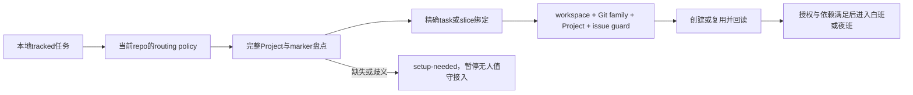

# Project-first 迁移与自动归属验收

2026-09-21；workspace superpoweringwithfiles。结论：Project作为产品/交付流隔离适合当前多本地项目、共享个人执行队伍的使用方式，已经实施。Team按组织/权限/工作流保留稳定边界，不再一产品一Team。Project是管理边界，不能充当文件系统权限或进程锁。

## 已落实的四层方案

| 层 | 当前采用 | 新本地项目的规则 |
|---|---|---|
| Team | 复用SUP | 默认复用已批准Team；独立权限/组织需求才配置新Team |
| Project | 每产品默认一个；SWF按4个独立交付流拆分 | productKey/projectKey精确marker+固定UUID；不按标题或目录开关猜归属 |
| Label | workstream、swf-managed、executor及runtime标签 | 分类与注意力；不是归属证明或执行授权 |
| Status | Backlog→Todo→In Progress→In Review→Done | readiness及完成门；父单In Progress不等于agent正在运行 |

该选择与Linear的Team级工作流、Project组织能力相容：[Teams](https://linear.app/docs/teams)、[Projects](https://linear.app/docs/projects)、[Issue status](https://linear.app/docs/configuring-workflows)。这是当前使用方式的架构选择，不主张Project提供独立安全沙箱。

## 全量迁移结果

完整分页51原issue、逐票full read；新增SUP-52用于本轮真实intake/验收，最终52张。

| Project | 任务数 | 原票范围 |
|---|---:|---|
| SWF — Core & Operations | 11 | SUP5–14、47；保留原Project UUID |
| SWF — Render Verification | 7 | SUP15–21 |
| SWF — Project Isolation & Automation | 14 | SUP22–34 + 本轮SUP52 |
| SWF — Decision Runtime | 16 | SUP35–46、48–51 |
| Workspace — Onboarding | 4 | SUP1–4；人工任务，无managed/nightly资格 |

UUID、父子关系、依赖、优先级、原有labels与Done状态保持。SUP15的ready-review语义映射为In Review；迁移本身不替代其内容验收。现有Roadmap的Render/LMP/Decision任务均归属对应Project，LMP当前规格和票面增加明确覆盖旧一产品一Team方案的规则；docs/roadmap.md、docs/backlog.md同步归属。Initiatives经UI核实未启用，本轮未开通。

## 自动接入与防串台

已采纳repo的新tracked任务，包括不经Chief的direct入口，默认入Linear；普通问答不建单，用户显式opt-out可保留本地。新repo首次明确要求Linear白夜班管理时按同协议bootstrap默认Project；不是监控所有文件夹、自动创建Team或自动授予nightly权限。

实现：canonical/global Trio、Chief、Linear skill及既有night/morning/weekly automation已接线。配置只存归属，不新增任务状态权威。共享normalizer保留v1父子映射，读取v2已存在schema；实际7绑定48任务全部解析。所有48任务具备唯一marker并full readback；48次重放均复用原UUID。6个既有status comment逐issue读取核验归属；父评论不会继承给子任务。

每次mutation前核对workspace及exact目标；policy中另一个合法Project也不能冒充本任务。完整workspace Project catalog检查遗漏/重复ownership。相同Git family的多个Project仍共用互斥边界。遇到手工移动、权限/读回失败、未知owner，停止相应写入并暴露原因。

## 独立审查及修复

四名辅助agent分别审查方案、绑定/roadmap、实现和状态语义。最终review发现并修复：评论guard漏参数；task marker身份约束不够；完整Project/marker覆盖证据不足；旧identifier/UUID混用与子项可能丢失。Chief复核又纠正了初版adapter依赖本地忽略文件、弱UUID/评论继承问题，最终使用独立fixture。

实测还发现Linear自动把SUP15标记中的`sup-15`转成issue链接；已改fenced text并逐字回读。后续写marker一律fenced，既有稳定的plain marker可精确读取复用，不强迫无意义格式迁移。

## 验证证据与边界

- 完整核心套件：486+82项通过（主体实现）；末次修改后相关集成套件98/98通过。
- 最终routing/normalizer18项覆盖正确/错误Project、未知或关闭Project、完整盘点、重复ownership、根目录/worktree、评论归属、旧binding无损和marker重放。
- 7 live绑定、48 live issue guards、48同UUID reuse通过；同Team错Project反例DENY。
- 51原票迁移及48marker更新均逐票读回；关系与状态保持（前述SUP15语义调整除外）。
- canonical与global相关文件一致；night/morning prompt与canonical一致，weekly更新与live TOML逐字一致；原model/schedule保留。
- 直接UI验证Project布局、Tonight/Agent Queue/Ready for Review按Project分组；Tonight仍4候选。

测试证明helper与当前数据一致；协议仍由调用agent遵守，没有声称Host拦截任意MCP调用。跨进程原子锁属于SUP29；全新其他repo bootstrap、下一次真实cron仍待实测，不能由本次配置和重放冒充。没有部署、merge或批量触碰其他repo。

## 夜班衔接与Human决策

今晚现有候选SUP49、SUP25、SUP19、SUP20，跨3Project；共享3attempt/45min预算，依赖和冲突检查后才领取。SUP25继承本轮helper，做剩余caller/漂移验收；后继LMP票按依赖晋升。[实施计划](../../../docs/plans/project-isolation-20260921/implementation-plan.md)区分已做与待做。

无需新增Human审批来完成本轮迁移。后续只有新产品的敏感权限边界、实际执行范围无法从上下文确认等情况才需要决策；不因新文件夹出现询问或创建Team。

入口：[Projects](https://linear.app/superpoweringwithfiles/projects/all)、[Tonight](https://linear.app/superpoweringwithfiles/view/tonight-4ff974bfcabb)。原始证据见同目录migration-plan、full-before/full-after、marker-before/marker-after、project-catalog、live-acceptance、comment-ownership及测试日志。

最终回读：本轮SUP52已Done，唯一status comment已绑定并通过归属guard。SUP25/26/28票面已明确剩余范围及本轮可复用成果。
